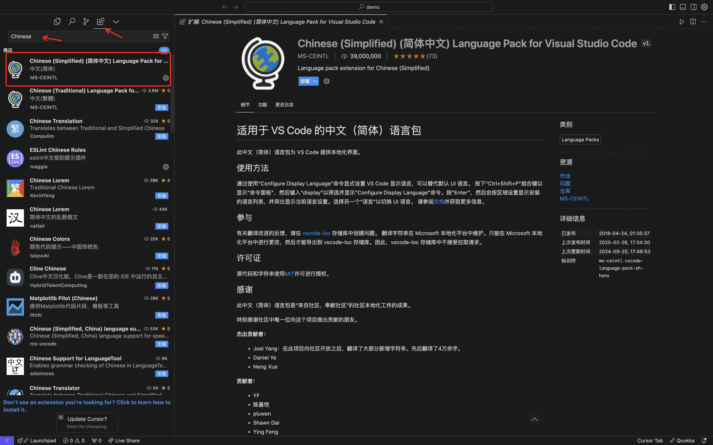
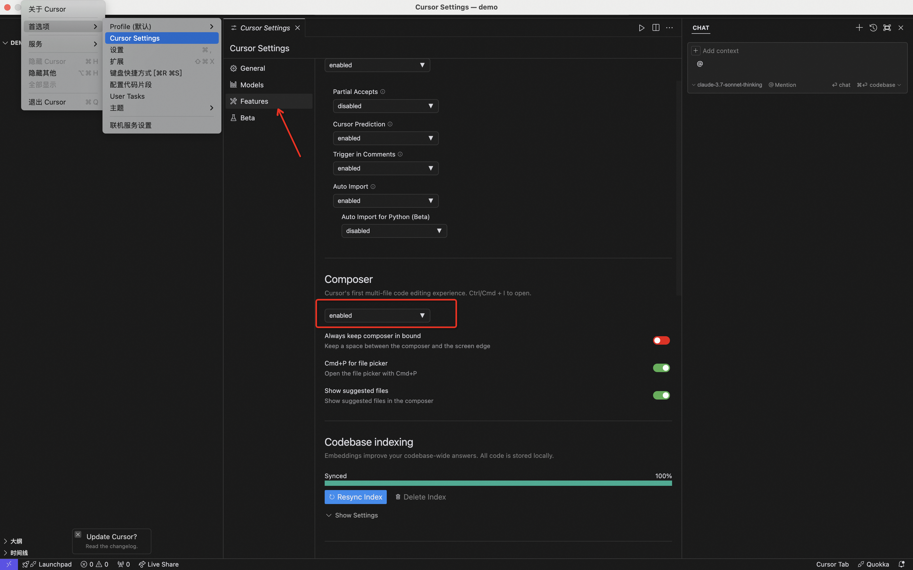
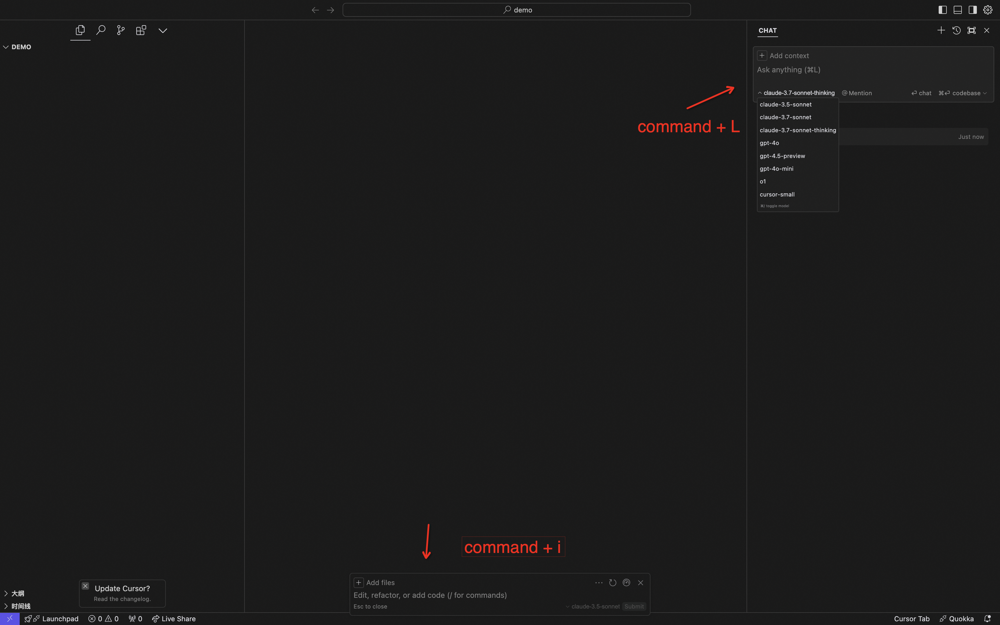
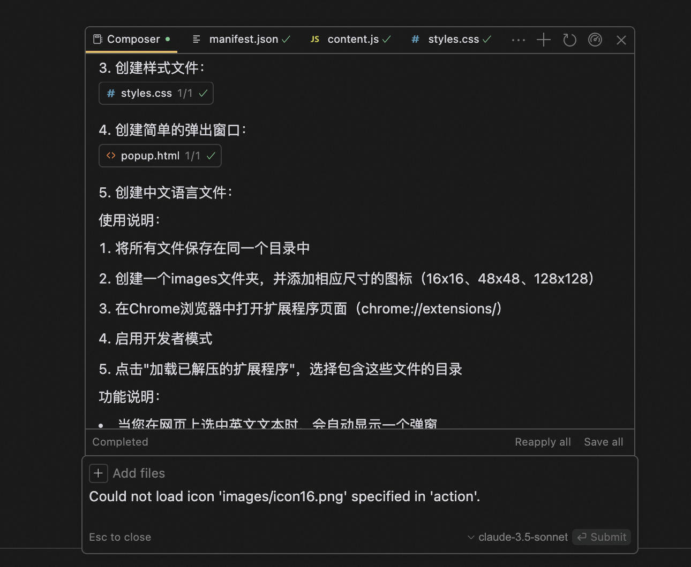
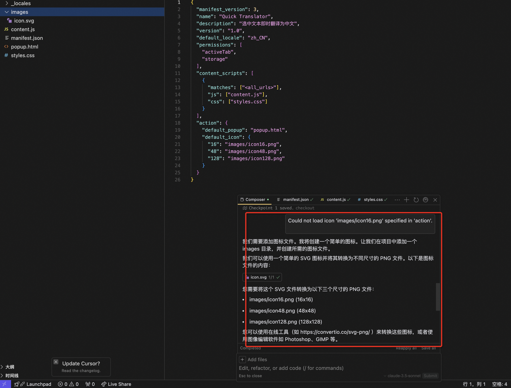
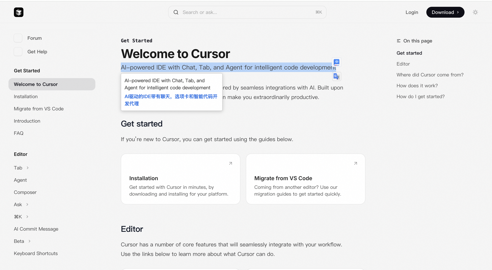
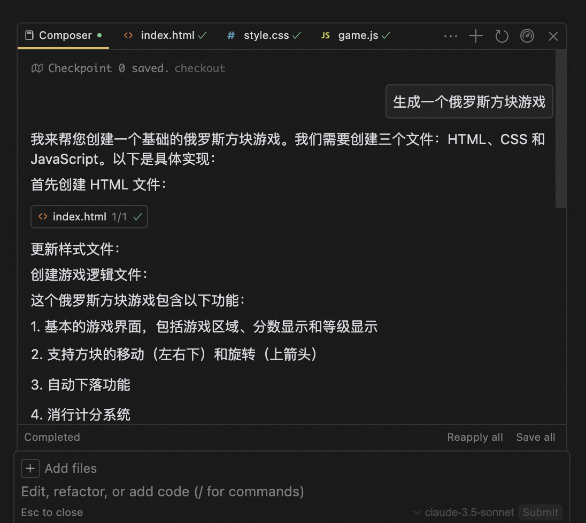
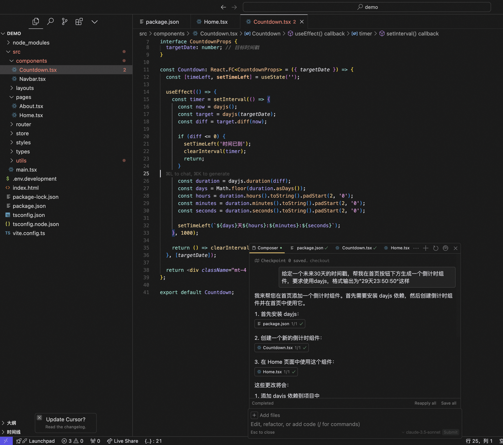
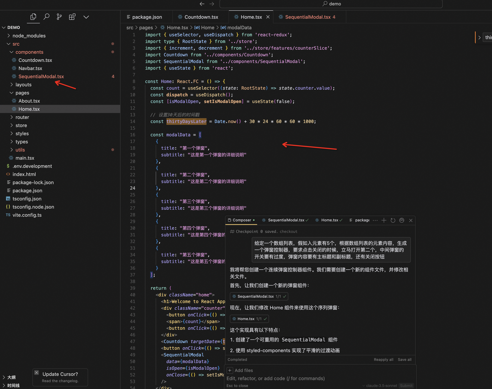

# Cursor！让小白也能飞起来！

大家好，我是墨衡，某厂前端码农。今天，我要给大家介绍一个让我彻底爱上的神器——Cursor！

## 一、Cursor 是什么？

如果你还在为写代码熬夜加班，那我必须告诉你，Cursor 是你的救星！它是一个 AI 编程助手，能够帮你生成、优化代码，甚至直接解决复杂问题。无论是新手还是老鸟，Cursor 都能让你的编程效率提升不止一个档次。甚至是非程序员的小白，都能按你的要求，创造出你想的产品。

## 二、Cursor 的超多优点

**代码生成**：只需要输入简单的指令，Cursor 就能生成高质量的代码，当下所有主流编程语言，它都能轻松搞定。

**代码优化**：它能帮你优化现有代码，提升性能，减少冗余，让你的代码更加优雅。

**智能补全**：输入代码时，Cursor 会自动补全代码，让你更快地完成代码。

**实时交互**：支持实时交互，你可以随时调整需求，Cursor 会立即给出反馈。

**跨文件对话**：能记住整个项目的「数字大脑」。

**零成本迁移**：VSCode用户5分钟无缝切换。

## 三、如何快速上手 Cursor？

1、官网：https://www.cursor.com/cn

2、 注册登录
使用 GitHub 账号或邮箱注册，简单几步就能完成登录。
免费用户权益如下：

3、安装中文插件，即使不懂英文，也能轻松使用。

4、核心操作

确保打开 composer

关键快捷键，输入用户指令，如果是 Windows 用户，使用 `Ctrl + I`， `Ctrl + L`。选择 `claude-3.5` 模型即可。有条件的你就用`claude-3.7` 是最近刚推出的更高级的模型，需要付费，模型的能力会更强大，生成的代码会更加健壮，阅读上下文的能力也会更强。

图中下方 `command + I` 打开的就是 composer，直接输入指令，可以帮你生成你要的功能代码。右侧的 `command + L` 打开的就是聊天窗口，可以和 Cursor 对话。

## 四、让小白也能飞起来

### 英文转中文浏览器插件

首先新建空文件夹，输入需求指令

自动生成代码中，不断地 **`Accept all`** 接收就好了

按要求载入插件

报错啦

 

继续将错误信息丢给 composer

需要生成三个文件，放到对应路径

再次载入插件，成功啦，打开 cursor 官网学习文档（https://docs.cursor.com/get-started/welcome），进行操作，即可翻译啦

### 俄罗斯方块游戏

再在浏览器打开这个本地 index.html 文件即可

<video width="50%" height="50%" controls>
  <source src="./img/18.mp4" type="video/mp4">
</video>

这这这这？就成啦！即使你是编程小白，只需按照提示操作，就能快速生成代码。一点都不用担心，它会手把手教你！

## 五、如何解决工作效率问题？

这里以前端工程师为例，假如你有一个活动页，倒计时少不了吧，复杂弹窗少不了吧？你就统统丢给 composer，它五分钟内就帮你搞定组件了。

<video width="50%" height="50%" controls>
  <source src="./img/17.mp4" type="video/mp4">
</video>

是不是超快的，像以往你要不就自己写，要不就找组件库当api调用师😄😄。现在可好了，起飞啦✈️。

当然，在更复杂的项目里，你都可以让 cursor 帮你解决各种各样的难点，你只要喂给它就行了。以前呢，不都得面向 google 编程，查 issue，查 stack overflow，现在可好了，直接让 cursor 帮你解决。

现在回想起来曾经熬夜爆肝赶的工，解的疑难杂症，到头来，就值几句提示词？AI 发展之迅速，简直让人惊叹！小白都可以做产品啦，我当下只有震惊和兴奋，不知道你们是啥感觉呢？欢迎评论区交流。