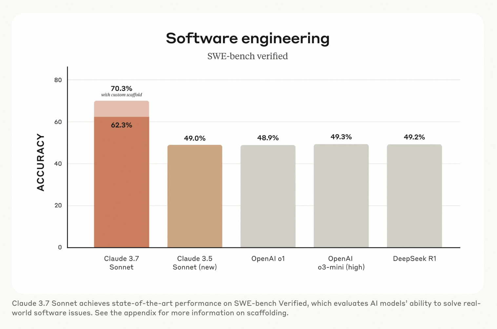
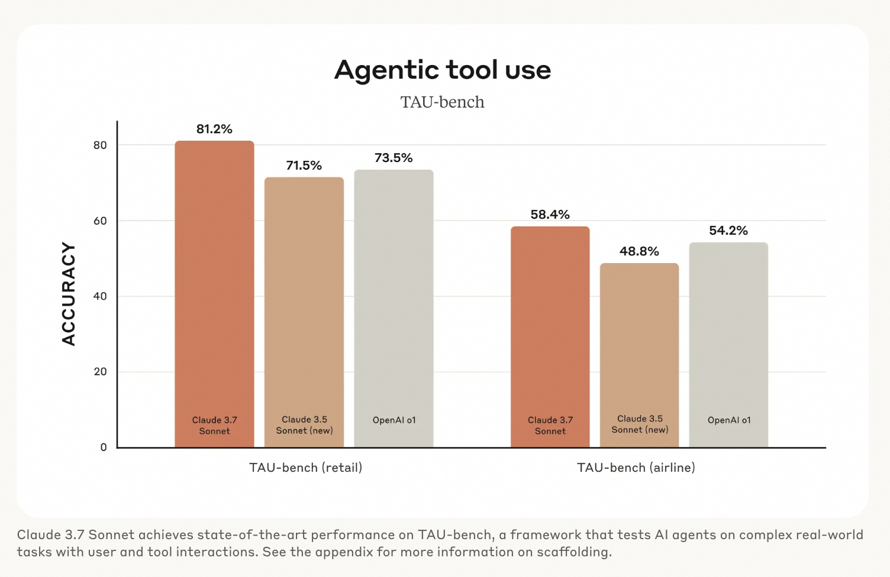
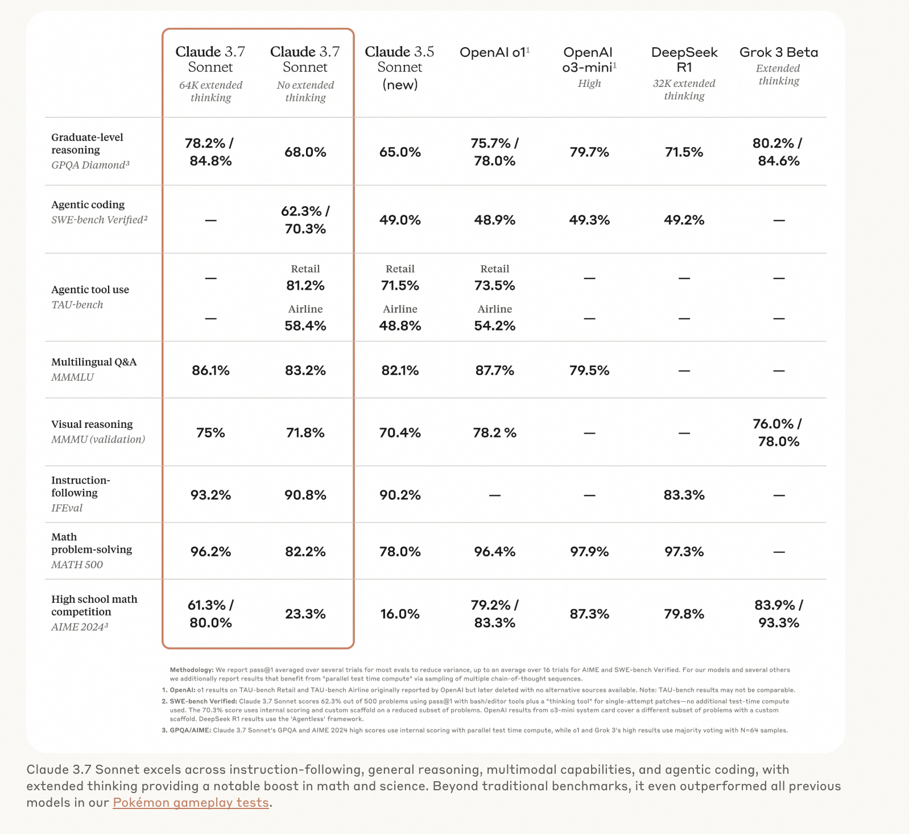
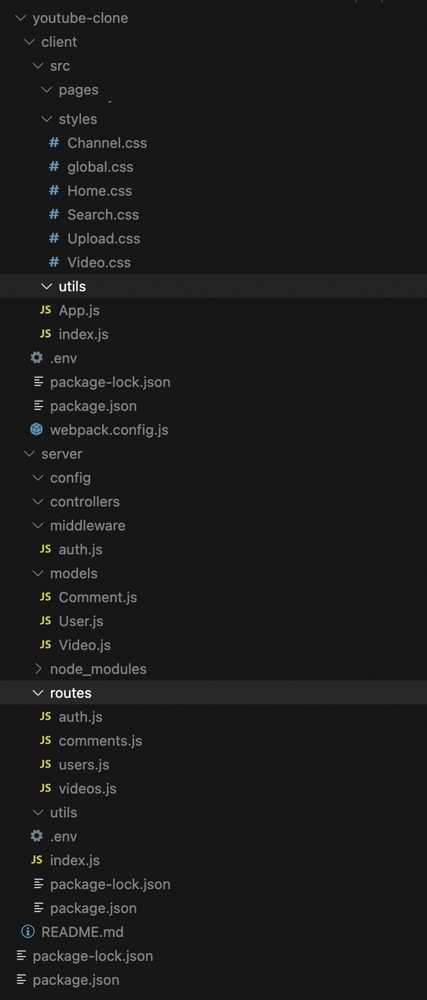

# 见证奇迹！Cursor + Claude3.7，重塑编程新纪元，效率逆天

大家好，我是墨衡。就在上周，Anthropic （https://www.anthropic.com/news/claude-3-7-sonnet）官网，正式发布了 Claude 3.7 Sonnet。

Claude3.7 Sonnet 是市场上**首款混合推理模型**，也是最智能的模型之一。它集**快速响应**与**深度思考**于一身，用户可依需求选择模式。标准模式是 Claude 3.5 Sonnet，***扩展模式则通过自我反思，在数学、物理、指令遵循、编码等任务上表现卓越***。

相比其他模型，Claude3.7 Sonnet 优势突出。它在编码和前端 Web 开发上大幅提升，实际测试中性能卓越。如在 SWE-bench Verified 测试中，取得最先进成绩，展现解决实际软件问题的强大能力。



在 TAU-bench 测试中，也表现出处理复杂现实任务的出色性能。





作为程序员得墨衡，在体验了一段时间的 Claude3.5 Sonnet 后，迫不及待地开启了 Claude3.7 Sonnet 的扩展模式，想一探究竟，看看它到底有多惊艳，结果一经使用，便发现它强大到超乎想象。

如果还有小伙伴不知道怎么用 cursor 来体验 Claude 的话，请看墨衡的往期文章[Cursor！让小白也能飞起来！](https://mp.weixin.qq.com/s/gCs1TNpcafOgJ200qb3p-w)

对了，新版本的 cursor（0.46）界面有更新，**Agent、Ask、Edit 三种模式**被整合到统一的界面中，功能定位和适用场景有显著差异。以下是核心区别及使用建议：

---

### **1. Agent（代理模式）**

**功能特点**  
- **自动化执行**：可自主运行终端命令、安装依赖、修复错误，支持多任务协同和跨文件操作。  
- **智能上下文**：自动理解代码库结构，新增对 Git 提交记录、终端会话的上下文支持，还能调用网络搜索功能（无需手动输入 `@web`）。  
- **YOLO 模式**：允许自动执行高风险操作（如文件写入、Git 提交），突破工具调用次数限制。  

**适用场景**  
- 自动化复杂工作流（如代码重构、数据抓取）  
- 需要多文件协同或跨平台操作的任务（例如启动本地服务器并修改代码）  

**操作方式**：输入目标后，AI 自动完成代码生成、测试和部署，用户仅需监督关键步骤。

---

### **2. Edit（编辑模式）**

**功能特点**  

- **多文件操作**：支持同时生成或修改多个文件（如 HTML/CSS/JS 联动开发），直接保存到磁盘。  
- **精细控制**：提供代码框架生成、结构优化功能，且可回退到历史检查点（Checkpoints）。  
- **上下文依赖**：需手动通过 `@files` 或 `@folder` 添加文件/文件夹作为上下文。  

**适用场景**  

- 创建新项目或优化现有代码结构  
- 需要分步调试的复杂功能开发（例如生成 SVG 转 PNG 工具站）  

**操作方式**：用户指定需求后，AI 生成完整代码片段并自动应用，无需手动复制粘贴。

---

### **3. Ask（问答模式）**

**功能特点**  

- **快速交互**：类似传统聊天助手，适用于即时调试、API 用法查询等简单问题。  
- **轻量级上下文**：仅支持当前文件或手动添加的少量文件作为参考。  
- **模型兼容性**：可调用 Claude 3.5-Sonnet 等基础模型，但不支持高级 Agent 功能。  

**适用场景**  

- 解决具体代码错误或技术概念澄清  
- 临时性需求（例如生成 Mermaid 图表解释项目结构）  

**操作方式**：输入问题后，AI 返回答案或代码建议，需手动复制到编辑器中。

---

### **如何选择模式？**
| 维度         | Agent                      | Edit                      | Ask                      |
|--------------|----------------------------|---------------------------|--------------------------|
| **自动化程度** | 完全自主执行               | 半自动（需用户确认）      | 手动应用代码             |
| **适用任务**  | 跨文件、多步骤复杂任务     | 多文件生成/重构           | 单文件简单问题           |
| **学习成本**  | 较高（需理解工具调用逻辑） | 中等（熟悉上下文管理）    | 低（即问即用）           |
| **资源消耗**  | 高（消耗更多 Token）       | 中等                      | 低                       |

---

### **新版本升级提示**
- **Claude 3.7 支持**：仅限 Pro 用户使用，免费用户可尝试替代模型如 Claude 3.5。  
- **模式切换快捷键**：`Ctrl/Cmd + L`（Ask）、`Ctrl/Cmd + I`（Agent），界面更集成。

下面一起来感受下最强 AI 编程的震撼。

## 在网页中制作一款坦克大战游戏

```
提示词：
创建一个单人游戏的坦克大战，添加：
画布：坦克不得超出画布
敌人AI：方向随机，子弹一直在高频发射中，玩家的子弹不受限，自行控制
障碍物：坦克遇到障碍物，无法跨域，只能绕开，分配合理，有一定的间隔
得分系统
武器
胜利机制：敌方AI发射子弹到玩家身上，玩家输，反之玩家胜
```

<video width="100%" controls>
  <source src="https://zjc-blog.oss-cn-beijing.aliyuncs.com/tank.mp4" type="video/mp4">
  您的浏览器不支持视频标签
</video>

## 生成一个 youtube 网站

```
提示词：生成一个 youtube 网站
```

<video width="100%" controls>
  <source src="https://zjc-blog.oss-cn-beijing.aliyuncs.com/be.mp4" type="video/mp4">
  您的浏览器不支持视频标签
</video>

你敢信，这里面的前后端所有文件，全是 Agent 生成的。报错，就继续问，还需要啥细节，就继续加。就差我在数据库里塞视频了！：）



## 生成动效

```
提示词：使用 p5.js 模拟 200 条小鱼在鱼群中时而聚集时而分散的游动，不要碰到墙壁
```

<video width="100%" controls>
  <source src="https://zjc-blog.oss-cn-beijing.aliyuncs.com/fish.mp4" type="video/mp4">
  您的浏览器不支持视频标签
</video>


## 生成高品质 UI 界面

```
提示词： 请帮我创建一个简单直观的 iOS 原生时钟 APP 的设计图，使用 HTML 画出所有页面，平铺在这个 HTML 里
```

<video width="100%" controls>
  <source src="https://zjc-blog.oss-cn-beijing.aliyuncs.com/time.mp4" type="video/mp4">
  您的浏览器不支持视频标签
</video>

这效果实在是太惊艳，家人们都懂得，继续喂给他，让他去做你想要的产品形式，不限于小程序，原生app，网页等等，大胆去创造吧！

经过这段时间的深度体验，墨衡不得不感叹，Claude3.7 Sonnet 已经初步具备了打造完整系统的能力，无论是动效、UI、游戏、小工具还是网站开发，它都能轻松应对。如果你还在犹豫是否尝试 AI 编程，或者纠结于选择哪款大模型，我强烈推荐你试试 Claude3.7 Sonnet，它绝对会给你带来满满的惊喜！
