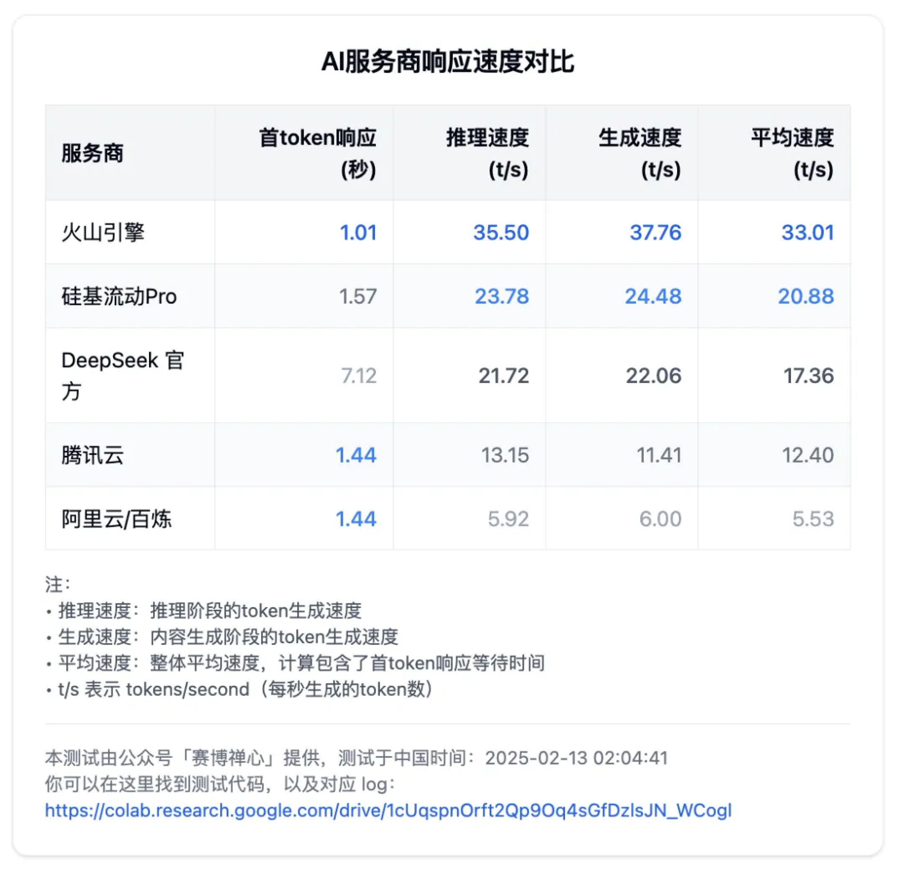
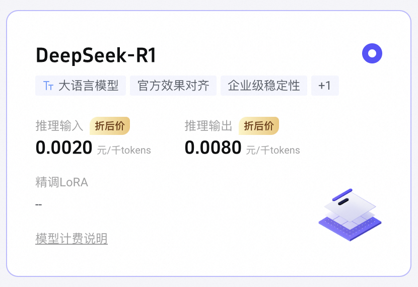
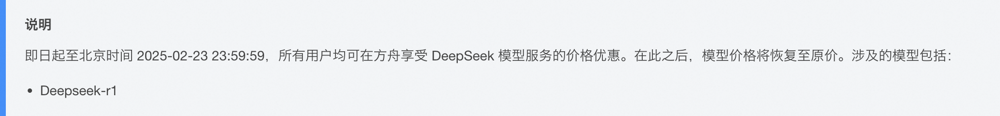
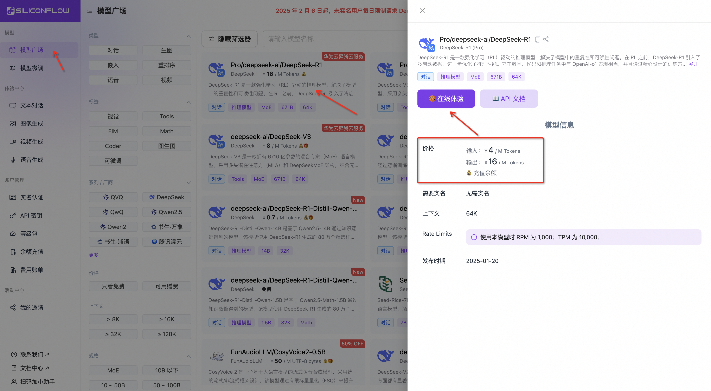
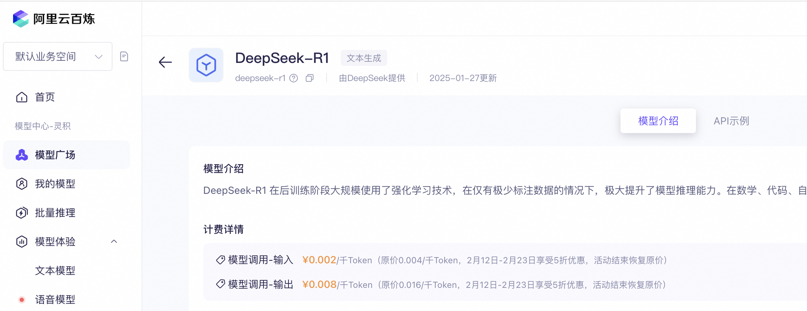
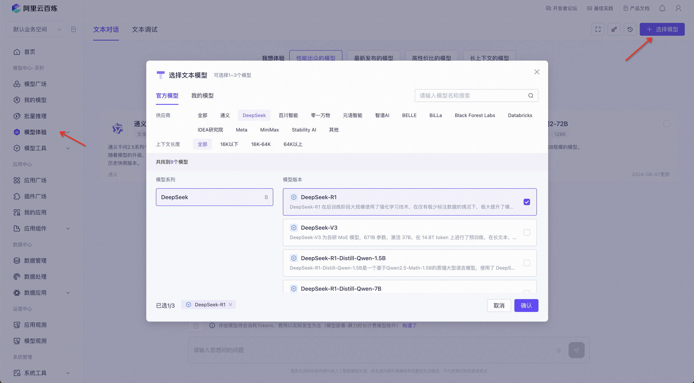
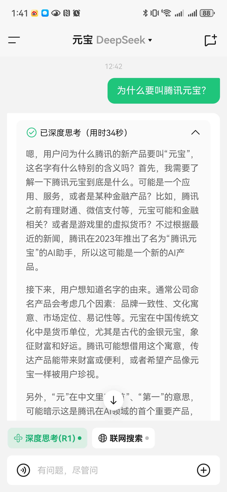
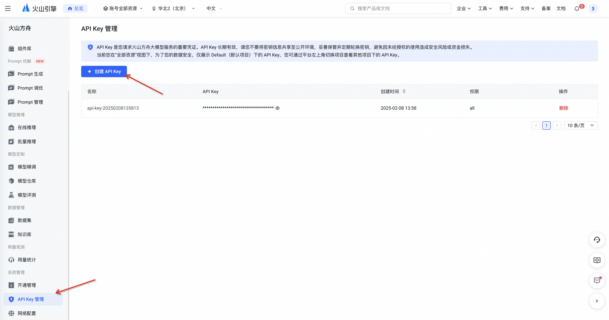
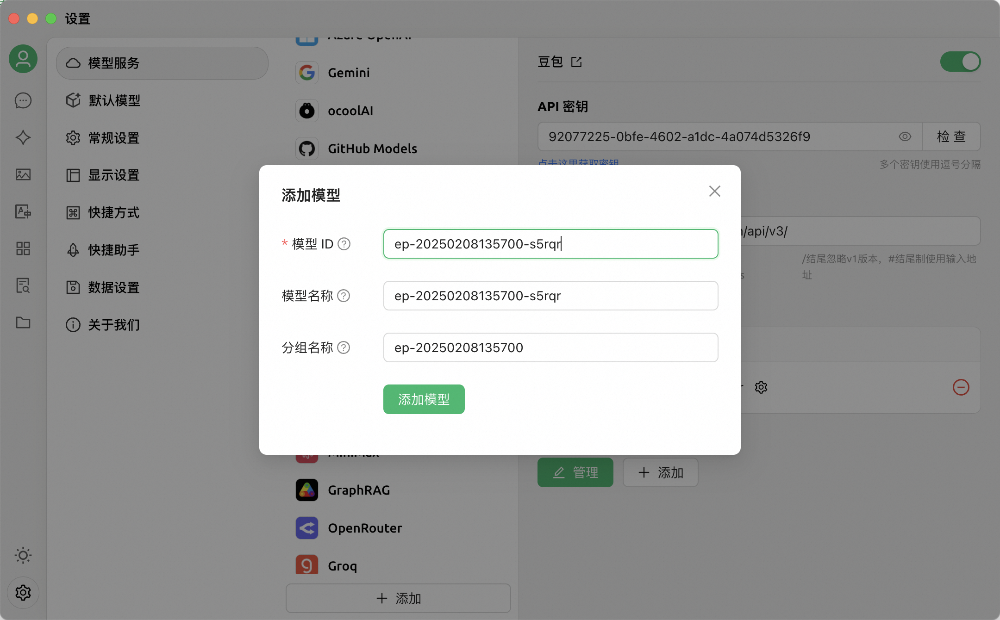
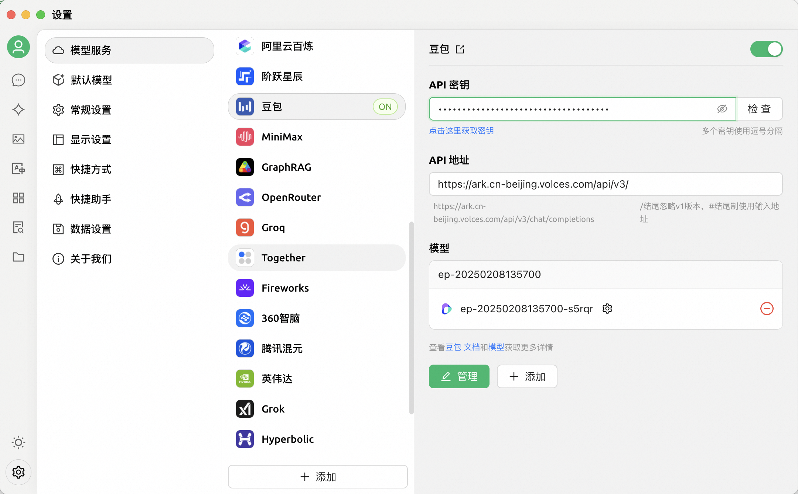

# 满血 DeepSeek-R1 免费替代方案

[DeepSeek](https://www.deepseek.com/) 爆火以后，官网是被挤爆了，常常是无法使用，等待许久后，显示“**服务器繁忙，请稍后再试**”。

前不久，直到看到了「赛博禅心」公众号发出的 DeepSeek-R1 测评以后，就找到了许多满血替代方案。

下面就快速的介绍下使用流程

## [火山方舟](https://console.volcengine.com/ark/region:ark+cn-beijing/model?vendor=Bytedance&view=LIST_VIEW)

https://console.volcengine.com/ark/region:ark+cn-beijing/model?vendor=Bytedance&view=LIST_VIEW

新用户免费赠送50万token额度，官网上说截至2-23日，都是半价优惠

## [硅基流动](https://cloud.siliconflow.cn/models)

https://cloud.siliconflow.cn/models

新用户赠送14元

## [阿里云百炼](https://bailian.console.aliyun.com/#/efm/model_experience_center/text)

https://bailian.console.aliyun.com/#/efm/model_experience_center/text

新用户免费赠送100万token，价格优惠如下：

## [腾讯元宝](https://yuanbao.tencent.com/chat/naQivTmsDa)

https://yuanbao.tencent.com/chat/naQivTmsDa

还有上周连微信也接入了 DeepSeek-R1 模型。移动端app的话，各自去应用市场下载即可。

个人使用下来主观上的速度体感也能如上面的评测结果一样。腾讯元宝需要单拎出来，在移动端你就可以拿他和「豆包」一样使用即可。

## [Cherry Studio](https://cherry-ai.com/)

想要大大提升自己的办公效率，这里再推荐个桌面端应用 [Cherry Studio](https://cherry-ai.com/)（https://cherry-ai.com/） 它是一款集多模型对话、知识库管理、AI 绘画、翻译等功能于一体的全能 AI 助手平台，并且聊天数据存储在本地，巨好用。

这里以火山方舟为例，首先创建接入点

创建好在线推理接入点后，再去创建API Key

再去 [Cherry Studio](https://cherry-ai.com/) 里设置，找到豆包，添加R1模型

即可享受丝滑聊天，快去试试吧。

## DeepSeek为何还不建立稳定服务？

DeepSeek为何还不推出会员制，建立官网稳定服务？在OpenAI通过每月20美元订阅费创造35亿美元年收入的当下，DeepSeek为何坚持免费策略？这场看似反常的商业选择，实则是中国AI突围战的精妙布局。

### 开源即武器：算力霸权下的生态破局

**1. 打破硅谷技术垄断**

DeepSeek 创始人，深谙「产业落地」才是 AI 竞争核心。通过开源模型权重（如 MIT 协议），DeepSeek 将全球开发者转化为其技术生态的「毛细血管」，形成类似安卓系统的开源联盟，削弱 OpenAI 闭源模型的统治地位。

**2. 低成本撬动用户规模**

DeepSeek-R1 的训练成本仅为 OpenAI 的 1/20，使其能以「开源免费 + 商业友好」策略快速渗透中小企业和开发者社区。用户量积累优先于短期变现，这与早期微信放弃会员费、专注用户增长的逻辑一致。

### 构建中国主导的 AI 标准：地缘技术博弈

**1. 全球产业捆绑战略**

DeepSeek 开源后，印度农业 AI 依赖深圳无人机、阿根廷医疗系统需对接浙江器械，形成「算法在外，实体在内」的格局。这种模式将中国制造业与全球 AI 开发生态深度绑定，类似英特尔通过 x86 架构控制 PC 产业链。

**2. 绕开美国技术封锁**

开源协议使 DeepSeek 规避了闭源模型面临的出口管制风险。同时，与华为等 16 家国产芯片适配，推动国产算力链替代英伟达 GPU，降低被「卡脖子」的可能性。

### 开源背后的隐性盈利路径：商业闭环设计

**1. 分层收费模式**

当前开源模型仅释放基础能力（推理代码），而训练框架、智能反馈优化等核心工程细节未公开。未来可通过企业级技术支持、定制化训练服务收费。

**2. 端云协同生态变现**

DeepSeek 已在布局 AIMO 智能体等端侧产品，未来可通过「开源模型 + 闭源工具链」「免费社区版 + 企业私有云」组合盈利。

**3. 数据飞轮效应**

开源吸引大量开发者贡献使用数据，反向优化模型性能。这种「用免费换数据」的策略，比会员制更利于构建数据护城河。

### 从技术供应商到规则制定者：战略终局判断

**1. 定义 AI 开发范式**

通过开源协议控制接口标准，使全球开发者习惯 DeepSeek 的技术栈。

**2. 倒逼硬件产业链升级**

与国产芯片厂商的合作，推动自主算力基础设施发展。一旦形成「DeepSeek 模型 - 国产芯片 - 行业应用」闭环，会员制等 C 端变现将变得次要。

### 总结
**DeepSeek 的战略本质是「以开源换主权」**

其选择与 ChatGPT 截然不同，产生了鲜明的对比「闭源筑墙VS开源搭桥，会员收费VS生态共赢」：OpenAI 通过闭源 API 和 PLUS 会员构建商业壁垒，而 DeepSeek 以开源为杠杆，将中国制造业优势转化为 AI 生态控制力。这种战略短期内牺牲了会员收入，但长期看可能重塑全球 AI 产业格局。

坚持长期主义，DeepSeek 牛逼！
