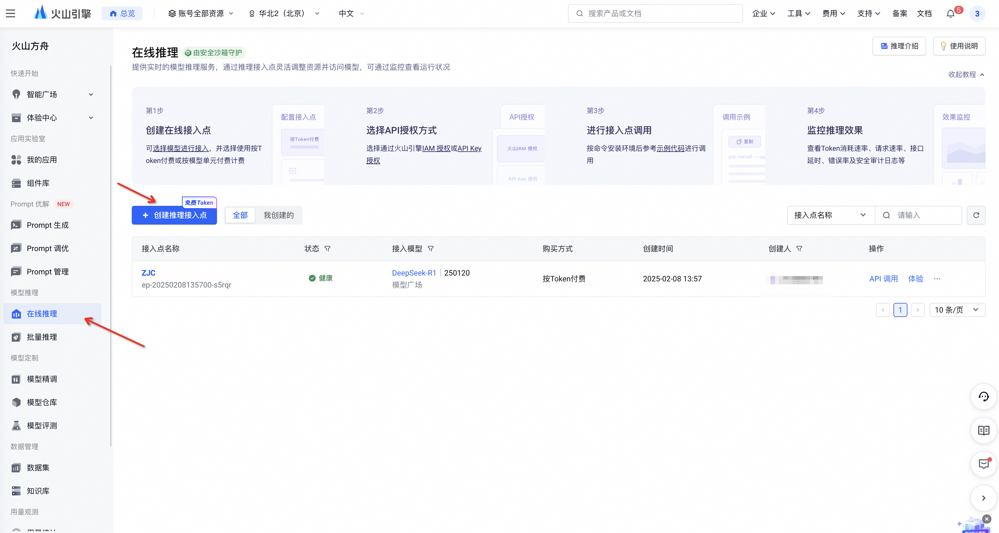

# deepseek极速接入

deepseek 爆火以后，官网是被挤爆了，常常无法使用。但是开源多强大，非常多的应用产品在扩展开发接入 deepseek。

目前使用下来，个人觉得就[火山方舟](https://console.volcengine.com/ark/region:ark+cn-beijing/model?vendor=Bytedance&view=LIST_VIEW)是最快的，下面简单说下使用流程。

火山的DeepSeek-R1和V3模型每百万token的输入和输出价格分别是2元和8元，是官方价格的一半，每个用户会有50万的免费token额度。

进入模型在线问答超享丝滑😄😄

当然假如你想在其他产品上使用该模型的话，需要创建端点，操作如下：

创建好在线推理接入点后，再去创建API Key

再去套壳产品应用里使用即可，这里拿 [Cherry Studio](https://cherry-ai.com/) 举例

即可享受丝滑聊天。[Cherry Studio](https://cherry-ai.com/) 是一款集多模型对话、知识库管理、AI 绘画、翻译等功能于一体的全能 AI 助手平台，并且聊天数据存储在本地，巨好用，快去试试吧。