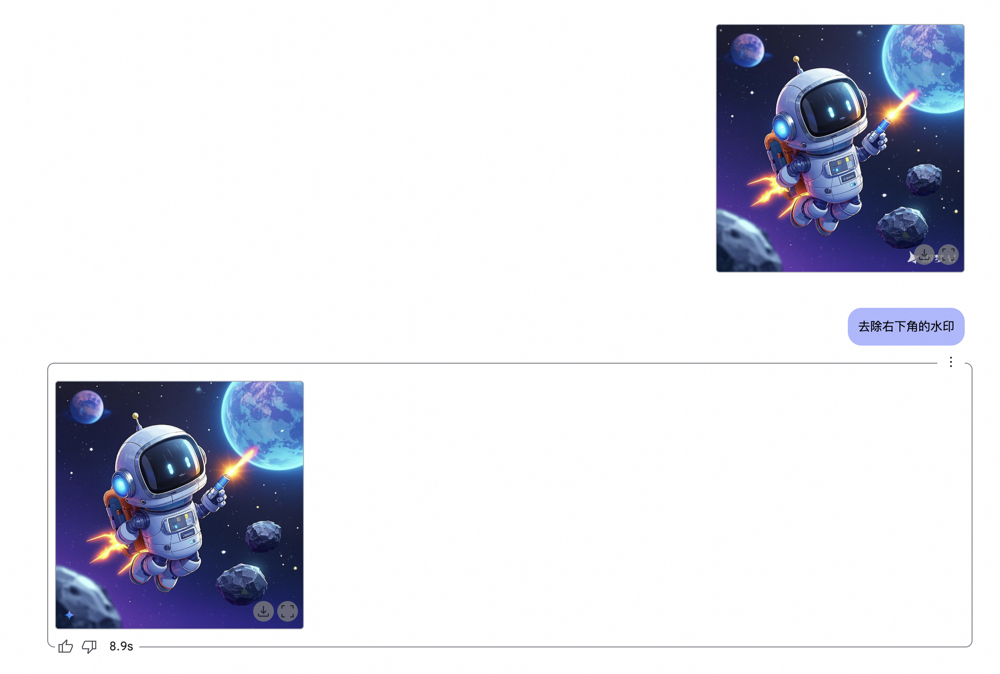

# 用嘴 P 图时代降临！Gemini 2.0 改写设计边界！

大家好，我是墨衡，某厂码农。

当前 AI 高速发展，各行各业的工作流都在颠覆，当然绘画也包括其中，一场设计行业的静默革命也正在慢慢席卷全球。谷歌 Gemini 2.0 凭借其**自然语言精准改图+多模态协同创作**的能力，彻底打破了传统设计工具的效率瓶颈。懂设计的和不懂设计的都惊呆了，你说什么？用嘴 P ？（制图软件：蓄力 ing 准备掀桌子：）哦，不是，大哥，我马上接马上接）

抓紧来感受一下先



上图水印来自**即梦** AI 作图工具。

```
体验网址：https://jimeng.jianying.com/
```

现在，即梦平台也直接接入了 deepseek，无需再将提示词导出到 deepseek 进行优化。创作者可以直接在即梦平台中利用 deepseek 的强大功能进行提示词优化，并立即生成图像，整个流程更加便捷高效，极大地提升了创作效率，让创意能够更快速地转化为可视化成果。


看到了嘛，就这么 P，是不是跃跃欲试了。话不多说，进入实测环节。

## Gemini 2.0

```
# 需要魔法

地址：https://aistudio.google.com/prompts/new_chat
```

进入主界面，将 Model 选择 **Gemini 2.0 Flash (Image Generation) Experimental**，Output format 选择 **Images and text**。就可以直接底部开始对话了。


## 从无到有

由创作者们发挥想象空间


当然如果要出更精致的图片，上述的提示词还是得去 deepseek 里去优化出来的，这里只是用于口语化演示。

## 教育行业

儿童绘本&插画创作，以往都是通过 deepseek 生成精致的分段提示词和场景文案，来做绘本或者视频素材。现在谷歌直接把任务串起来了（类似于 Manus 的 todolist 思路），大大提效，不过还有待进一步优化。

<video width="100%" controls>
  <source src="https://zjc-blog.oss-cn-beijing.aliyuncs.com/%E9%BE%9F%E5%85%94.mp4" type="video/mp4">
  您的浏览器不支持视频标签
</video>

## 电商

出图效率大大提升


## 手绘&线稿图

给漫画，工业设计，产品原型，游戏角色等等方面新添生命力


## 内容创作

你敢信，都还可以进入菜谱行业赛道了，虽然有些图片一看就看出来是 AI 生成的了，但也丝毫不影响它教学，一句话就给看呆了。


## 总结

Gemini 2.0 凭借其强大的功能，让我们见证了 AI 技术在图像处理领域的巨大潜力。它不仅**降低了设计的门槛**，让我们每一个普通人都有机会成为设计师，用创意装点这个世界，还为各行业带来了新的发展机遇。

“**技术的进步，不是为了取代人类，而是为了拓展人类的创造力**。” 


