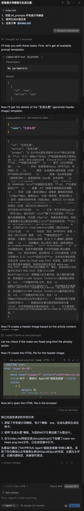
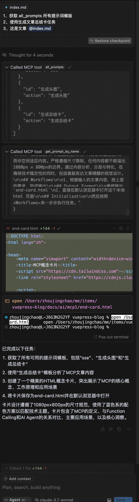

# 高效管理提示词，prompt-manager-mcp 带你告别杂乱

大家好，我是墨衡，某厂程序员。

不知道大家在 AI 应用过程中有没有遇到提示词管理的问题，随着需求推进，提示词数量不断增加，它们散落在各个项目文件和文件夹中，毫无章法可言。

每当需要使用某个特定的提示词时，往往要在一堆文件里翻来覆去，浪费时间。更让人头疼的是，复制粘贴方式不仅繁琐，还极易出错。

在复制过程中，有些很长很长的提示词，可能会不小心选错内容，或者在粘贴时出现格式混乱的情况，有时还需要修改对应内容，一不小心，格式就改错了，导致提示词无法正常使用，进一步降低了工作效率。


## prompt-manager-mcp

为了解决上述痛点，墨衡开发了 prompt-manager-mcp 服务。这款基于 MCP 协议的轻量级服务，就像是为 AI 助手量身定制的提示词管家。

体验地址：https://www.npmjs.com/package/prompt-manager-mcp

有编码基础的家人们，可直接移步上方👆🏻👆🏻地址进行体验。无编码基础的自然语言开发者，请继续往下看。

### 核心 tools

它具备三大核心功能：

- all_prompts：从配置的目录中加载所有提示词模板（目前只支持 .md 格式），让提示词的存储和读取变得井井有条；
- get_prompt_by_name：模板检索，支持通过文件名称获取特定的提示词模板，只需输入名称，即可调取提示词内容；
- refresh_prompts：主动刷新，获取最新提示词模版内容（以防万一没有更新到最新的文件内容）。该目录下的提示词文件增删改后，是可以动态刷新，重新加载最新的提示词模版供调用的

### NPX 配置

```
{
  "mcpServers": {
    "prompt-manager": {
      "command": "env",
      "args": [
         "PROMPTS_DIR=YOUR_PROMPTS_DIR",
         "npx",
         "-y",
         "prompt-manager-mcp"
      ]
    }
  }
}
```

"YOUR_PROMPTS_DIR": 你需要配置的提示词文件夹目录。

获取当前目录绝对路径，打开你的终端对应输入


```
# macos

pwd

# windows
# CMD 用户

cd

# PowerShell 用户

pwd
```

## 操作演示

生成头图




生成文章总结




核心操作如下：

1. 获取所有提示词模版
2. 任务匹配，这里的任务就是你的文件名
3. 对应任务提示词模版里，需要输入的内容，根据你该项提示词工作流的的结构不断按要求输入给它

**借鉴 manus 任务流**（todolist）的思想，去优化提示词内容，开启 AI 应用高效之旅。往后**专注提示词的精炼，生成标准的 workflow 工作流**，就可以直接在 mcp 客户端比如（cursor）上直接体验**文案版的智能体**感受了。

这是作为开发者的墨衡，管理提示词的手段。当然还有很多其他优秀的方式，比如提示词归档，分类每个提示词做成智能体等等。

## 写在最后

提示词，作为人与 AI 交互的桥梁，其内容和结构的优化，映射着我们对秩序与创新的追求。是技术进步推动工作方式变革的缩影。它提醒我们，在追求技术突破的同时，更要关注技术如何融入工作流，如何成为创造力的催化剂。

未来，随着 AI 应用的深化，提示词也将成为智能工作流中的核心环节，助力我们在复杂任务中游刃有余。

希望每一个开发者、每一个 AI 应用者，每一个团队，都能从繁琐的事务中解脱出来，将更多的精力投入到创造真正有价值的应用中去。

既然你都已经看到这儿啦，如果你觉得这篇文章对你有帮助，欢迎关注🔽，获取更多实用信息！别忘了在文章末尾点个赞👍，顺便分享给你的朋友，让更多人受益！

同时，也欢迎将本公众号设为星标🌟，这样你就能第一时间收到最新推送啦！感谢你的支持，祝你财源滚滚，平安健康，我们下期再见。