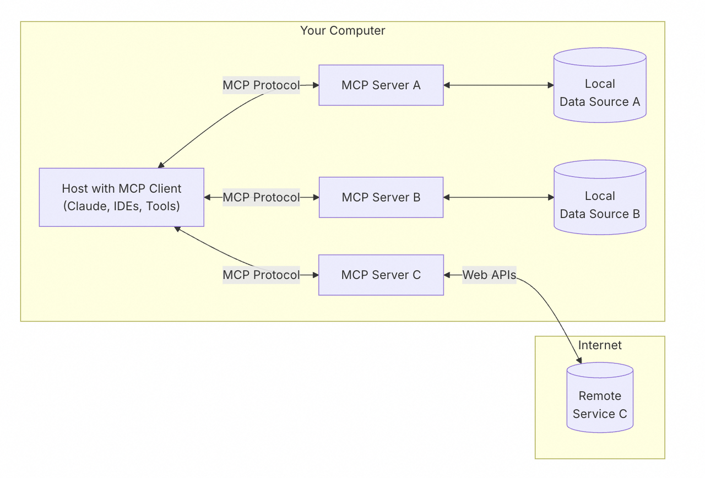
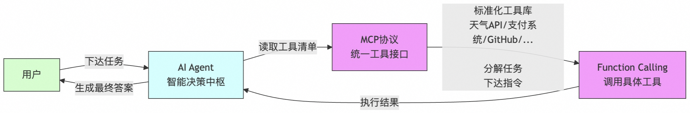
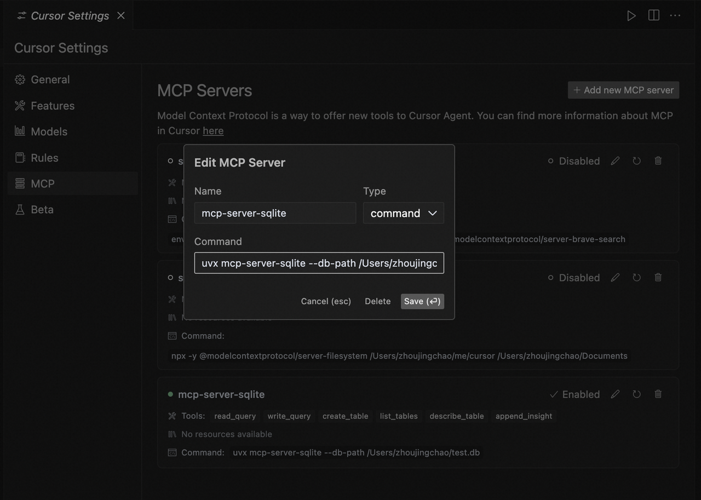
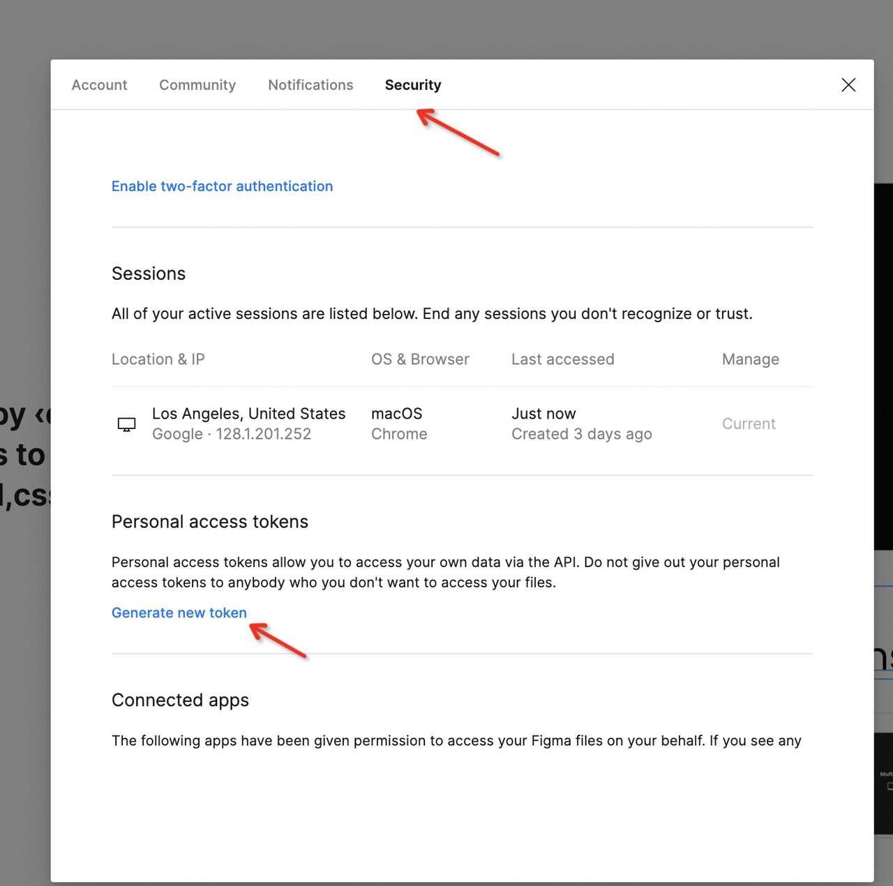
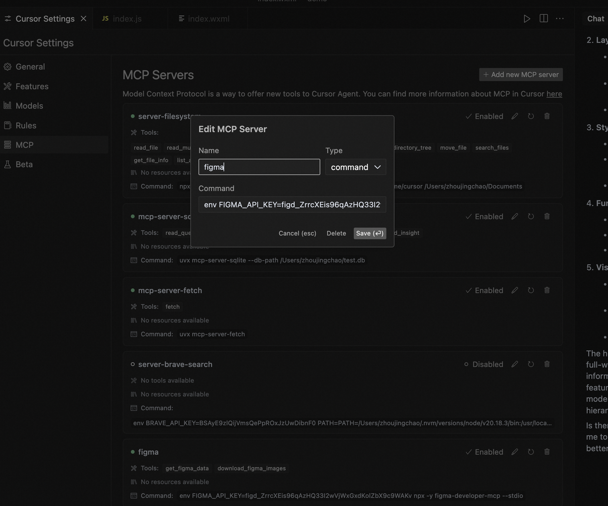
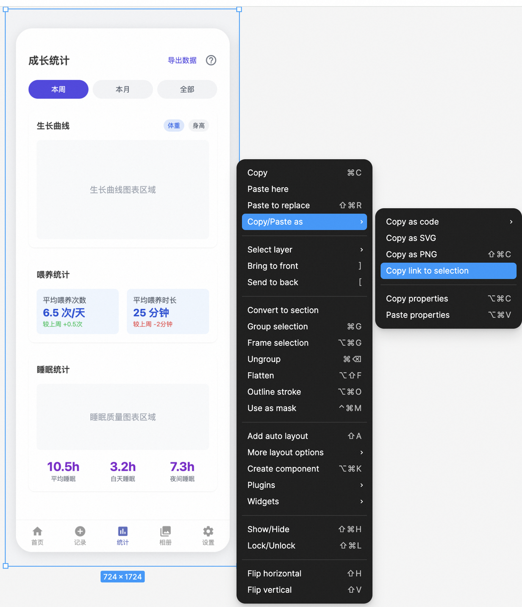
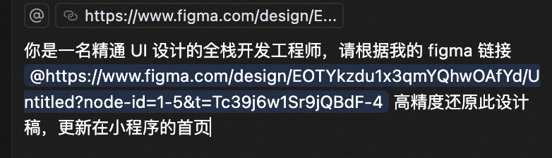
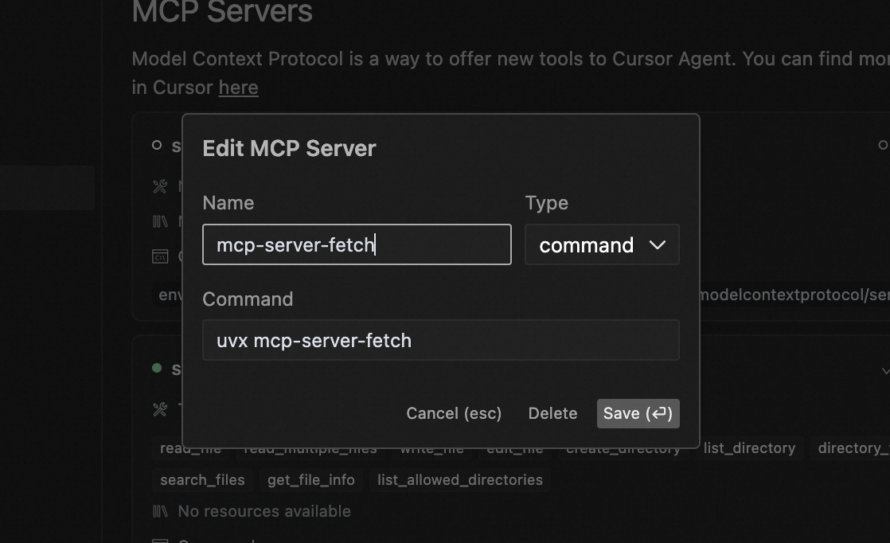
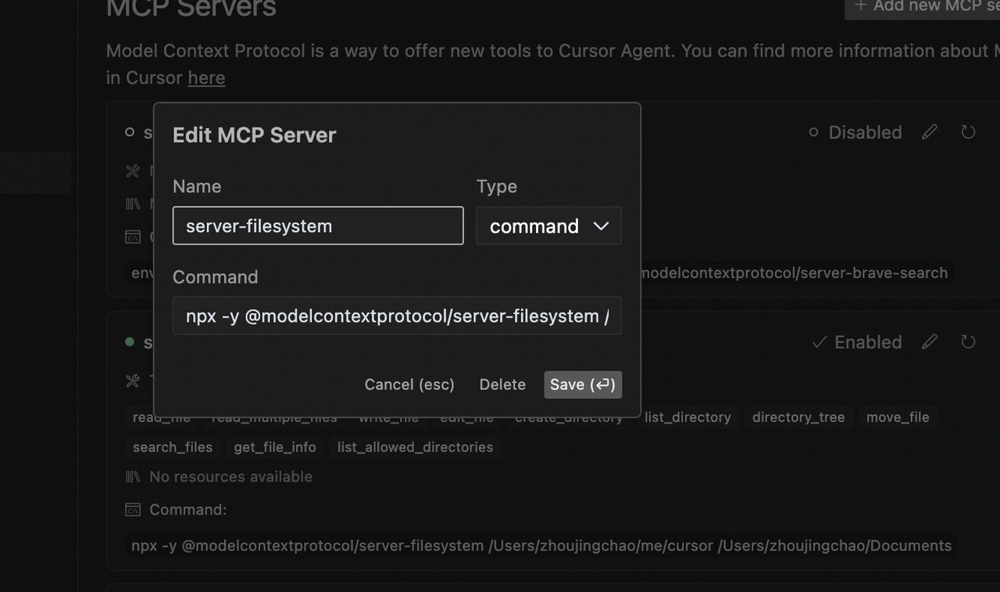

# 揭秘MCP：AI Agent的"超级连接器"如何颠覆工作流？

## MCP 是什么

全名：Model Context Protocol，**它是一种开放协议，可实现 LLM 应用程序与外部数据源和工具之间的无缝集成**。你可以将 MCP 想象成我们日常生活中的 USB-C 端口，正如 USB-C 提供了一种将设备连接到各种外围设备和配件的标准化方式一样。MCP 也提供了一种将 AI 模型连接到不同数据源和工具的标准化方式。

**简单来说它就是连接 AI 与数据世界的通用桥梁**。

## MCP 工作原理

遵循客户端-服务器架构，主机可连接多个服务器。



**MCP Client**: 希望通过 MCP 访问数据的 Claude Desktop、IDE 或 AI 工具等客户端。

**MCP Server**: 每个程序都通过标准化的 MCP 协议公开的特定功能。

**Local Data Source**: 本地数据源，MCP 服务器可以安全访问的计算机文件、数据库等服务。

**Remote Service**: 远程服务，MCP 服务器可以连接到的 Internet 上可用的外部系统（例如，通过 API）

## MCP 在 AI Agent 中扮演的角色

看了上面的工作原理，了解 GPT 的小伙伴可能要问了：“那 Function Calling 同样可以实现这样的访问功能，为什么还需要 MCP 呢？”这里就需要分析一下，Function Calling、MCP 和 AI Agent 之间的关系了，下面是墨衡的个人见解示意图：



### Function Calling 

  它是让大语言模型（比如 GPT-4）能“动手”调用外部工具或函数。比如用户问“今天杭州气温多少？”，模型会生成参数调用天气 API。

  - **单点执行**：它就像人类抬手拿水杯的动作，一次只能完成一个具体操作（比如调用计算器、发邮件）。
  - **依赖模型能力：不同模型的 Function Calling 实现方式可能不同（比如 OpenAI 和 Claude 的接口差异），需要开发者适配**。这就是最关键的问题，你说它能实现功能吧，那确实可以实现，但是无统一的标准。

### MCP

AI 的“通用插座”，它定义了 AI 如何与外部系统（文件、数据库、API）通信的规则。

  - **打破碎片化**：过去每个 AI 应用要自己写代码连数据库、调 API，而 MCP 通过统一的协议，让 AI 能像插U盘一样接入任何兼容工具。
  - **生态协作**：开发者可以共享 MCP 服务器（比如 GitHub 文件管理、天气查询服务），避免重复造轮子。

### AI Agent 
  一个能自主规划、使用工具、完成任务的大模型系统。比如用户说“帮我订一张明天杭州到上海的高铁票”，AI Agent 会分解任务：查票→选座→支付→发确认邮件

  - **规划与推理**：像人类一样拆解复杂任务（比如先查天气再推荐旅行路线）。
  - **记忆与学习**：记住用户偏好（比如上次选了靠窗座位）。
  - **工具调用**：通过 Function Calling 或 MCP 使用外部工具
  - **与 MCP 的关系**：AI Agent 是“用工具的人”，而 MCP 是“工具的说明书和连接器”。例如，当 Agent 需要调用 GitHub API 时，MCP 会告诉它：“这里有 3 种方式能操作仓库，参数格式是……”

### 打个比方

- Function Calling 是单点动作，​MCP 是通用规则，​AI Agent 是统筹指挥官。
- 类比人类：
  - Function Calling ≈ **手部动作**（拿筷子、敲键盘）；
  - MCP ≈ **神经系统**（传递信号、协调器官）；
  - AI Agent ≈ **大脑**（思考决策、长期记忆）。

## 如何颠覆你的工作流

墨衡这里拿平时用的 Cursor 来举例，还没上车 Cursor 的小伙伴，请看往期文章

### 数据库实操（mcp-server-sqlite）

[https://github.com/modelcontextprotocol/servers/tree/HEAD/src/sqlite](https://github.com/modelcontextprotocol/servers/tree/HEAD/src/sqlite)

首先安装依赖包

```
# macos
brew install uv sqlite3
```

进入终端新建 mock 数据

```
# 新建数据库
sqlite3 ~test.db

# 建表
CREATE TABLE good_items (
    商品编号 INTEGER PRIMARY KEY,
    商品名称 TEXT,
    库存数量 INTEGER,
    售价 REAL
);

# 插入数据
INSERT INTO good_items (商品名称, 库存数量, 售价) VALUES
('苹果手机', 10, 1999),
('蓝牙音响', 20, 199),
('mini无人机', 1, 29999),
('机械键盘', 30, 399),
('鼠标垫', 100, 29),
('智能手表', 400, 699);
```

进入 Cursor MCP 设置界面



```
# YOUR_USERNAME 如果不知道怎么查看，进入终端执行 whoami

uvx mcp-server-sqlite --db-path /Users/YOUR_USERNAME/test.db
```

丝滑体验自然语言写 sql。

<video width="100%" controls>
  <source src="https://zjc-blog.oss-cn-beijing.aliyuncs.com/db.mp4" type="video/mp4">
  您的浏览器不支持视频标签
</video>

### 快速复刻前端页面（figma-developer-mcp）

[https://github.com/GLips/Figma-Context-MCP](https://github.com/GLips/Figma-Context-MCP)

```
env FIGMA_API_KEY=<your-figma-api-key> npx -y figma-developer-mcp --stdio
```

your-figma-api-key 获取方式：

1、进入 Figma 官网 [https://www.figma.com/](https://www.figma.com/)，注册好账户，点击左上角头像里的设置 settings

2、切换到生成 token 的页面





连接成功后，进入你的 figma 工作界面画布



复制好上面的链接后，去 Cursor 给提示词



Accept all 后请看大屏幕，效率逆天，几乎一样😱😱😱

<video width="100%" controls>
  <source src="https://zjc-blog.oss-cn-beijing.aliyuncs.com/page.mp4" type="video/mp4">
  您的浏览器不支持视频标签
</video>

### 网页抓取（mcp-server-fetch）

[https://github.com/modelcontextprotocol/servers/tree/HEAD/src/fetch](https://github.com/modelcontextprotocol/servers/tree/HEAD/src/fetch)

需要先装命令环境

```
brew install uv
```



### 文件管理（server-filesystem）

[https://github.com/modelcontextprotocol/servers/tree/HEAD/src/filesystem](https://github.com/modelcontextprotocol/servers/tree/HEAD/src/filesystem)

```
npx -y @modelcontextprotocol/server-filesystem /Users/username/Desktop（你自己想要的文件路径，多个文件夹的话，就空格然后继续填充全局路径即可） 
```



把网页抓取和文件管理结合起来一起看，抓取网页内容存到本地。

<video width="100%" controls>
  <source src="https://zjc-blog.oss-cn-beijing.aliyuncs.com/zhua.mp4" type="video/mp4">
  您的浏览器不支持视频标签
</video>

墨衡已心服口服，眼前的实操案例，足以颠覆日常工作模式，其效果震撼至极。诸多提升效率的案例，正待家人们深入挖掘，欢迎在评论区踊跃分享学习心得。当然以上 mcp 服务不仅仅可以作用在 cursor 上，它都可以应用于那些支持 mcp 的客户端上。分享一个可查询 mcp 客户端和服务端服务的导航站：[https://www.pulsemcp.com/](https://www.pulsemcp.com/)

## 总结

MCP 正在成为 AI 应用的基础设施，让开发者能快速构建跨平台、多工具的智能体。**它将成为推动整个 AI 生态系统进化与发展的关键力量**。当 OpenAI 还在玩应用商店过家家时，大格局的人早已在构建属于未来的AI电网了。**在这算力爆炸的时代，连接的价值永远大于单体智能**。