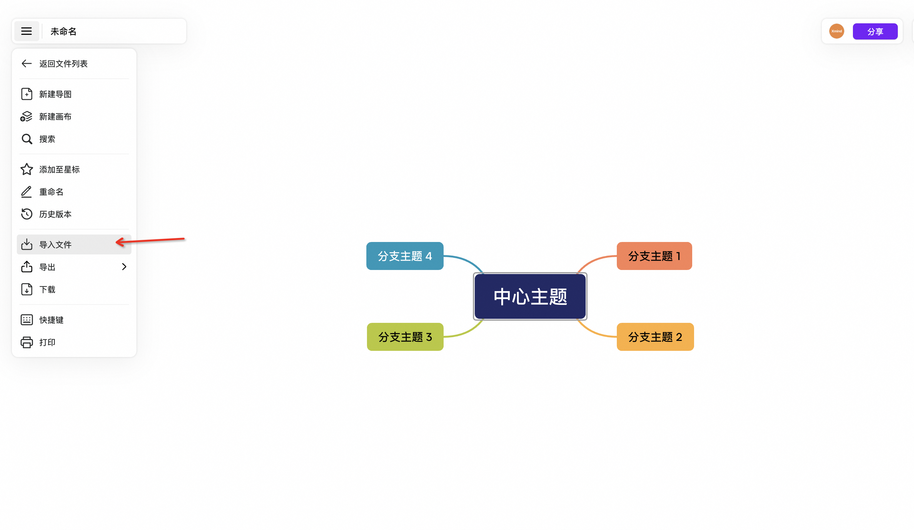

# Deepseek 四种高阶玩法，5分钟重构自己行业的工作流

大家好，我是墨衡。最近有一些小伙伴问我：“AI 编程，墨衡你倒是效率起飞了，那我们如何将 DeepSeek 融入自己的工作流呢？”

这里墨衡将分享四种高阶玩法，5分钟手把手教会你重构自己的工作流，**都是免费的**，家人们快冲。

## deepseek + kimi 制作 ppt

deepseek：https://chat.deepseek.com/

kimi：https://kimi.moonshot.cn/

在 deepseek 中上传文件，如果 deepseek 有问题，请看墨衡往期文章使用：

给出如下提示词模版（当然你也可以自己再丰富优化）：

```
# XXX都是你行业相关的内容

你是一名专业XXX人员，请根据我上传的文档，输出相对应的XXX章节和XXX内容，并以 markdown 格式输出
```

得到一份 markdown 格式的的文案，点击复制，去 kimi 填写。


进去后，把之前复制的 markdown 文案丢进去，等待填充完毕，看到结尾有“一键生成PPT”按钮。


当然如果你直接有 markdown 文档可以直接按如下操作输入即可，没有的话，就按上述步骤从 deepseek 复制过来填充。


点击”一键生成PPT“，你会看到**丰富模版和设计风格的主题**供你挑选使用。


过程中，如果不满意，**内容和模版还都可以随时修改**，快去体验吧。

## deepseek + mermaid 制作流程图

mermaid：https://mermaid.live/

将你想要生成图表的文件上传到 deepseek 中，之后使用如下提示词（可自行补充）：

```
请根据上传的文件，有条理且清晰的整理成一份流程图，以 mermaid 格式进行输出
```

这是一份我在腾讯元宝上使用 deepseek 生成的 mermaid 内容。


再丢进 mermaid 画布里进行优化编辑，得到最终你要的效果，进行导出即可。


**高效创建流程图，实时在线编辑，确保每个细节都符合你的需求**。

## deepseek + xmind 制作思维导图

xmind：https://ai.xmind.cn/

将你想要生成图表的文件继续上传到 deepseek 中，之后使用如下提示词（可自行补充）：

```
请根据上传的文件，生成一份思维导图，以 markdown 格式进行输出
```

进行复制后，将文件存到本地生成一个 .md 结尾的文件。进入 xmind 进行导入。



导入后立马得到思维导图，在线优化即可。


**轻松生成思维导图，帮助你理清思路，提升思维的条理性**。

## 秘塔 AI 搜索

秘塔：https://metaso.cn/

它的核心优势在于**实时精准搜索**与**可信答案生成**：通过全网实时检索结合自研大模型 MetaLLM ，**直接输出无广告的结构化结果**（如思维导图、学术文献溯源），并采用“搜索+AI”双引擎降低幻觉和错误风险，**兼顾效率与可靠性**。


根据用户需求自行选择，能力由低到高，简洁 -> 深入 -> 研究。

<video width="100%" controls>
  <source src="https://zjc-blog.oss-cn-beijing.aliyuncs.com/sou.mp4" type="video/mp4">
  您的浏览器不支持视频标签
</video>

## 总结

其实任何行业，都可以使用 deepseek + X 的这种模式去进化工作流，通过这些高阶玩法，还可以轻松制作视频、绘画、音乐等多种内容。家人们速速掌握这些 AI 工具，提升工作效率，解放双手。一定要去实操起来，相信你会对 AI 有更多的理解。