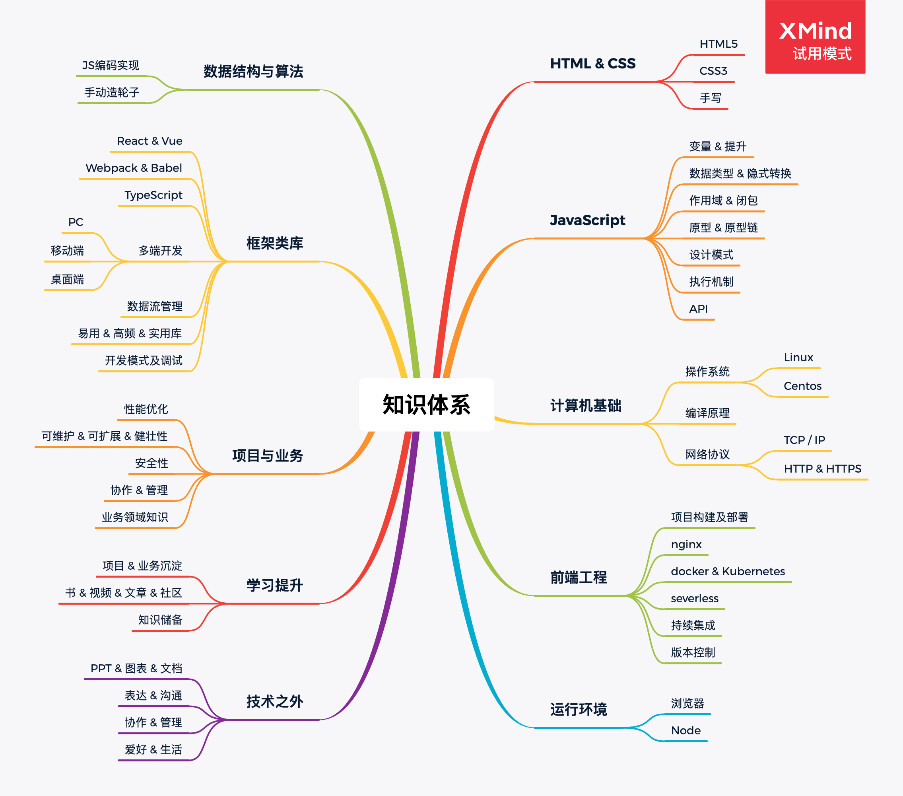

### JS进阶

* [js执行机制详解](/front-end/js/event-loop/)
* [深入理解promise](/front-end/js/promise/)
* [深入理解js原型](/front-end/js/prototype/)
* [数组扁平化](/front-end/js/flatten/)
* [节流与防抖](/front-end/js/throttle/)
* [函数柯里化](/front-end/js/curry/)
* [连续赋值的理解](/front-end/js/continuous-assignment/)
* [设计模式-工厂函数](/front-end/js/design/factory)
* [设计模式-构造函数](/front-end/js/design/constructor)
* [模拟实现call, apply, bind](/front-end/js/bind/)
* [一道经典的闭包面试题](/front-end/js/closure/)

### React深入系列

* [React函数式组件优化](/front-end/react/hooks/optimize)
* [React Hooks实现原理](/front-end/react/hooks/)
* [React v16.4的生命周期理解](/front-end/react/lifecycle/)
* [React高阶组件](/front-end/react/hoc/)
* [Redux实现原理](/front-end/react/redux/)
* [深入理解setState](/front-end/react/source/setState)
* [React任务调度](/front-end/react/source/fiber)
* [React组件的初始化与挂载](/front-end/react/source/dom)
* [React服务端渲染](/front-end/react/ssr/)
* [React虚拟DOM和Diff算法](/front-end/react/diff/)
* [React XSS注意事项](/front-end/react/xss/)
* [React的合成事件](/front-end/react/event/)

### 前端工程化

* [webpack4性能调优](/front-end/build/webpack/optimize)
* [编写webpack的自定义插件](/front-end/build/webpack/plugin)
* [webpack工作原理](/front-end/build/webpack/)
* [模块化的理解](/front-end/build/module/)
* [初识babel](/front-end/build/babel/)

### 浏览器和网络

* [深入浅出TCP协议](/front-end/net/tcp/)
* [http & http2 & https相关知识点](/front-end/net/http/)
* [Ajax工作原理](/front-end/net/ajax/)
* [浏览器输入URL到页面加载的过程](/front-end/browser/)

### 前端安全

* [前端安全CSRF && XSS](/front-end/safe/)

### 移动端

* [移动端适配方案](/front-end/mobile/rem/)
* [Hybrid App的理解与思考](/front-end/mobile/jsbridge/)

### CSS

* [认识盒模型](/front-end/css/box/)