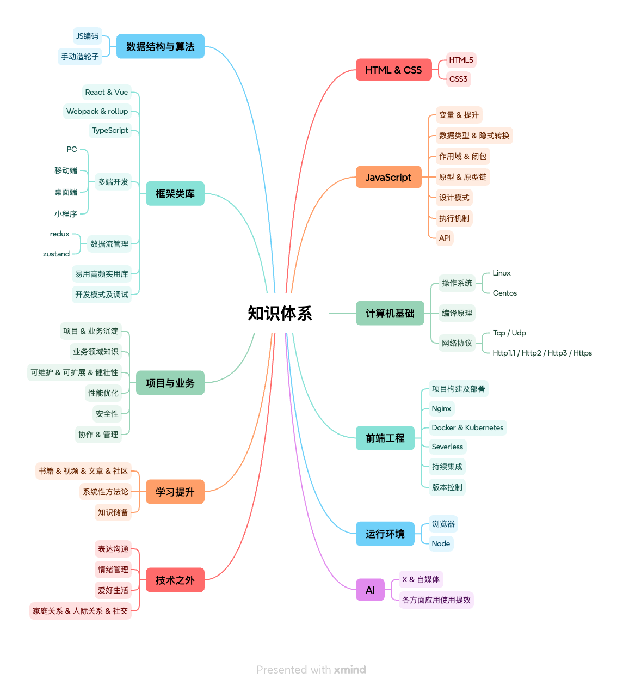

### JS 进阶

- [js 执行机制详解](/front-end/js/event-loop/)
- [深入理解 promise](/front-end/js/promise/)
- [深入理解 js 原型](/front-end/js/prototype/)
- [数组扁平化](/front-end/js/flatten/)
- [节流与防抖](/front-end/js/throttle/)
- [函数柯里化](/front-end/js/curry/)
- [连续赋值的理解](/front-end/js/continuous-assignment/)
- [设计模式-工厂函数](/front-end/js/design/factory)
- [设计模式-构造函数](/front-end/js/design/constructor)
- [模拟实现 call, apply, bind](/front-end/js/bind/)
- [一道经典的闭包面试题](/front-end/js/closure/)

### React 深入系列

- [React 函数式组件优化](/front-end/react/hooks/optimize)
- [React Hooks 实现原理](/front-end/react/hooks/)
- [React v16.4 的生命周期理解](/front-end/react/lifecycle/)
- [React 高阶组件](/front-end/react/hoc/)
- [Redux 实现原理](/front-end/react/redux/)
- [深入理解 setState](/front-end/react/source/setState)
- [React 任务调度](/front-end/react/source/fiber)
- [React 组件的初始化与挂载](/front-end/react/source/dom)
- [React 服务端渲染](/front-end/react/ssr/)
- [React 虚拟 DOM 和 Diff 算法](/front-end/react/diff/)
- [React XSS 注意事项](/front-end/react/xss/)
- [React 的合成事件](/front-end/react/event/)

### 前端工程化

- [webpack4 性能调优](/front-end/build/webpack/optimize)
- [编写 webpack 的自定义插件](/front-end/build/webpack/plugin)
- [webpack 工作原理](/front-end/build/webpack/)
- [模块化的理解](/front-end/build/module/)
- [初识 babel](/front-end/build/babel/)

### 浏览器和网络

- [深入浅出 TCP 协议](/front-end/net/tcp/)
- [http & http2 & https 相关知识点](/front-end/net/http/)
- [Ajax 工作原理](/front-end/net/ajax/)
- [浏览器输入 URL 到页面加载的过程](/front-end/browser/)

### 前端安全

- [前端安全 CSRF && XSS](/front-end/safe/)

### 移动端

- [移动端适配方案](/front-end/mobile/rem/)
- [Hybrid App 的理解与思考](/front-end/mobile/jsbridge/)

### 绘图

- [SVG 方形图实现圆角效果](/front-end/draw/radius)
- [SVG 路径动画](/front-end/draw/path)

### CSS

- [认识盒模型](/front-end/css/box/)
