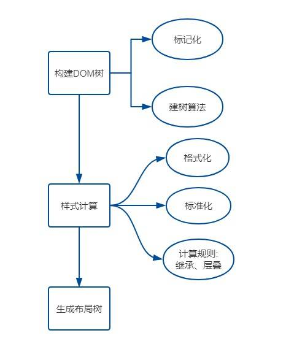

# 浏览器输入URL到页面加载的过程

我们平常输入网址到页面展现这里面究竟发生了哪些事情？

总体来说可以分为以下几个过程：

1. DNS域名解析
2. TCP连接
3. 服务器处理请求
4. 浏览器解析
5. 绘制页面

## DNS解析

DNS解析过程就是寻找哪台机器上有你需要的资源的过程。当你在浏览器中输入一个地址时，例如 `www.baidu.com`， 其实不是百度网站真正意义上的地址。互联网上每一台计算机的唯一标识是它的IP地址，由于IP地址并不方便记忆，用户更喜欢用方便记忆的网址去寻找互联网上的其他计算机，也就时上面提到的 `www.baidu.com`。所以互联网设计者需要在用户的方便性与可用性方面做一个权衡，这个权衡就是一个网址到IP地址的转换，此过程即是DNS解析。它实际上充当了一个翻译的角色，实现了网址到IP地址的转换。那么网址到IP地址转换的过程是如何进行的呢？

### 解析过程

DNS解析是一个递归查询的过程。

上述图片是查找`www.baidu.com`的IP地址过程。首先在本地域名服务器中查询IP地址，如果没有找到的情况下，本地域名服务器会向根域名服务器发送一个请求，如果根域名服务器也不存在该域名时，本地域名会向com顶级域名服务器发送一个请求，依次类推下去。直到最后本地域名服务器得到baidu的IP地址并把它缓存到本地，供下次查询使用。从上述过程中，可以看出网址的解析是一个从右向左的过程: `com` -> `baidu.com` -> `www.baidu.com`。但是你是否发现少了点什么，根域名服务器的解析过程呢？事实上，真正的网址是`www.baidu.com`.，并不是我多打了一个.，这个.对应的就是根域名服务器，默认情况下所有的网址的最后一位都是.，既然是默认情况下，为了方便用户，通常都会省略，浏览器在请求DNS的时候会自动加上，所有网址真正的解析过程为: `.` -> `.com` -> `baidu.com.` -> `www.baidu.com`.。

### DNS优化

了解了DNS的过程，可以为我们带来哪些？上文中请求到baidu的IP地址时，经历了8个步骤，这个过程中存在多个请求(扩展思考：同时存在UDP和TCP请求，为什么有两种请求方式？)。如果每次都经过这么多步骤，是否太耗时间？如何减少该过程的步骤呢？那就是DNS缓存。

#### DNS缓存

DNS存在着多级缓存，从离浏览器的距离排序的话，有以下几种: 浏览器缓存，系统缓存，路由器缓存，IPS服务器缓存，根域名服务器缓存，顶级域名服务器缓存，主域名服务器缓存。

1. 在你的`chrome`浏览器中输入: `chrome://dns/`，你可以看到`chrome`浏览器的`DNS`缓存。（现在已经访问不到这个列表了，只能`chrome://net-internals/#dns`进行清除缓存操作。）
2. 系统缓存主要存在`/etc/hosts(Linux系统)`中。
3. ...

#### DNS负载均衡

不知道大家有没有思考过一个问题: DNS返回的IP地址是否每次都一样？如果每次都一样是否说明你请求的资源都位于同一台机器上面，那么这台机器需要多高的性能和储存才能满足亿万请求呢？其实真实的互联网世界背后存在成千上百台服务器，大型的网站甚至更多。但是在用户的眼中，它需要的只是处理他的请求，哪台机器处理请求并不重要。DNS可以返回一个合适的机器的IP给用户，例如可以根据每台机器的负载量，该机器离用户地理位置的距离等等，这种过程就是DNS负载均衡，又叫做DNS重定向。大家耳熟能详的CDN(Content Delivery Network)就是利用DNS的重定向技术，DNS服务器会返回一个跟用户最接近的点的IP地址给用户，CDN节点的服务器负责响应用户的请求，提供所需的内容。

## TCP连接

TCP是互联网中的传输层协议，提供可靠的链接服务，采用三次握手确认一个连接：

1. 浏览器向服务器发送建立连接的请求。
2. 服务器接收到浏览器发送的请求后，像浏览器发送统一连接的信号。
3. 浏览器接受到服务器发出的同意连接的信号后，再次向服务器发出确认连接的信号。

当三次握手返程，TCP客户端和服务端成功的建立连接，就可以开始传输数据了。更多TCP详情请参考此[链接](/front-end/net/tcp/index)。

## 服务器处理请求

每台服务器上都会安装处理请求的应用——`Web server`。常见的`web server`产品有`apache`、`nginx`、`IIS`、`Lighttpd`等。

当web server接收到一个HTTP请求(request)，会返回一个HTTP响应(response)，例如送回一个HTML页面。对于不同用户发送的请求，会结合配置文件，把不同请求委托给服务器上处理对应请求的程序进行处理（例如CGI脚本，JSP脚本，servlets，ASP脚本，服务器端JavaScript，或者一些其它的服务器端技术等）。

无论它们(脚本)的目的如何，这些服务器端(server-side)的程序通常产生一个HTML的响应(response)来让浏览器可以浏览。

那么如何处理请求？实际上就是后台处理的工作。后台开发现在有很多框架，但大部分都还是按照[MVC设计模式](https://zh.wikipedia.org/wiki/MVC)进行搭建的。

处理过程如下图：

对于每一个用户输入的请求，首先被控制器接收，控制器决定用哪个模型来进行处理，然后模型用业务逻辑来处理用户的请求并返回数据，最后控制器确定用哪个视图模型，用相应的视图格式化模型返回html字符串给浏览器，并通过显示页面呈现给用户。

## 浏览器解析

接下来就是浏览器进行处理，通过后台处理返回的HTML字符串被浏览器接受后被一句句读取解析，html页面经历加载、解析、渲染。

### 加载

浏览器对一个html页面的加载顺序是从上而下的。如果加载过程中遇到外部css文件，浏览器另外发出一个请求，来获取css文件。遇到图片资源，浏览器也会另外发出一个请求，来获取图片资源。但是当文档加载过程中遇到js文件，html文档会挂起渲染（加载解析渲染同步）的线程，不仅要等待文档中js文件加载完毕，还要等待解析执行完毕，才可以恢复html文档的渲染线程。

### 解析

解析文档是指将文档转化成为有意义的结构，也就是可让代码理解和使用的结构。解析得到的结果通常是代表了文档结构的节点树，它称作解析树或者语法树，也就是DOM树。如下图：

涉及 HTML 解析相关算法阶段内容：
1. `标记化`：这个算法输入为HTML文本，输出为HTML标记，也成为标记生成器。其中运用有限自动状态机来完成。即在当当前状态下，接收一个或多个字符，就会更新到下一个状态。
2. `建树`：将DOM对象加入 DOM 树中，将对应标记压入存放开放(与闭合标签意思对应)元素的栈中。

css解析是指将css文件解析为样式表对象。如下图：

涉及 CSS 样式计算，它的来源一般是以下三种:
1. link标签引用
2. style标签中的样式
3. 元素的内嵌style属性

`格式化样式表`：首先，浏览器是无法直接识别 CSS 样式文本的，因此渲染引擎接收到 CSS 文本之后第一件事情就是将其转化为一个结构化的对象，即styleSheets。

`标准化样式属性`：有一些 CSS 样式的数值并不容易被渲染引擎所理解，因此需要在计算样式之前将它们标准化，如em->px,red->#ff0000,bold->700等等。

`计算每个节点的具体样式`: 继承和层叠。

js解析是文件在加载的同时也进行解析
如果想深入如何解析的话可以看[浏览器的工作原理：新式网络浏览器幕后揭秘](https://www.html5rocks.com/zh/tutorials/internals/howbrowserswork/#Parsing_general)这篇文章。

### 生成布局树
现在已经生成了DOM树和DOM样式，接下来要做的就是通过浏览器的布局系统确定元素的位置，也就是要生成一棵`布局树(Layout Tree)`。
1. 遍历生成的 DOM 树节点，并把他们添加到布局树中。
2. 计算布局树节点的坐标位置。

总结：

更多图片里的[详情内容](https://juejin.im/post/5df5bcea6fb9a016091def69?utm_source=gold_browser_extension#heading-33)参考。

## 渲染

即为构建渲染树的过程，就是将DOM树进行可视化表示。构建这棵树是为了以正确的顺序绘制文档内容。
1. 建立图层树(Layer Tree)：对特定的节点进行分层，构建一棵图层树(Layer Tree)。
2. 生成绘制列表：图层的绘制拆分成一个个绘制指令，比如先画背景、再描绘边框......然后将这些指令按顺序组合成一个待绘制列表，相当于给后面的绘制操作做了一波计划。
3. 生成图块并栅格化：现在开始绘制操作，实际上在渲染进程中绘制操作是由专门的线程来完成的，这个线程叫`合成线程`。`渲染进程`中专门维护了一个`栅格化线程池`，专门负责把`图块`转换为`位图数据`
4. 显示器显示内容: 栅格化操作完成后，合成线程会生成一个绘制命令，即"DrawQuad"，并发送给浏览器进程。无论是 PC 显示器还是手机屏幕，都有一个`固定的刷新频率`，一般是 `60 HZ`，即 60 帧，也就是一秒更新 60 张图片，一张图片停留的时间约为 16.7 ms。而每次更新的图片都来自显卡的`前缓冲区`。而显卡接收到浏览器进程传来的页面后，会合成相应的图像，并将图像保存到`后缓冲区`，然后`系统自动将前缓冲区和后缓冲区对换位置`，如此循环更新。看到这里你也就是明白，`当某个动画大量占用内存的时候，浏览器生成图像的时候会变慢，图像传送给显卡就会不及时，而显示器还是以不变的频率刷新，因此会出现卡顿，也就是明显的掉帧现象。`

总结：

更多图片里的[详情内容](https://juejin.im/post/5df5bcea6fb9a016091def69?utm_source=gold_browser_extension#heading-46)参考。

## 参考文章

> https://www.html5rocks.com/zh/tutorials/internals/howbrowserswork/#Parsing_general

> https://juejin.im/post/5df5bcea6fb9a016091def69?utm_source=gold_browser_extension#heading-46

> https://juejin.im/post/5df5bcea6fb9a016091def69?utm_source=gold_browser_extension#heading-33
