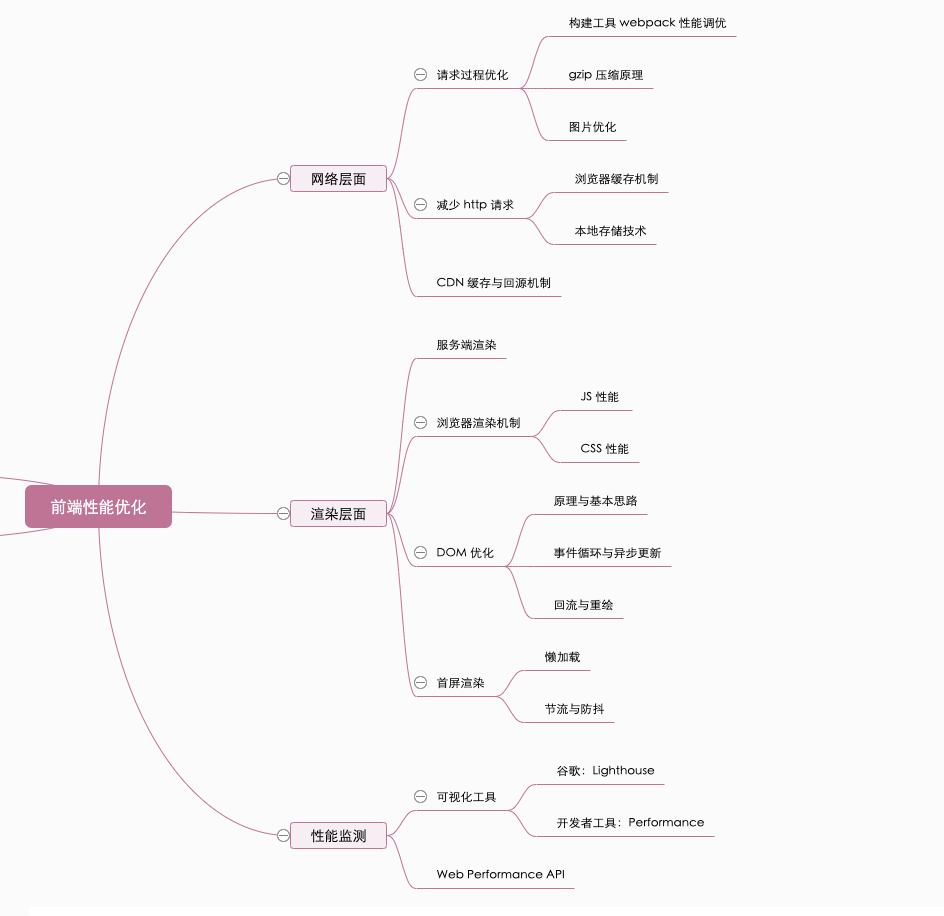
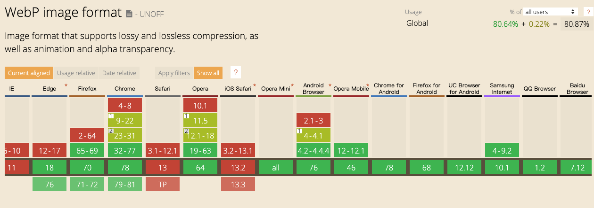
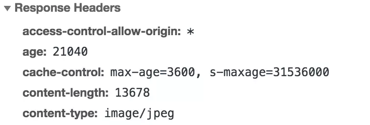
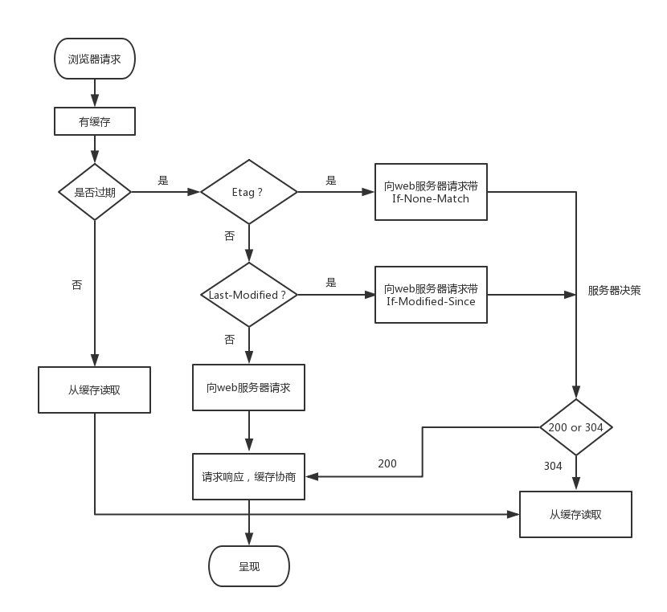
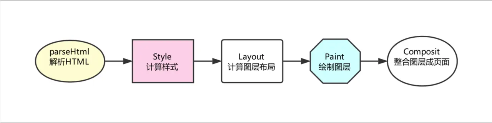
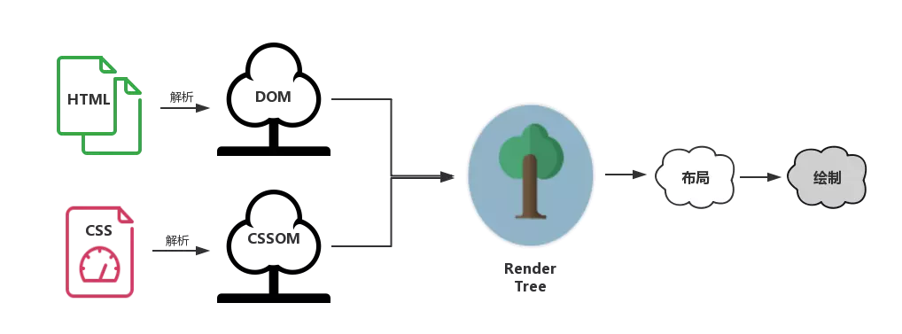

# 前端性能优化原理与实践



## 网络层面

### 请求过程优化

#### webpack 性能调优

瓶颈：

- 构建过程太花时间
- 打包结果体积太大

提速策略：

<b>1、不要让 loader 做太多事情，以 `babel-loader` 为例</b>

```js
module: {
  rules: [
    {
      test: /\.js$/,
      // 规避了对庞大的 node_modules 文件夹或者 bower_components 文件夹的转译处理
      exclude: /(node_modules|bower_components)/,
      use: {
        // loader: 'babel-loader',
        // 开启缓存将转译结果缓存至文件系统，至少可以将 babel-loader 的工作效率提升两倍
        loader: 'babel-loader?cacheDirectory=true'
        options: {
          presets: ['@babel/preset-env']
        }
      }
    }
  ]
}
```

<b>2、第三方库的打包</b>

处理第三方库的姿势有很多，其中，`Externals`不够聪明，一些情况下会引发重复打包的问题；而`CommonsChunkPlugin`每次构建时都会重新构建一次`vendor`；出于对效率的考虑，推荐`DllPlugin`。DllPlugin 是基于 Windows 动态链接库（dll）的思想被创作出来的。这个插件会把第三方库单独打包到一个文件中，这个文件就是一个单纯的依赖库。这个依赖库不会跟着你的业务代码一起被重新打包，只有当依赖自身发生版本变化时才会重新打包。

`webpack.dll.js`

```js
module.exports = {
  entry: {
    // 依赖的库数组
    vendor: [
      'prop-types',
      'babel-polyfill',
      'react',
      'react-dom',
      'react-router-dom',
    ],
  },
  output: {
    path: path.join(__dirname, 'dist'),
    filename: '[name].js',
    library: '[name]_[hash]',
  },
  plugins: [
    new webpack.DllPlugin({
      // DllPlugin的name属性需要和libary保持一致
      name: '[name]_[hash]',
      path: path.join(__dirname, 'dist', '[name]-manifest.json'),
      // context需要和webpack.config.js保持一致
      context: __dirname,
    }),
  ],
};
```

打包完得到

1. `vendor-manifest.json`：用于描述每个第三方库对应的具体路径
2. `vendor.js`：第三方库打包的结果

`webpack.config.js`

```js
module.exports = {
  mode: 'production',
  // 编译入口
  entry: {
    main: 'index.js',
  },
  // 目标文件
  output: {
    path: path.join(__dirname, 'dist/'),
    filename: '[name].js',
  },
  // dll相关配置
  plugins: [
    new webpack.DllReferencePlugin({
      context: __dirname,
      // manifest就是我们第一步中打包出来的json文件
      manifest: require('./dist/vendor-manifest.json'),
    }),
  ],
};
```

<b>3、Happypack</b>

将 loader 由单进程转为多进程，并发执行提高打包效率

```js
const HappyPack = require('happypack')
const os = require('os')
// 手动创建进程池
const happyThreadPool =  HappyPack.ThreadPool({ size: os.cpus().length })

module.exports = {
  module: {
    rules: [
      ...
      {
        test: /\.js$/,
        // 问号后面的查询参数指定了处理这类文件的HappyPack实例的名字
        loader: 'happypack/loader?id=happyBabel',
        ...
      },
    ],
  },
  plugins: [
    ...
    new HappyPack({
      // 这个HappyPack的“名字”就叫做happyBabel，和楼上的查询参数遥相呼应
      id: 'happyBabel',
      // 指定进程池
      threadPool: happyThreadPool,
      loaders: ['babel-loader?cacheDirectory']
    })
  ],
}
```

<b>4、[webpack-bundle-analyzer](https://www.npmjs.com/package/webpack-bundle-analyzer)</b>

可视化构建结果分析体积过大的原因

```js
const BundleAnalyzerPlugin = require('webpack-bundle-analyzer')
  .BundleAnalyzerPlugin;

module.exports = {
  plugins: [new BundleAnalyzerPlugin()],
};
```

<b>5、删除冗余代码</b>

```js
const UglifyJsPlugin = require('uglifyjs-webpack-plugin');
module.exports = {
  plugins: [
    new UglifyJsPlugin({
      // 允许并发
      parallel: true,
      // 开启缓存
      cache: true,
      compress: {
        // 删除所有的console语句
        drop_console: true,
        // 把使用多次的静态值自动定义为变量
        reduce_vars: true,
      },
      output: {
        // 不保留注释
        comment: false,
        // 使输出的代码尽可能紧凑
        beautify: false,
      },
    }),
  ],
};
```

这段手动引入`UglifyJsPlugin`的代码其实是`webpack3`的用法，`webpack4`现在已经默认使用`uglifyjs-webpack-plugin`对代码做压缩了——在`webpack4`中，是通过配置`optimization.minimize`与`optimization.minimizer`来自定义压缩相关的操作的。

<b>6、路由按需加载</b>

#### Gzip 压缩原理

客户端请求头添加`accept-encoding:gzip`。
Gzip 是高效的，压缩后通常能帮我们减少响应 70% 左右的大小。
但它并非万能。Gzip 并不保证针对每一个文件的压缩都会使其变小。
Gzip 压缩背后的原理，是在一个文本文件中找出一些重复出现的字符串、临时替换它们，从而使整个文件变小。根据这个原理，文件中代码的重复率越高，那么压缩的效率就越高，使用 Gzip 的收益也就越大。反之亦然。

#### 图片优化

[HTTP-Archive](https://httparchive.org/reports/page-weight#bytesTotal)：定期抓取 Web 上的站点，并记录资源的加载情况、Web API 的使用情况等页面的详细信息。

<b>1、二进制位数与色彩的关系</b>

在计算机中，像素用二进制数来表示。不同的图片格式中像素与二进制位数之间的对应关系是不同的。一个像素对应的二进制位数越多，它可以表示的颜色种类就越多，成像效果也就越细腻，文件体积相应也会越大。
一个二进制位表示两种颜色（0|1 对应黑|白），如果一种图片格式对应的二进制位数有 n 个，那么它就可以呈现 2^n 种颜色。

<b>2、JPEG/JPG</b>

特点：有损压缩、体积小、加载快。

压缩至原有体积 50%以下时，仍然可以保持住 60%的品质，格式以 24 位存储单个图，可呈现 1600 万种颜色。

使用场景：大背景图、轮播图和 Banner 图。

缺陷：处理矢量图形和 Logo 等线条感强，颜色对比强烈时，模糊就会相当明显，不支持透明度处理。

<b>3、PNG-8 与 PNG-24</b>

特点：无损压缩、质量高、支持透明。

更强的色彩表现力，对线条的处理更加细腻。

使用场景：各种 Logo。

缺陷：体积大。

<b>4、SVG</b>

特点：与 png 和 jpg 相比，文件体积更小，可压缩性更强，无限放大不失真，文本文件比较灵活。

缺陷：渲染成本高，编程学习成本。

<b>5、Base64</b>

特点：雪碧图、小图标解决方案、文本文件、依赖编码。

是一种传输 8Bit 字节码的编码方式，通过图片 Base64 编码，可以直接将编码结果写入 HTML 或者 CSS，减少 HTTP 请求的次数。

使用场景：

- 图片的实际尺寸很小，非常小的 Logo。
- 图片无法以雪碧图的形式与其它小图结合（合成雪碧图主要减少 HTTP 请求的途径，Base64 是雪碧图的补充）图片的更新频率非常低（不需重复编码和修改文件内容，维护成本较低）。

编码工具推荐：[url-loader](https://github.com/webpack-contrib/url-loader)

<b>6、Webp</b>

特点：

> 与 PNG 相比，WebP 无损图像的尺寸缩小了 26％。在等效的 SSIM 质量指数下，WebP 有损图像比同类 JPEG 图像小 25-34％。 无损 WebP 支持透明度（也称为 alpha 通道），仅需 22％ 的额外字节。对于有损 RGB 压缩可接受的情况，有损 WebP 也支持透明度，与 PNG 相比，通常提供 3 倍的文件大小。

使用场景：

- 前端：xxx.png.jpg\_.webp，浏览器来识别是否支持。
- 后端：交给后端来判断，当 Accept 字段包含 image/webp 时，就返回 WebP 格式的图片，否则返回原图。这种做法的好处是，当浏览器对 WebP 格式图片的兼容支持发生改变时，我们也不用再去更新自己的兼容判定代码，只需要服务端像往常一样对 Accept 字段进行检查即可。

缺陷：截止 2019-11-14 日，兼容性如下

WebP 还会增加服务器的负担——和编码 JPG 文件相比，编码同样质量的 WebP 文件会占用更多的计算资源。

### 减少 http 请求

#### 浏览器缓存机制

缓存可以减少网络 IO 消耗，提高访问速度。chrome 官方解释：

> 通过网络获取内容既速度缓慢又开销巨大。较大的响应需要在客户端与服务器之间进行多次往返通信，这会延迟浏览器获得和处理内容的时间，还会增加访问者的流量费用。因此，缓存并重复利用之前获取的资源的能力成为性能优化的一个关键方面。

浏览器缓存机制有四个方面，它们按照获取资源时请求的优先级依次排列如下：

1. Memory Cache
2. Service Worker Cache
3. HTTP Cache
4. Push Cache

HTTP 缓存是最主要、最具有代表性的缓存策略。我们先讲讲`HTTP Cache`。

<b>HTTP Cache</b>

`Cache` 它又分为强缓存和协商缓存，当强缓存命中失败时，才会走协商缓存。
强缓存利用 http 请求头中的 `Expires` 和 `Cache-Control` 两个字段来控制。当服务端返回资源时会在返回头中记录 `Expires` 的值，它是时间戳，在客户端再次请求时，浏览器会比对本地时间和 `Expires` 设定的时间，如果小于，则会走缓存读取资源。

这里不难看出，这太过于依赖当前“本地时间”，客户端时间被篡改，`Expires` 就无法达到我们的预期。
因此，考虑到 `expires` 的局限性，`HTTP1.1` 新增了 `Cache-Control` 字段来完成 `expires` 的任务。
`expires` 能做的事情，`Cache-Control` 都能做；`expires` 完成不了的事情，`Cache-Control` 也能做。因此，`Cache-Control` 可以视作是 `expires` 的完全替代方案。我们继续使用 `expires` 的唯一目的就是向下兼容。现在我们给 `Cache-Control` 字段一个特写：

```js
cache-control: max-age=31536000
```

在 `Cache-Control` 中，我们通过 `max-age` 来控制资源的有效期。`max-age` 不是一个时间戳，而是一个时间长度。在本例中，`max-age` 是 31536000 秒，它意味着该资源在 31536000 秒以内都是有效的，完美地规避了时间戳带来的潜在问题。

`Cache-Control` 相对于 `expires` 更加准确，它的优先级也更高。当 `Cache-Control` 与 `expires` 同时出现时，我们以 `Cache-Control` 为准。

`Cache-Control` 的神通，可不止于这一个小小的 `max-age`。如下的用法也非常常见：

```js
cache-control: max-age=3600, s-maxage=31536000
```

`s-maxage` 优先级高于 `max-age`，两者同时出现时，优先考虑 `s-maxage`。如果 `s-maxage` 未过期，则向代理服务器请求其缓存内容。`s-maxage`仅在代理服务器中生效，客户端中我们只考虑`max-age`。

在依赖各种代理的大型架构中，我们不得不考虑代理服务器的缓存问题。`s-maxage` 就是用于表示 `cache` 服务器上（比如 cache CDN）的缓存的有效时间的，并只对 `public` 缓存有效。

`public` 与 `private` 是针对资源是否能够被代理服务缓存而存在的一组对立概念。

如果我们为资源设置了 `public`，那么它既可以被浏览器缓存，也可以被代理服务器缓存；如果我们设置了 `private`，则该资源只能被浏览器缓存。`private` 为默认值。但多数情况下，`public` 并不需要我们手动设置，比如有很多线上网站的 `cache-control` 是这样的：



设置了 `s-maxage`，没设置 `public`，那么 `CDN` 还可以缓存这个资源吗？答案是肯定的。因为明确的缓存信息（例如“max-age”）已表示响应是可以缓存的。

`no-cache` 绕开了浏览器：我们为资源设置了 no-cache 后，每一次发起请求都不会再去询问浏览器的缓存情况，而是直接向服务端去确认该资源是否过期（即走我们下文即将讲解的协商缓存的路线）。

`no-store` 比较绝情，顾名思义就是不使用任何缓存策略。在 no-cache 的基础上，它连服务端的缓存确认也绕开了，只允许你直接向服务端发送请求、并下载完整的响应。

协商缓存：浏览器与服务器合作之下的缓存策略.

协商缓存机制下，浏览器需要向服务器去询问缓存的相关信息，进而判断是重新发起请求、下载完整的响应，还是从本地获取缓存的资源。

如果服务端提示缓存资源未改动（Not Modified），资源会被重定向到浏览器缓存，这种情况下网络请求对应的状态码是 304。



<b>Memory Cache</b>

是指存在内存中的缓存。从优先级上来说，它是浏览器最先尝试去命中的一种缓存。从效率上来说，它是响应速度最快的一种缓存。

内存缓存是快的，也是“短命”的。它和渲染进程“生死相依”，当进程结束后，也就是 tab 关闭以后，内存里的数据也将不复存在。

事实上，这个划分规则，一直以来是没有定论的。不过想想也可以理解，内存是有限的，很多时候需要先考虑即时呈现的内存余量，再根据具体的情况决定分配给内存和磁盘的资源量的比重——资源存放的位置具有一定的随机性。

<b>Service Worker Cache</b>

是一种独立于主线程之外的 Javascript 线程。它脱离于浏览器窗体，因此无法直接访问 DOM。这样独立的个性使得 Service Worker 的“个人行为”无法干扰页面的性能，这个“幕后工作者”可以帮我们实现离线缓存、消息推送和网络代理等功能。我们借助 Service worker 实现的离线缓存就称为 Service Worker Cache。
Service Worker 的生命周期包括 install、active、working 三个阶段。一旦 Service Worker 被 install，它将始终存在，只会在 active 与 working 之间切换，除非我们主动终止它。这是它可以用来实现离线存储的重要先决条件。<b>Server Worker 对协议是有要求的，必须以 https 协议为前提。</b>

<b>Push Cache</b>

Push Cache 是指 HTTP2 在 server push 阶段存在的缓存。

Push Cache 是缓存的最后一道防线。浏览器只有在 Memory Cache、HTTP Cache 和 Service Worker Cache 均未命中的情况下才会去询问 Push Cache。

Push Cache 是一种存在于会话阶段的缓存，当 session 终止时，缓存也随之释放。

不同的页面只要共享了同一个 HTTP2 连接，那么它们就可以共享同一个 Push Cache。

更多内容：[HTTP/2 push is tougher than I thought](https://jakearchibald.com/2017/h2-push-tougher-than-i-thought/)

#### 本地存储机制

<b>cookie</b>

键值对存在，不大只有 4kb 的量，紧跟域名

<b>web storage</b>

- session storage：临时性的本地存储，是会话级别的存储，当会话结束（页面被关闭）时，存储内容也随之被释放。即便是相同域名下的两个页面，只要它们不在同一个浏览器窗口中打开，那么它们的 Session Storage 内容也是无法共享的。
- local storage：持久化的本地存储，存储在其中的数据是永远不会过期的，使其消失的唯一办法是手动删除。
  存储容量可以达到 5-10M 之间。

<b>IndexedDB</b>

是一个运行在浏览器上的非关系型数据库。既然是数据库了，那就不是 5M、10M 这样小打小闹级别了。理论上来说，IndexedDB 是没有存储上限的（一般来说不会小于 250M）。它不仅可以存储字符串，还可以存储二进制数据。

#### CDN 缓存和回源

> CDN （Content Delivery Network，即内容分发网络）指的是一组分布在各个地区的服务器。这些服务器存储着数据的副本，因此服务器可以根据哪些服务器与用户距离最近，来满足数据的请求。 CDN 提供快速服务，较少受高流量影响。

“缓存”就是说我们把资源 copy 一份到 CDN 服务器上这个过程，“回源”就是说 CDN 发现自己没有这个资源（一般是缓存的数据过期了），转头向根服务器（或者它的上层服务器）去要这个资源的过程。

## 渲染层面

### 服务端渲染

所见即所得，服务端返回的字符串里包含了所有的内容。他可以帮我们解决首屏加载速度过慢的问题和 SEO 的问题。

### 浏览器渲染

浏览器内核决定了浏览器解释网页语法的方式，所以不同浏览器下代码渲染效果会有差异。目前市面上常见的浏览器内核可以分为这四种：Trident（IE）、Gecko（火狐）、Blink（Chrome、Opera）、Webkit（Safari）。
下面我们就以当下霸主 Webkit 为例，对现代浏览器的渲染过程进行一个深度的剖析。
什么是渲染过程？简单来说，渲染引擎根据 HTML 文件描述构建相应的数学模型，调用浏览器各个零部件，从而将网页资源代码转换为图像结果，这个过程就是渲染过程（如下图）。


- HTML 解释器：将 HTML 文档经过词法分析输出 DOM 树。
- CSS 解释器：解析 CSS 文档, 生成样式规则。
- 图层布局计算模块：布局计算每个对象的精确位置和大小。
- 视图绘制模块：进行具体节点的图像绘制，将像素渲染到屏幕上。
- JavaScript 引擎：编译执行 Javascript 代码。

有了对零部件的了解打底，我们就可以一起来走一遍浏览器的渲染流程了。在浏览器里，每一个页面的首次渲染都经历了如下阶段（图中箭头不代表串行，有一些操作是并行进行的，下文会说明）：



• 解析 HTML

在这一步浏览器执行了所有的加载解析逻辑，在解析 HTML 的过程中发出了页面渲染所需的各种外部资源请求。

• 计算样式

浏览器将识别并加载所有的 CSS 样式信息与 DOM 树合并，最终生成页面 render 树（:after :before 这样的伪元素会在这个环节被构建到 DOM 树中）。

• 计算图层布局

页面中所有元素的相对位置信息，大小等信息均在这一步得到计算。

• 绘制图层

在这一步中浏览器会根据我们的 DOM 代码结果，把每一个页面图层转换为像素，并对所有的媒体文件进行解码。

• 整合图层，得到页面

最后一步浏览器会合并合各个图层，将数据由 CPU 输出给 GPU 最终绘制在屏幕上。（复杂的视图层会给这个阶段的 GPU 计算带来一些压力，在实际应用中为了优化动画性能，我们有时会手动区分不同的图层）。

为了使渲染过程更明晰一些，我们需要给这些”树“们一个特写:



- DOM 树：解析 HTML 以创建的是 DOM 树（DOM tree ）：渲染引擎开始解析 HTML 文档，转换树中的标签到 DOM 节点，它被称为“内容树”。
- CSSOM 树：解析 CSS（包括外部 CSS 文件和样式元素）创建的是 CSSOM 树。CSSOM 的解析过程与 DOM 的解析过程是并行的。
- 渲染树：CSSOM 与 DOM 结合，之后我们得到的就是渲染树（Render tree ）。
- 布局渲染树：从根节点递归调用，计算每一个元素的大小、位置等，给每个节点所应该出现在屏幕上的精确坐标，我们便得到了基于渲染树的布局渲染树（Layout of the render tree）。
- 绘制渲染树: 遍历渲染树，每个节点将使用 UI 后端层来绘制。整个过程叫做绘制渲染树（Painting the render tree）。

渲染过程说白了，首先是基于 HTML 构建一个 DOM 树，这棵 DOM 树与 CSS 解释器解析出的 CSSOM 相结合，就有了布局渲染树。最后浏览器以布局渲染树为蓝本，去计算布局并绘制图像，我们页面的初次渲染就大功告成了。之后每当一个新元素加入到这个 DOM 树当中，浏览器便会通过 CSS 引擎查遍 CSS 样式表，找到符合该元素的样式规则应用到这个元素上，然后再重新去绘制它。

查表是个花时间的活，我怎么让浏览器的查询工作又快又好地实现呢？OK，讲了这么多原理，我们终于引出了我们的第一个可转化为代码的优化点——CSS 样式表规则的优化！

<b>CSS 选择符是从右到左进行匹配的</b>

好的 CSS 选择器书写习惯，可以为我们带来非常可观的性能提升。根据上面的分析，我们至少可以总结出如下性能提升的方案：

- 避免使用通配符，只对需要用到的元素进行选择。
- 关注可以通过继承实现的属性，避免重复匹配重复定义。
- 减少嵌套。后代选择器的开销是最高的，因此我们应该尽量将选择器的深度降到最低（最高不要超过三层），尽可能使用类来关联每一个标签元素。
- 不要画蛇添足，id 和 class 选择器不应该被多余的标签选择器拖后腿。
- 少用标签选择器。如果可以，用类选择器替代，举个 🌰：

错误示范：

```css
#myList li {}
```

课代表：

```css
.myList_li {}
```

HTML、CSS 和 JS，都具有<b>阻塞渲染</b>的特性。

CSS 是阻塞渲染的资源。需要将它尽早、尽快地下载到客户端，以便缩短首次渲染的时间。
事实上，现在很多团队都已经做到了尽早（将 CSS 放在 head 标签里）和尽快（启用 CDN 实现静态资源加载速度的优化）。这个“把 CSS 往前放”的动作，对很多同学来说已经内化为一种编码习惯。那么现在我们还应该知道，这个“习惯”不是空穴来风，它是由 CSS 的特性决定的。

<b>JS 引擎是独立于渲染引擎存在的。</b>我们的 JS 代码在文档的何处插入，就在何处执行。当 HTML 解析器遇到一个 script 标签时，它会暂停渲染过程，将控制权交给 JS 引擎。JS 引擎对内联的 JS 代码会直接执行，对外部 JS 文件还要先获取到脚本、再进行执行。等 JS 引擎运行完毕，浏览器又会把控制权还给渲染引擎，继续 CSSOM 和 DOM 的构建。 因此与其说是 JS 把 CSS 和 HTML 阻塞了，不如说是 JS 引擎抢走了渲染引擎的控制权。

三种加载方式：

- 正常模式

```html
<script src="index.js"></script>
```

这种情况下 JS 会阻塞浏览器，浏览器必须等待 index.js 加载和执行完毕才能去做其它事情。

- async 模式：

```html
<script async src="index.js"></script>
```

async 模式下，JS 不会阻塞浏览器做任何其它的事情。它的加载是异步的，当它加载结束，JS 脚本会立即执行。

- defer 模式：

```html
<script defer src="index.js"></script>
```

defer 模式下，JS 的加载是异步的，执行是被推迟的。等整个文档解析完成、DOMContentLoaded 事件即将被触发时，被标记了 defer 的 JS 文件才会开始依次执行。

从应用的角度来说，一般当我们的脚本与 DOM 元素和其它脚本之间的依赖关系不强时，我们会选用 async；当脚本依赖于 DOM 元素和其它脚本的执行结果时，我们会选用 defer。

通过审时度势地向 script 标签添加 async/defer，我们就可以告诉浏览器在等待脚本可用期间不阻止其它的工作，这样可以显著提升性能。

### DOM 优化

> 把 DOM 和 JavaScript 各自想象成一个岛屿，它们之间用收费桥梁连接。——《高性能 JavaScript》

JS 是很快的，在 JS 中修改 DOM 对象也是很快的。在 JS 的世界里，一切是简单的、迅速的。但 DOM 操作并非 JS 一个人的独舞，而是两个模块之间的协作。

之前有提到，JS 引擎和渲染引擎（浏览器内核）是独立实现的。当我们用 JS 去操作 DOM 时，本质上是 JS 引擎和渲染引擎之间进行了“跨界交流”。这个“跨界交流”的实现并不简单，它依赖了桥接接口作为“桥梁”（如下图）。


过“桥”要收费——这个开销本身就是不可忽略的。我们每操作一次 DOM（不管是为了修改还是仅仅为了访问其值），都要过一次“桥”。过“桥”的次数一多，就会产生比较明显的性能问题。因此“减少 DOM 操作”的建议，并非空穴来风。

很多时候，我们对 DOM 的操作都不会局限于访问，而是为了修改它。当我们对 DOM 的修改会引发它外观（样式）上的改变时，就会触发回流或重绘。

- 回流：当我们对 DOM 的修改引发了 DOM 几何尺寸的变化（比如修改元素的宽、高或隐藏元素等）时，浏览器需要重新计算元素的几何属性（其他元素的几何属性和位置也会因此受到影响），然后再将计算的结果绘制出来。这个过程就是回流（也叫重排）。
- 重绘：当我们对 DOM 的修改导致了样式的变化、却并未影响其几何属性（比如修改了颜色或背景色）时，浏览器不需重新计算元素的几何属性、直接为该元素绘制新的样式。这个过程叫做重绘。

所以代码优化，少读取 dom 操作。

### 首屏优化

懒加载：滑动元素，当元素进入可视区域，再加载资源。滚动监听属于高频操作，注意防抖或者节流。

## 性能监测

performance，lighthouse......
