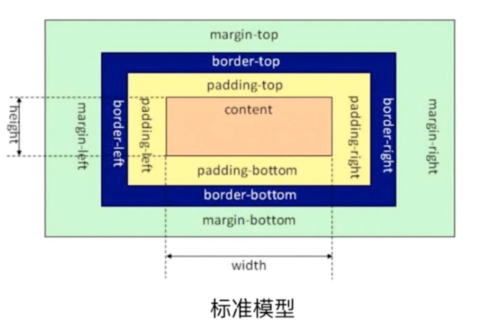
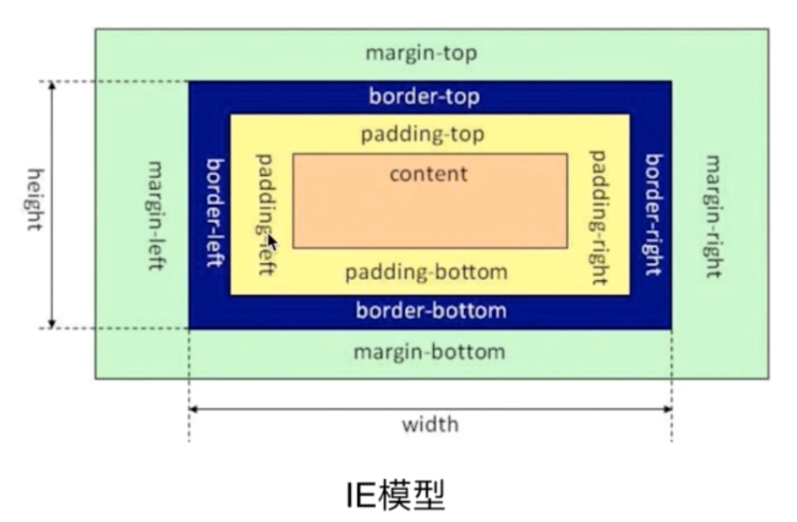
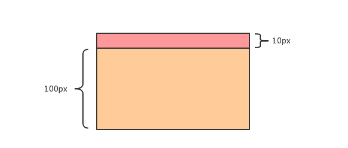
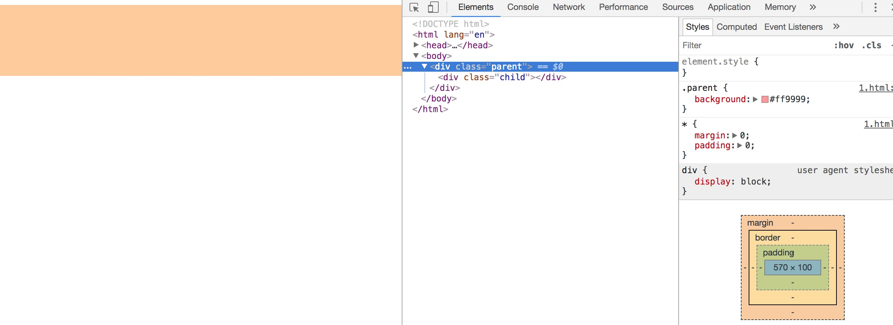
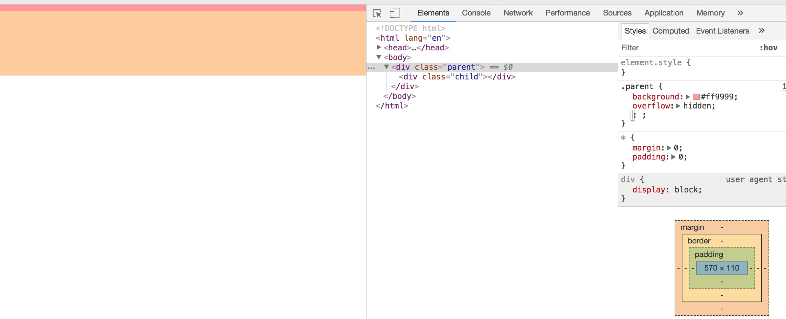
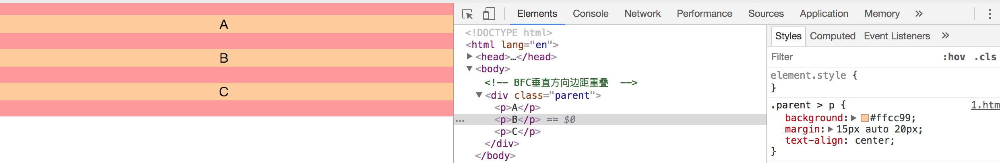
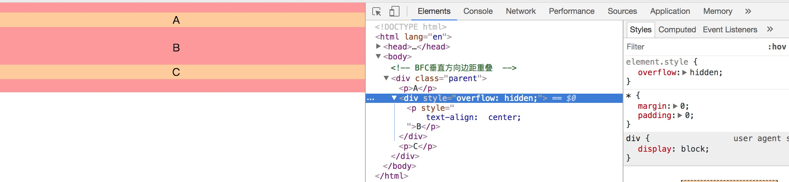
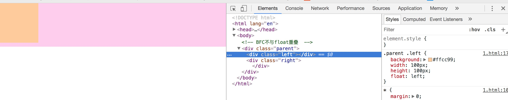
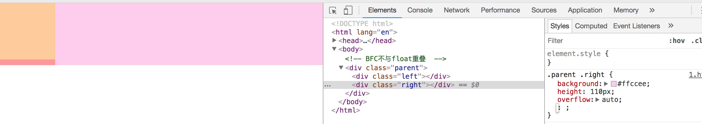

# 认识盒模型
## 前言

CSS是前端工程师绕不开的话题，呈现在人们眼前的网页布局，可都离不开它的功劳。

今天我们就来探讨一下对CSS盒模型的认识。

## 何为CSS盒模型

网页设计中常听的属性名：内容(content)、填充(padding)、边框(border)、边界(margin)， CSS盒子模式都具备这些属性。
这些属性我们可以用日常生活中的常见事物——盒子作一个比喻来理解，所以叫它盒子模式。
CSS盒子模型就是在网页设计中经常用到的CSS技术所使用的一种思维模型。

## 基本概念

浏览器解析CSS有两种模式：`标准模式(strict mode)` 和 `怪异模式(quirks mode)`。因此就产生了两种盒模型 `标准盒模型` 和 `IE盒模型`。

标准模式：浏览器按W3C标准解析执行代码。示意图如下：



怪异模式：使用浏览器自己的方式解析执行代码，因为不同浏览器解析执行的方式不一样，所以称之为怪异模式。示意图如下：



浏览器解析时使用标准模式还是怪异模式，与网页中的DTD（Document Type Defination）声明直接相关，DTD声明定义了标准文档的类型（标准模式解析）文档类型，会使浏览器使用相关的方式加载网页并显示，**忽略DTD声明，将使网页进入怪异模式**。

当然也可以通过css来设置盒模型：
box-sizing: content-box;
box-sizing: border-box;
前者就是标准模型，后者是IE模型。

## JS如何获取盒模型的宽和高

dom为html里获取到的节点
1. dom.style.width/height，通过dom节点的style属性拿到
2. dom.currentStyle.width/height，浏览器渲染后的宽高，仅IE支持
3. window.getComputedStyle(dom).width/height，原理同第二条，兼容第二种写法
4. dom.getBoundingClientRect().width/height，用与计算元素的绝对位置，也能拿到宽高

## 盒模型的边距重叠



假如这里有两个元素，子元素高度100px，margin-top为10px，那么它的父元素高度是多少呢？这里我暂时先不给答案，后面再给。

```html
<!DOCTYPE html>
<html lang="en">
<head>
  <meta charset="UTF-8">
  <meta name="viewport" content="width=device-width, initial-scale=1.0">
  <meta http-equiv="X-UA-Compatible" content="ie=edge">
  <title>Document</title>
  <style>
    * {
      margin: 0;
      padding: 0;
    }
    .parent {
      background: #ff9999;
    }
    .child {
      background: #ffcc99;
      height: 100px;
      margin-top: 10px;
    }
  </style>
</head>
<body>
  <div class="parent">
    <div class="child"></div>
  </div>
</body>
</html>
```



可以看到父元素是100px，是吧，嗯，没毛病。
接着在父元素parent上加上 `overflow: hidden` 属性我们再看看效果



父元素是不是变成110px了，嗯？，你接着说，我在听...
这是为什么呢？其实给父级加了 `overflow: hidden` 即给这个元素创建了 `BFC`。

## BFC

那么什么是 BFC 呢？
BFC 即 Block Formatting Contexts (块级格式化上下文)
**具有 BFC 特性的元素可以看作是隔离了的独立容器，容器里面的元素不会在布局上影响到外面的元素，并且 BFC 具有普通容器所没有的一些特性**
通俗一点来讲，可以把 BFC 理解为一个封闭的大箱子，箱子内部的元素无论如何翻江倒海，都不会影响到外部。

只要元素满足下面任一条件即可触发 BFC 特性：

1. body 根元素
2. 浮动元素：float 除 none 以外的值
3. 绝对定位元素：position (absolute、fixed)
4. display 为 inline-block、table-cells、flex
5. overflow 除了 visible 以外的值 (hidden、auto、scroll)

```html
<!DOCTYPE html>
<html lang="en">
<head>
  <meta charset="UTF-8">
  <meta name="viewport" content="width=device-width, initial-scale=1.0">
  <meta http-equiv="X-UA-Compatible" content="ie=edge">
  <title>Document</title>
  <style>
    * {
      margin: 0;
      padding: 0;
    }
    .parent {
      background: #ff9999;
      overflow: hidden;
    }
    .parent > p {
      background: #ffcc99;
      margin: 5px auto 20px;
      text-align: center;
    }
  </style>
</head>
<body>
  <!-- BFC垂直方向边距重叠  -->
  <div class="parent">
    <p>A</p>
    <p>B</p>
    <p>C</p>
  </div>
</body>
</html>
```



是不是可以发现 B 的上边距和 A 的下边距发生了重叠，按照重叠原则会取最大的像素即时如上20px。
那么要如何解决这个呢，不让他们重叠，那就是给元素创建 BFC。

```html
<body>
  <!-- BFC垂直方向边距重叠  -->
  <div class="parent">
    <p>A</p>
    <div style="overflow: hidden;">
      <p>B</p>
    </div>
    <p>C</p>
  </div>
</body>
```



相信到这里，大家已经对 BFC 有个理解了吧。
下面我们就创建一个 BFC 上有关布局的应用便于加深印象

```html
<!DOCTYPE html>
<html lang="en">

<head>
  <meta charset="UTF-8">
  <meta name="viewport" content="width=device-width, initial-scale=1.0">
  <meta http-equiv="X-UA-Compatible" content="ie=edge">
  <title>Document</title>
  <style>
    * {
      margin: 0;
      padding: 0;
    }

    .parent {
      background: #ff9999;
    }

    .parent .left {
      background: #ffcc99;
      width: 100px;
      height: 100px;
      float: left;
    }

    .parent .right {
      background: #ffccee;
      height: 110px;
    }
  </style>
</head>

<body>
  <!-- BFC不与float重叠  -->
  <div class="parent">
    <div class="left"></div>
    <div class="right"></div>
  </div>
</body>

</html>
```



给 `.right` 加上 `overflow: hidden` 类似于清除浮动的操作，在这里就不多描述了，对清除浮动不熟悉的童鞋 [请往这里走](https://blog.csdn.net/promisecao/article/details/52771856)



是不是发现 BFC 元素不与 float 元素相重叠了。

好了，说了这么多，希望小伙伴们对 CSS盒模型 有个了解和认识，有讲得不对的地方希望各位童鞋多多指正，共同进步。

