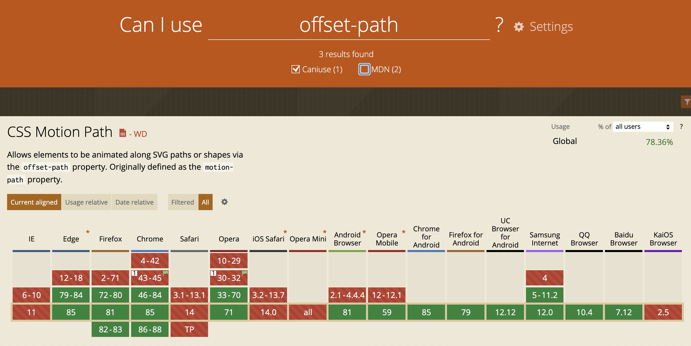

# SVG 路径动画

## CSS 实现

<iframe width="100%" height="500" src="https://codepen.io/zhoujingchao/pen/yLOdebQ"></iframe>

[demo 地址](https://codepen.io/zhoujingchao/pen/yLOdebQ)

此方式实现核心是通过`CSS`的`offset-path`、`offset-distance`属性。但是很遗憾，这两属性浏览器支持程度很低，如下图：

## JS 实现

<iframe width="100%" height="500" src="https://codepen.io/zhoujingchao/pen/zYqVrEg"></iframe>

[demo 地址](https://codepen.io/zhoujingchao/pen/zYqVrEg)

如果不打算找 js 库的话，动画就要自己用帧数去算。
