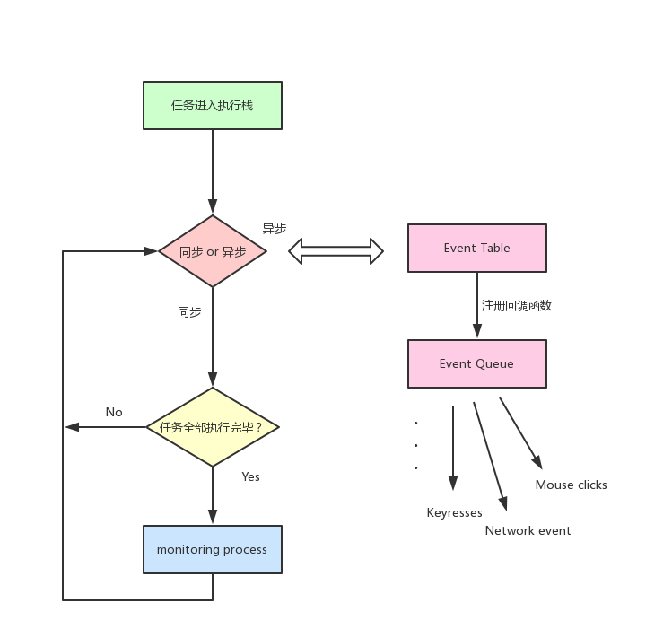
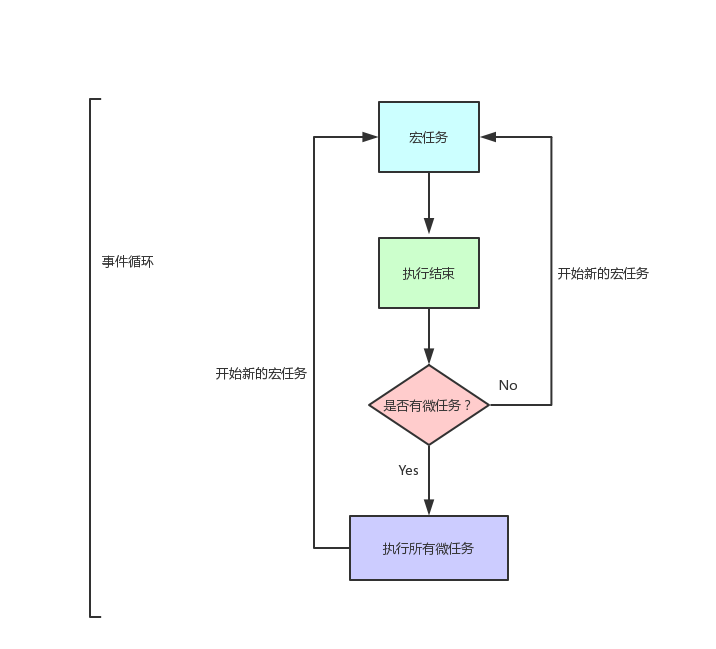
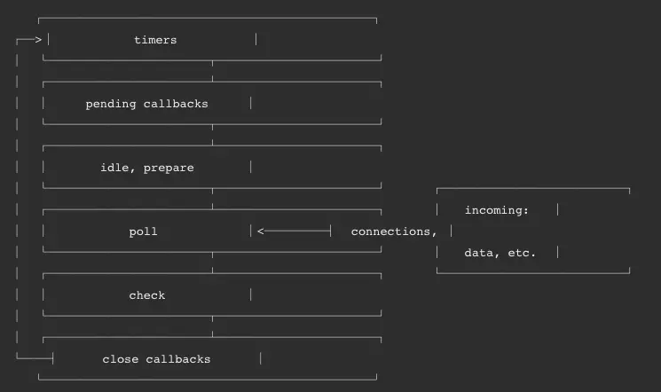
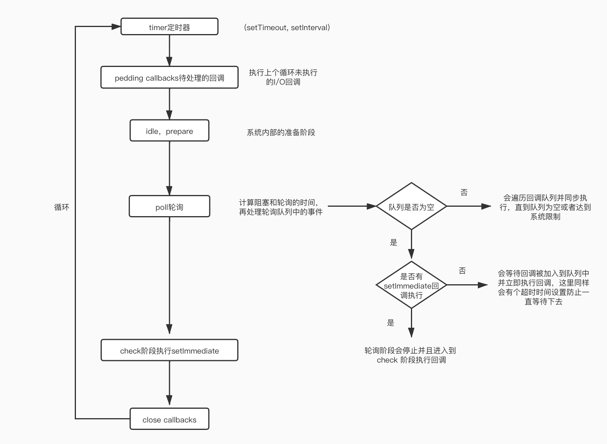

# js执行机制详解
## 前言

理解 javascript 的执行机制有助于我们更好的编写代码逻辑以及排查问题。

抛砖引玉，先上个🌰：
```js
console.log(1)

setTimeout(() => {
  console.log(2)
  new Promise(resolve => {
    console.log(3)
    resolve()
  }).then(() => {
    console.log(4)
  })
})

new Promise(resolve => {
  console.log(5)
  resolve()
}).then(() => {
  console.log(6)
})

setTimeout(() => {
  console.log(7)
  new Promise(resolve => {
    console.log(8)
    resolve()
  }).then(() => {
    console.log(9)
  })
})
```


下面我们分析一下相关知识点：

## javascript

javascript 是一门 <strong style="font-size:20px">单线程</strong> 语言，作为浏览器脚本语言，它的主要用途就是与用户交互，以及操作 DOM ，这个性质也决定了它是单线程，不然多线程的话，就会有很多复杂性的同步问题。为利用多核 CPU 的计算能力，最新的 HTML5 中提出的 [Web-Worker](https://developer.mozilla.org/zh-CN/docs/Web/API/Web_Workers_API/Using_web_workers) 标准，允许 javascript 创建多个线程，但子线程完全受主线程控制，且不得操作 DOM。所以 javascript 是单线程的核心从未改变，一切 javascript 版的 “多线程” 都是单线程模拟出来的。

### 事件循环

既然是单线程就意味着，所有任务都需要排队，前一个任务结束，才能执行后一个任务。如果前一个任务耗时很长，那么后一个任务就不得不一直等待。因此大佬们就把任务分成了两类：

1. 同步: 只有前一个任务执行完毕，才能执行后一个任务。
2. 异步: 当同步任务执行到某个 WebAPI 时，会触发异步操作，此时浏览器会单独开线程去处理这些异步任务。

下面用最火的导图来补充说明下：



用文字来表述的话：

1. 同步任务进入主线程，异步任务进入 Event Table 注册站进行注册函数。
2. 当指定的事情完成时，Event Table 会将这个事情对应的函数移入 Event Queue 这个缓冲区。
3. 主线程内的任务执行完为空时，就会去 Event Queue 读取对应的函数，进入主线程执行。
4. js引擎的 monitoring process 进程会持续不断的检查主线程执行栈是否为空，一旦为空，就会去缓冲区检查是否有等待被调用的函数，上述过程会不断重复，也就是常说的 Event Loop (事件循环)。

说了这么多，不如来看一段代码：

```js
console.log('1')
setTimeout(() => { 
  console.log('2')
}, 0)
console.log('3')
```

上面一段简易的 setTimeout 代码：

1. 输出1
2. 遇到 setTimeout 进入 Event Table，注册回调函数 <code>() => { console.log('2') }</code>
3. 输出3
4. 主线程从 Event Queue 读取回调函数并执行输出2

#### micro task 与 macro task

异步任务的优先级并不相同，它们被分为两类： 

1. 微任务（micro task）: Promise，process.nextTick，MutationObserver...
2. 宏任务（macro task）：包括整体代码script，setTimeout，serInterval，setImmediate，I/O，UIrendering...

根据异步事件的类型，这些事件会被派发到对应的微任务和宏任务中，在当前主线程执行完毕后：

1. 首先在 宏任务 的队列中取出第一个任务，执行完毕后取出 微任务 队列中的所有任务顺序执行。
2. 再取 宏任务 周而复始，直至两个队列的任务都取完。

我们用图来说明一下：



来看一段代码理解下：

```js
setTimeout(() => {
  console.log('setTimeout')
})

new Promise((resolve) => {
  console.log('promise')
  resolve()
}).then(() => {
  console.log('then')
})

console.log('console')
```

第一轮事件循环

-  宏任务
  -  整体script
-  微任务
  -  then

1. 首先整体script作为宏任务，进入主线程。
2. 先遇到 setTimeout 注册后派发到宏任务。
3. 再遇到 Promise，new Promise 立即执行，then 函数派发到微任务。
4. `console.log('console')`，立即执行。

开始第二轮

-  宏任务
  -  setTimeout
-  微任务
  -  无

1. 第一轮事件循环结束了，我们开始第二轮循环，当然要从宏任务Event Queue 开始发现 setTimeout 立即执行。

结果输出：

```js
promise
console
then
setTimeout
```

最后回过头来，让我们再分析下最开始的代码：

```js
console.log(1)

// setTimeout1
setTimeout(() => {
  console.log(2)
  new Promise(resolve => {
    console.log(3)
    resolve()
  }).then(() => {
    // then4
    console.log(4)
  })
})

new Promise(resolve => {
  console.log(5)
  resolve()
}).then(() => {
  // then6
  console.log(6)
})

// setTimeout2
setTimeout(() => {
  console.log(7)
  new Promise(resolve => {
    console.log(8)
    resolve()
  }).then(() => {
    // then9
    console.log(9)
  })
})
```

为了方便下面记录分析，先在代码上做个标记。再根据上面的事件循环导图就可以得出以下结论：

第一轮事件循环
1. 宏任务： 整体script
2. 微任务：then6
3. 输出1，5，6

第二轮事件循环

1. 宏任务： setTimeout1
2. 微任务：then4
3. 输出2，3，4

第三轮事件循环

1. 宏任务： setTimeout2
2. 微任务：then9
3. 输出7，8，9

所以在浏览器端输出的结果为1，5，6，2，3，4，7，8，9。

接下去我们看下在 Node 环境下里它会是怎么样？

## Node Event Loop

当 nodejs 启动后，它会初始化事件轮训，它可能会调用一些异步API，调度定时器，或者 `process.nextTick()` 等，然后开始处理事件循环。

它会分为6个阶段，按照顺序循环进行：



### timer

本阶段执行 `setTimeout` 和 `setInterval` 的回调。

计时器指定可以执行所提供回调的阈值，而不是用户希望其执行的确切时间。在指定的一段时间间隔后， 计时器回调将被尽可能早地运行。但是，操作系统调度或其它正在运行的回调可能会延迟它们。它们由 poll 阶段控制何时执行

### I/O

上一轮未执行的，被延迟到下一个循环迭代的I/O回调

### idle，prepare

系统内部使用

### poll

轮询阶段会有两个重要功能：

1. 计算阻塞和 poll I/O的时间
2. 执行 poll 队列里的事件

并且在进入该阶段时如果没有设定了 timer 的话，会发生以下两件事情

1. 如果 poll 队列不为空，会遍历回调队列并同步执行，直到队列为空或者达到系统限制
2. 如果 poll 队列为空时，会有两件事发生：
- 如果有 `setImmediate` 回调需要执行，poll 阶段会停止并且进入到 check 阶段执行回调
- 如果没有 `setImmediate` 回调需要执行，会等待回调被加入到队列中并立即执行回调，这里同样会有个超时时间设置防止一直等待下去

当然设定了 timer 的话且 poll 队列为空，则会判断是否有 timer 超时，如果有的话会回到 timer 阶段执行回调。

### check

check 阶段执行 `setImmediate`

### close callbacks

如果套接字或句柄突然关闭（例如`socket.destroy()`），则在此阶段将发出'close'事件。否则它将通过`process.nextTick()`发出。

了解了这些阶段后，我们通过一些代码再来理解一下。

首先在某种特定的情况下，定时器timer的执行顺序是随机的。

```js
setTimeout(() => {
  console.log('setTimeout')
}, 0)
setImmediate(() => {
   console.log('setImmediate')
})
```

结果是 setTimeout 可能执行在前也可能在后。
事件循环的延迟可能足够低，以至于计时器在立即触发后触发，本身事件循环也是需要成本的，如果在准备时候花费了大于 1ms 的时间，那么在 timer 阶段就会直接执行 setTimeout 回调，如果准备时间花费小于 1ms，那么就是 setImmediate 回调先执行了。

在下面这个场景下，执行顺序一定是固定的

```js
const fs = require('fs')

fs.readFile(__filename, () => {
  setTimeout(() => {
    console.log('timeout');
  }, 0)
  setImmediate(() => {
    console.log('immediate')
  })
})
```

在上述代码中，setImmediate 永远先执行。因为两个代码写在 IO 回调中，IO 回调是在 poll 阶段执行，当回调执行完毕后队列为空，发现存在 setImmediate 回调，所以就直接跳转到 check 阶段去执行回调了。

最后我们来看看 Node 中的 `process.nextTick`，这个函数其实是独立于 Event Loop 之外的，它有一个自己的队列，当每个阶段完成后，如果存在 nextTick 队列，就会清空队列中的所有回调函数，并且优先于其他 microtask 执行。

```js
setTimeout(() => {
 console.log('timer1')

 Promise.resolve().then(function() {
   console.log('promise1')
 })
}, 0)

process.nextTick(() => {
 console.log('nextTick')
 process.nextTick(() => {
   console.log('nextTick')
   process.nextTick(() => {
     console.log('nextTick')
   })
 })
})
```

对于以上代码，无论如何，永远都是先把 nextTick 全部打印出来。
了解了 node 的事件循环以后，再回过头来看看最初始的例子，你就会发现它输出的结果是：1, 5, 6, 2, 3, 7, 8, 4, 9。

总结一下 node 的执行机制大概如下：


## 最后
1. javascript 是一门单线程语言
2. Event Loop是 javascript 的执行机制
3. EVent Loop在浏览器和 Node 环境下却又是完全不一样的机制

## 思考
留下一道扩展题，结合async，await，在浏览器和node环境下又输出什么？
```js
async function async1() {     
  console.log("async1 start");      
  await async2();     
  console.log("async1 end");
}  
async function async2() {    
  console.log('async2'); 
  setTimeout(() => {
    console.log('async-settimeout'); 
  }, 0);
  new Promise(function (resolve) {      
    console.log("async2-promise");      
    resolve();  
  }).then(function () {      
    console.log("async2-then"); 
  }); 
}

console.log("script start");  
setTimeout(function () {      
  console.log("settimeout");  
},0);
  
async1();  
  
new Promise(function (resolve) {      
  console.log("promise1");      
  resolve();  
}).then(function () {      
  console.log("promise2"); 
}); 
console.log('script end'); 
```

