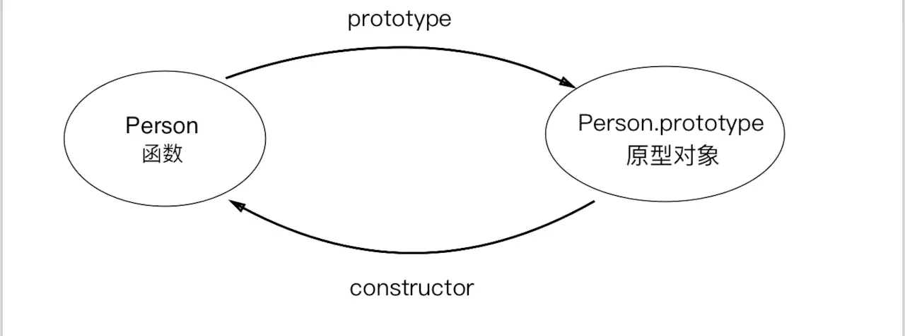
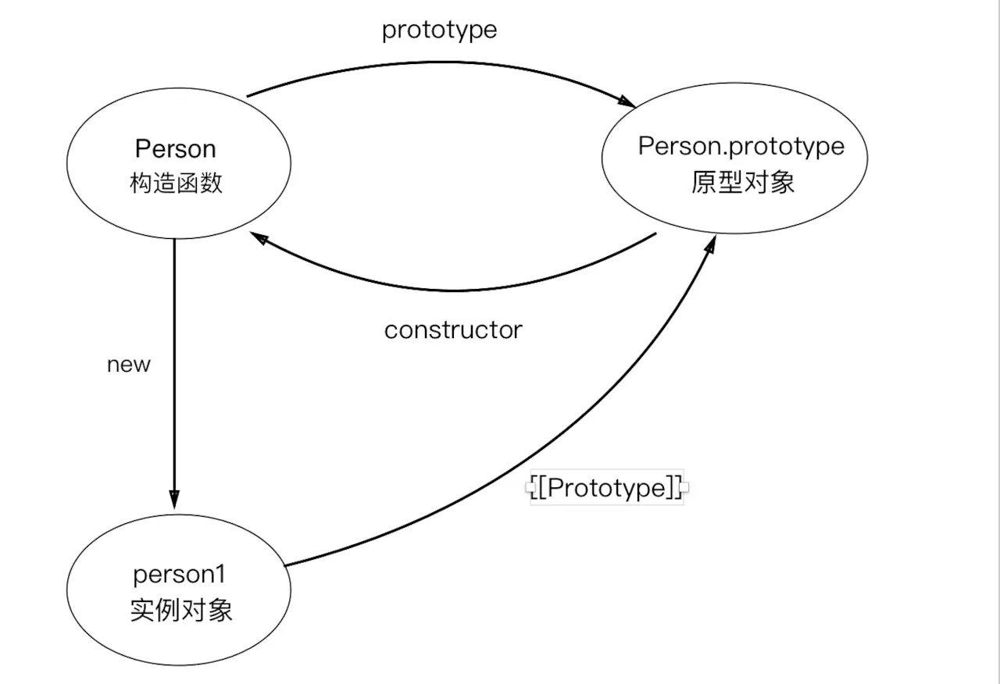
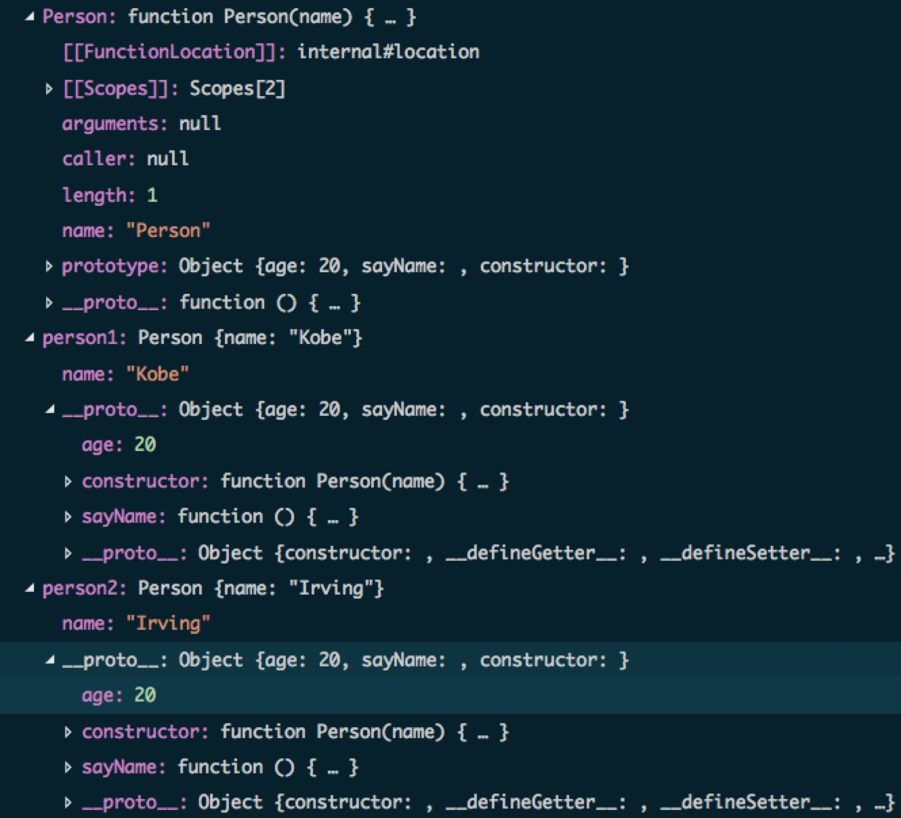
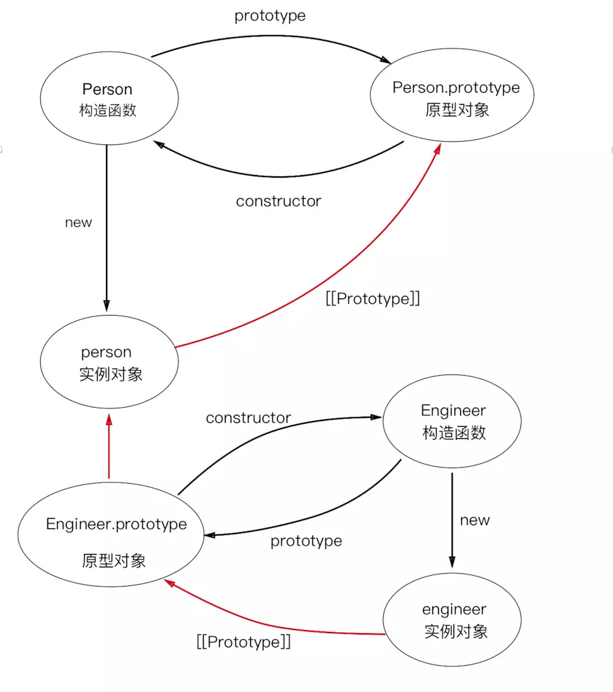
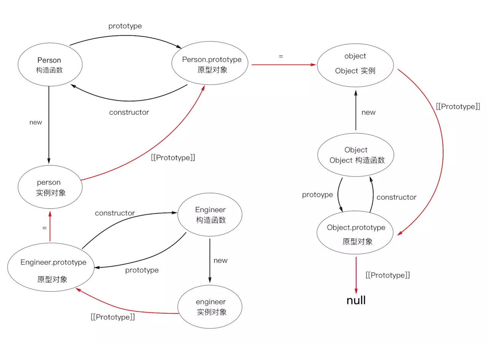

# 深入理解js原型
## 原型是什么？

js是一门基于对象的脚本语言，但他没有类的概念。js中的对象是无序属性的集合，其属性可以包含基本值，对象或者函数，类似于键值对的集合。
有了对象，按理说得有继承啊，不然对象之间没有任何联系了，也就真的沦为键值对的集合了。

我们知道，在js中可以使用构造函数来创建一个新对象，像下面这样：

```js
// 构造函数无返回值
function Person(name) {
  this.name = name;
}
// 通过 new 创建一个新对象
var person = new Person('Zhoujc');
```
`new`后面跟的不是类，而是构造函数。这里的构造函数可以看作是一种类型，就像面向对象编程语言中的类，但是这样创建的对象除了属性一样外，并没有其他的任何联系，对象之间无法共享属性和方法。每当我们新建一个对象时，都会分配一块新的内存，这是极大的资源浪费。考虑到这点，js的设计者`Brendan Eich`决定为构造函数设置一个属性。这个属性指向一个对象，所有实例对象需要共享的属性和方法，都放在这个对象里，那些不需要共享的属性和方法，就放在构造函数里。实例对象一旦创建，将自动引用这个对象的属性和方法。也就是说实例对象的属性和方法分成两种，一种本地的，不共享的，另一种是引用的，共享的。这个就对象就是原型`prototype`对象，简称为原型。

<!-- more -->

我们通过函数声明或函数表达式创建的函数都有一个`prototype`（原型）属性，这个属性是一个指针，指向一个对象，这个对象就是调用构造函数而创建的对象实例的原型。有一个特别的，在ECMA-262规范中，通过`Function.prototype.bind`创建的函数没有`prototype`属性。原型可以包含所有实例共享的属性和方法，也就是说只要是原型有的属性和方法，通过调用构造函数而生成的对象实例都会拥有这些属性和方法。看下面代码：

```js
function Person(name) {
  this.name = name;
}

Person.prototype.age = 20;
Person.prototype.sayName = function () {
  console.log(this.name);
}

var person1 = new Person('Kobe');
var person2 = new Person('Irving');

person1.sayName(); // Kobe
person2.sayName(); // Irving
console.log(person1.age); // 20
console.log(person2.age); // 20 
```

这段代码我们声明了一个`Person`函数，并在这个函数的原型上添加了`age`属性和`sayName`方法，然后生成了两个对象实例`Person1`和`Person2`，这两个实例分别拥有自己的属性`name`和原型的属性`age`以及方法`sayName`。所有的实例对象共享原型对象的属性和方法，那么看起来，原型对象就像是类，我们就可以用原型来实现继承了。

## constructor与[[Prototype]]

我们知道每个函数都有一个`prototype`属性，指向函数的原型，因此当我们拿到一个函数的时候，就可以确定函数的原型。反之，如果给我们一个函数的原型，我们怎么知道这个原型属于哪个函数的呢？这就要说说`constructor`属性了：

>在默认情况下，所有原型对象都会自动获得一个constructor（构造函数）属性，这个属性包含一个指向prototype属性所在函数的指针

也就是说每个原型都有一个`constructor`属性，指向了原型所在的函数，拿前面的例子来说`Person.prototype.constructor`指向`Person`。
下面是构造函数和原型的关系图：



继续，让我们说说`[[prototype]]`。

当我们调用构造函数创建一个新的实例之后，比如上面例子中的`person1`，实例的内部会包含一个指针（内部属性），指向构造函数的原型。ECMA-262第5版中管这个指针叫`[[prototype]]`。我们可以更新函数和原型的关系图：



不过在脚本中没有标准的方式访问`[[prototype]]`，但在Firefox，Safari和Chrome中可以通过`__proto__`属性访问。而在其他实现中，这个属性对脚本则是完全不可见的。不过，要明确的真正重要一点就是，**这个连接存在于实例与构造函数的原型对象之间，而不是存在于实例与构造函数之间。**

在VSCode中开启调试模式，我们可以看到这些关系：



从上图中我们可以看到`Person`的`prototype`属性和`person1`的`__proto__`属性是完全一致的，`Person.prototype`包含了一个`constructor`属性，指向了`Person`函数。这些可以很好的印证我们上面所说的构造函数、原型、`constructor`以及`__proto__`之间的关系。

## 对象实例与原型

了解完构造函数、原型、对象之间的关系后，下面我们来探讨一下对象实例和原型之间的关系。

### 判断对象实例和原型之间的关系

因为我们无法直接访问实例对象的`__proto__`属性，所以当我们想要确定一个对象实例和某个原型之间是否存在关系时，可能会有些困难，好在我们有一些方法可以判断。
我们可以通过`isPrototypeOf()`方法判断某个原型和对象实例是否存在关系，或者，我们也可以使用 ES5 新增的方法`Object.getPrototypeOf()`获取一个对象实例 `__proto__`属性的值。看下面的例子:

```js
console.log(Person.prototype.isPrototypeOf(person1)); // true
console.log(Object.getPrototypeOf(person1) === Person.prototype); // true
```

### 对象实例属性和方法的获取

每当代码读取某个对象的某个属性时，都会执行一次搜索，目标是具有给定名字的属性。搜索首先从对象实例本身开始。如果在实例对象中找到了具有给定名字的属性，则返回该属性的值。如果没有找到，则继续搜索`__proto__`指针指向的原型对象，在原型对象中查找具有给定名字的属性，如果在原型对象中找到了这个属性，则返回该属性的值。如果还找不到，就会接着查找原型的原型，直到最顶层为止。这正是多个对象实例共享原型所保存的属性和方法的基本原理。

虽然可以通过对象实例访问保存在原型中的值，但却不能通过对象实例重写原型中的值。我们在实例中添加的一个属性，会屏蔽原型中的同名的可写属性，如果属性是只读的，严格模式下会触发错误，非严格模式下则无法屏蔽。另外，通过`hasOwnProperty`方法能判断对象实例中是否存在某个属性（不能判断对象原型中是否存在该属性）。来看下面的例子：

```js
function Person() {
  Person.prototype.name = 'Kobe';
  Person.prototype.age = 18;
  Person.prototype.job = 'NBA player';
  Person.prototype.sayName = function () {
    console.log(this.name);
  };
}

var person1 = new Person();
var person2 = new Person();

// 设置 phone 属性为不可写
Object.defineProperty(person1, 'phone', {
  write: false,
  value: '100'
});

// 新增一个访问器属性 address
Object.defineProperty(person1, 'address', {
  set: function (value) {
    console.log('set');
    address = value;
  },
  get: function () {
    return address;
  }
});

// 注意，此处不能用 name，因为函数本身存在 name 属性
console.log(person1.hasOwnProperty('age')); // false
console.log(Person.hasOwnProperty('age')); // false

person1.name = 'Irving';
console.log(person1.hasOwnProperty('name')); // true
console.log(person1.name); //'Irving'—来自实例
console.log(person2.name); //'Kobe'—来自原型

person1.phone = '123'; // 严格模式下报错
person1.address = 'china'; // 调用 set 方法，输出 'set'
console.log(person1.address); // 'china'
console.log(person1.phone); // 100
```

### in 操作符

有两种方式使用 in 操作符：

1. 单独使用

>在单独使用时，in 操作符会在通过对象能够访问给定属性时返回 true，无论该属性存在于实例中还是原型中。

1. for-in 循环中使用

>在使用 for-in 循环时，返回的是所有能够通过对象访问的、可枚举的（enumerated）属性，其中既包括存在于实例中的属性， 也包括存在于原型中的属性。如果需要获取所有的属性（包括不可枚举的属性），可以使用 Object.getOwnPropertyNames() 方法。

看下面例子：

```js
function Person() {
  this.name = 'Kobe';
  Person.prototype.age = 18;
  Person.prototype.job = 'NBA player';
  Person.prototype.sayName = function () {
    console.log(this.name);
  };
}

var person = new Person();

for (var i in person) {
  console.log(i); // name age job sayName 
}

console.log('name' in person); // true-来自实例
console.log('age' in person); // true-来自原型
```

### 原型的动态性

由于在对象中查找属性的过程是一次搜索，而实例与原型之间的连接只不过是一个指针，而非一个副本，因此我们对原型对象所做的任何修改都能够立即从实例上反映出来——即使是先创建了实例后修改原型也照样如此：

```js
var person = new Person();
Person.prototype.sayHi = function () {
  console.log('hi');
};
person.sayHi(); // hi
```

上面的代码中，先创建了`Person`的一个实例，并将其保存在`person`中。然后，下一条语句在`Person.prototype`中添加了一个方法`sayHi()`。即使`person`实例是在添加新方法之前创建的，但它仍然可以访问这个新方法。在调用这个方法时，首先会查找`person`实例中是否有这个方法，发现没有，然后到`person`的原型对象中查找，原型中存在这个方法，查找结束。

但是下面这种代码所得到的结果就完全不一样了：

```js
function Person() {};
var person = new Person();
Person.prototype = {
  constructor: Person,
  name: "kobe",
  age: 18,
  job: "NBA player",
  sayName: function () {
    console.log(this.name);
  }
};
person.sayName(); // error
```

仔细观察上面的代码，我们直接用对象字面量语法给`Person.prototype`赋值，这似乎没有什么问题。但是我们要知道字面量语法会生成一个新的对象，也就是说这里的 `Person.prototype`是一个新的对象，和`person`的`__proto__`属性不再有任何关系了。此时，我们再尝试调用`sayName`方法就会报错，因为`person`的 `__proto__` 属性指向的还是原来的原型对象，而原来的原型对象上并没有`sayName`方法，所以就会报错。

## 原型链

### 原型的原型

在前面的例子，我们是直接在原型上添加属性和方法，或者用一个新的对象赋值给原型，那么如果我们让原型对象等于另一个类型的实例，结果会怎样呢？

```js
function Person() {
  this.age = '18';
}
Person.prototype.height = '198cm';

function Engineer() {
  this.work = 'Front-End';
}
Engineer.prototype = new Person(); // 此时 Engineer.prototype 没有 constructor 属性
Engineer.prototype.constructor = Engineer;
Engineer.prototype.getAge = function () {
  console.log(this.age);
}

var person = new Person();
var engineer = new Engineer();

console.log(person.age); // 18
Engineer.getAge(); // 18
console.log(Engineer.height); // 198cm
console.log(Engineer.prototype.__proto__ === Person.prototype); // true
```

在上面代码中，有两个构造函数`Person`和`Engineer`，可以看作是两个类型，`Engineer`的原型是`Person`的一个实例，**也就是说`Engineer`的原型指向了`Person`的原型**。 然后我们分别新建了一个`Person`和`Engineer`的实例对象，可以看到`engineer`实例对象能够访问到`Person`的 age 和 height 属性，这很好理解： `Engineer`的原型是`Person`的实例对象，`Person`的实例对象包含了 age 属性，而 height 属性是`Person`原型对象的属性，`Person`的实例对象自然可以访问原型中的属性，同理，`Engineer`的实例对象`engineer`也能访问`Engineer`原型上的属性，间接的也能访问`Person`原型的属性。

看起来关系有些复杂，不要紧，我们用一张图来解释这些关系：



是不是一下就很清楚了，顺着图中红色的线，`engineer`实例对象可以顺利的获取`Person`实例的属性以及`Person`原型的属性。至此，已经铺垫的差不多了，我们理解了原型的原型之后，也就很容易理解原型链了。

### 原型链

原型链其实不难理解，上图中的红色线组成的链就可以称之为原型链，只不过这是一个不完整的原型链。我们可以这样定义原型链：

>原型对象可以包含一个指向另一个原型（原型2）的指针，相应地，另一个原型（原型2）中也可以包含着一个指向对应构造函数（原型2 的构造函数）的指针。假如另一个原型（原型2）又是另一个类型（原型3 的构造函数）的实例，那么上述关系依然成立，如此层层递进，就构成了实例与原型的链条。这就是所谓原型链的基本概念。

结合上面的图，这个概念不难理解。上面的图中只有两个原型，那么当有更多的原型之后，这个红色的线理论上可以无限延伸，也就构成了原型链。

通过实现原型链，本质上扩展了前面提到过的原型搜索机制：当以读取模式访问一个实例的属性时，首先会在实例中搜索该属性。如果没有找到该属性，则会继续搜索实例的原型。在通过原型链实现继承的情况下，搜索过程就得以沿着原型链继续向上。在找不到属性或方法的情况下，搜索过程总是要一环一环地前行到原型链末端才会停下来。

那么原型链的末端又是什么呢？我们要知道，所有函数的`默认原型`都是`Object`的实例，因此默认原型都会包含一个内部指针，指向`Object.prototype`。我们可以在上面代码的尾部加上一行代码进行验证：

```js
console.log(Person.prototype.__proto__ === Object.prototype); // true
```

那`Object.prototype`的原型又是什么呢，不可能没有终点啊？聪明的小伙伴可能已经猜到了，没错，就是`null`，`null`表示此处不应该有值，也就是终点了。我们可以在 Chrome 的控制台或 Node 中验证一下：

```js
console.log(Object.prototype.__proto__); // null
```

我们更新一下关系图



至此，一切已经很清楚了，下面我们来说说原型链的用处。

## 继承

继承是面向对象语言中的一个很常见的概念，在阅读前面代码的过程中，我们其实已经实现了简单的继承关系，细心的小伙伴可能已经发现了。在 JavaScript 中，实现继承主要是依靠原型链来实现的。

### 原型链实现

一个简单的基于原型链的继承实现看起来是这样的：

```js
function Parent() {
  this.flag = 'parent';
}
Parent.prototype.getFlag = function () {
  return this.flag;
}

function Child() {
  this.childFlag = 'child';
}

Child.prototype = new Parent();
Child.prototype.getChildFlag = function () {
  return this.childFlag;
}

var instance = new Child();

console.log(instance.childFlag); // child
console.log(instance.flag); // parent
```

原型链虽然很强大，可以实现继承，但是会存在一些问题：

1. **引用类型的原型属性会被所有实例共享。**
  在通过原型链来实现继承时，引用类型的属性会被所有实例共享，一旦一个实例修改了引用类型的值，会立刻反应到其他实例上。由于基本类型不是共享的，所以彼此不会影响。
2. 创建子类型的实例时，不能向父类型的构造函数传递参数。
  实际上，应该说是没有办法在不影响所有对象实例的情况下，给父类型的构造函数传递参数，我们传递的参数会成为所有实例的属性。

基于上面两个问题，实践中很少单独使用原型链实现继承。

### 借用构造函数

为了解决上面出现的问题，出现了一种叫做`借用构造函数的技术`。这种技术的基本思想很简单：`apply()`或`call()`方法，在子类型构造函数的内部调用父类型的构造函数，使得子类型拥有父类型的属性和方法。

```js
function Parent(properties) {
  this.properties = [].concat(properties);
  this.nums = [1, 2, 3, 4];
}

function Child(properties) {
  // 继承了 Parent，传递参数，互不影响
  Parent.apply(this, properties);
}

var instance1 = new Child(['instance1']);
instance1.nums.push(5);
console.log(instance1.nums); // 1,2,3,4,5
console.log(instance1.properties[0]); // instance1

var instance2 = new Child();
console.log(instance2.nums); // 1,2,3,4
console.log(instance2.properties[0]); // undefined
```

借用构造函数的确可以解决上面提到的两个问题，实例间不会共享属性，也可以向父类型传递参数，但是这种方法仍然存在一些问题：**子类型无法继承父类型原型中的属性**。我们只在子类型的构造函数中调用了父类型的构造函数，没有做其他的，子类型和父类型的原型也就没有任何联系。考虑到这个问题，借用构造函数的技术也是很少单独使用的。

### 组合继承

上面两个方法能够互补彼此的不足之处，我们把这两个方法结合起来，就能比较完美的解决问题了，这就是组合继承。其背后的思路是**使用原型链实现对原型属性的方法的继承，而通过借用构造函数来实现对实例属性的继承**。这样，既通过在原型上定义方法实现了函数复用，又能够保证每个实例都有自己的属性，从而发挥两者，看一个简单的实现：

```js
function Parent(properties) {
  this.properties = [].concat(properties);
  this.nums = [1, 2, 3, 4];
}

Parent.prototype.sayProperties = function () {
  console.log(this.properties[0]);
}

function Child(properties) {
  // 继承了 Parent，传递参数，互不影响
  Parent.apply(this, properties);
}

// 继承父类型的原型
Child.prototype = new Parent();
// isPrototypeOf() 和 instance 能正常使用
Child.prototype.constructor = Child;

var instance1 = new Child(['instance1']);
instance1.nums.push(5);
console.log(instance1.nums); // 1,2,3,4,5
instance1.sayProperties(); // instance1

var instance2 = new Child();
console.log(instance2.nums); // 1,2,3,4
instance2.sayProperties(); // undefined
```

组合继承避免了原型链和借用构造函数的缺陷，融合了它们的优点，是js中最常用的继承模式。组合继承看起来不错，但是也有它的缺点：**无论什么情况下，组合继承都会调用两次父类型的构造函数：一次是在创建子类型原型的时候，另一次是在子类型构造函数内部**。

### 寄生组合式继承

为了解决上面组合继承的问题，一种新的继承方式出现了-寄生组合继承，可以说是 JavaScript 中继承最理想的解决方案。

```js
// 用于继承的函数
function extend(child, parent) {
  var F = function () {}
  F.prototype = parent.prototype;
  child.prototype = new F();
  child.prototype.constructor = child;
}
// 父类型
function Parent(name) {
  this.name = name;
  this.nums = [1, 2, 3, 4];
}
Parent.prototype.sayName = function () {
  console.log(this.name);
}
// 子类型
function Child(name, age) {
  Parent.call(this, name);
  this.age = age;
}
var parent = new Parent('baba');
var child = new Child('erzi', '18');
// 继承原型上的属性和方法
extend(child, parent);
Child.prototype.getAge = function () {
  console.log(this.age);
}
console.log(parent.name); // baba
console.log(child.name); // erzi
console.log(child.getAge()); // 18
```

所谓寄生组合式继承，即**通过借用构造函数来继承属性，通过借用临时构造函数来继承原型**。其背后的基本思路是：**不必为了指定子类型的原型而调用父类型的构造函数，我们所需要的无非就是父类型原型的一个副本而已**。

