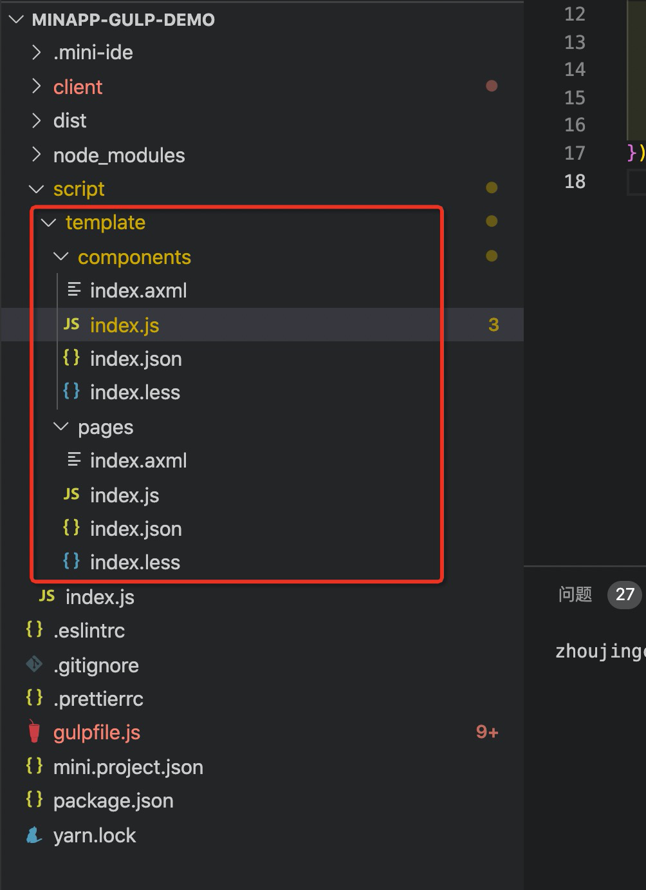
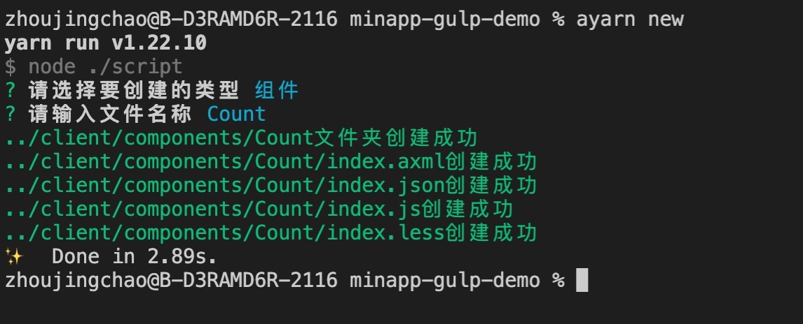

# 工程化落地实践

## 前言

自从 2020 年底接触支付宝和手淘小程序以来，在上手小程序业务体系中，个人对于小程序的开发效率看法着实不高。虽然听说过`rax`、`uni-app`、`taro`等框架，但本人跨端经验几乎没有，曾经最多有些许`hybrid app`经验。恰巧现在维护的项目是原生小程序，所以借此机会，衍生拓展工程化，打造高效的开发体系。在这里也多提一句，在使用任何框架或者工具的时候，其实我们回归底层去掌握它们的核心原理，才能让我们事半功倍，更加深入的理解我们现在使用的东西。

## 开发痛点

1. 我相信应该没人会在小程序开发工具里编码吧，几乎绝大多数开发者都是用自己熟悉的代码编辑器在工作。但是流程上的一些东西，我们必须依赖小程序开发工具，因此小程序开发工具的体验是对于开发者效率提升也是比较重要的一环。
2. css 预处理（less，sass，stylus）无法使用，有些 IDE 的插件可以监听编译（vscode 有[Easy-less](https://github.com/mrcrowl/vscode-easy-less)插件可以使用），但不同编辑器需要额外安装（前提是它得有支持的插件，不然你得自己造）。
3. 编码繁琐，在创建一个页面或组件时需要新建 4 个文件.axml、.js、.json、.acss，复制粘贴删除操作。
4. 项目长期维护，团队多人协作，代码风格、使用的编辑器不一致等等，规范的工程化实践存在就非常重要。
5. 生产环境除了小程序开发工具自身提供的优化，项目工程无工程化，基本无任何优化能力。

## 技术选型

工程化首选当之无愧 webpack，但是在调研过程中打包出来的代码存在 eval 注入函数，在小程序容器里是不允许执行的，卡了很久没找到解决办法。迫于业务节奏和期望快速构建落地，并且基于已有同学开展了 gulp 部分工作，就以 gulp 为基调开展了工程化。这里是 [demo](https://github.com/zhoujingchao/miniapp-gulp-demo) 仓库地址。

### 构建基础

小程序的运行依赖于 mini.project.json 配置文件里的指定根目录

```json
// mini.project.json
{
  "component2": true,
  "axmlStrictCheck": true,
  "enableAppxNg": true,
  "enableNodeModuleBabelTransform": true,
  "include": ["prefetch.js"],
  "exclude": ["client/**", "node_modules/**"],
  "miniprogramRoot": "dist", // 最终的源码根目录
  "enableParallelLoader": true,
  "scripts": {
    "beforeUpload": "tnpm --by=yarn build"
  }
}
```

构建脚本 gulpfile.js，将业务源码，编译到打包目录 dist，

```js
const { series, parallel, src, dest } = require('gulp');
const gulpChanged = require('gulp-changed');
const del = require('del');

const SOURCE = './client/**/*';
const DESTINATION = './dist/';

// 将需要的文件放入 dist 目录。
const assembleFiles = () =>
  src([SOURCE, '!./client/**/*.less', '!./client/**/*.ts'])
    .pipe(gulpChanged(DESTINATION))
    .pipe(dest(DESTINATION));

// 根据package.json的运行时依赖打包到 dist 目录中，同时复制package.json文件。
const buildDependencies = () =>
  src('./package.json')
    .pipe(gulpChanged(DESTINATION))
    .pipe(dest(DESTINATION))
    .pipe(
      gulpInstall({
        production: true, // 只安装运行依赖
      })
    );

// 删除目标文件
const clean = () => del(DESTINATION, { force: true });

// 编译成最终的开发包
const buildApp = parallel(buildDependencies, assembleFiles);

exports.dev = series(clean, buildApp);
```

### css 预编译

这里以 less 为例。

```js
const less = require('gulp-less');
const gulpRename = require('gulp-rename');

// 将 less 文件编译为小程序工具识别的到的 acss 文件
const lessc = () => {
  return src('./client/**/*.less')
    .pipe(less())
    .pipe(
      gulpRename(path => {
        path.extname = '.acss';
      })
    )
    .pipe(dest(DESTINATION));
};
```

此时，我们已经可以使用 less 了，但是当我们抽离公共样式后，再编辑公共样式文件，其它 import 这公共样式的业务文件却不会更新视图，此时的源码包括打包后的源码都已经更新了。经过一番波折并且验证 h5 浏览器场景下排除了 less 以及 gulp-less 的问题后，提供复现 demo 给到小程序容器组帮忙 debug 看下，才找到原因：<b>在小程序的容器里，公共 less 文件变化了，引用的文件没有变，编译也都编译了这个 case 下，gulp dest 里面执行的 writeFile 后 updateMeta 写入的文件 mtime 和 atime 依然是老的，从而导致 webpack 的 watchpack 基于 mtime 进行检测认为这个文件并没有变化，小程序内部是用 webpack 构建的</b>，所以就没有更新。

因此，添加处理器手动更改时间。

```js
const through2 = require('through2');

const lessc = () => {
  return src('./client/**/*.less')
    .pipe(less())
    .pipe(
      gulpRename(path => {
        path.extname = '.acss';
      })
    )
    .pipe(
      through2.obj((file, enc, cb) => {
        file.stat.mtime = new Date();
        file.stat.atime = new Date();
        cb(null, file);
      })
    )
    .pipe(dest(DESTINATION));
};
```

### css modules

在上面的 less 编译下，可以通过一些包来快速添加 css modules。

```js
const postcss = require('gulp-postcss');
const autoprefixer = require('autoprefixer');
const modules = require('postcss-modules');

const lessc = () => {
  return src('./client/**/*.less')
    .pipe(less())
    .pipe(postcss([modules(), autoprefixer()]))
    .pipe(
      gulpRename(path => {
        path.extname = '.acss';
      })
    )
    .pipe(
      through2.obj((file, enc, cb) => {
        file.stat.mtime = new Date();
        file.stat.atime = new Date();
        cb(null, file);
      })
    )
    .pipe(dest(DESTINATION));
};
```

这种 css modules 方式在当下情况可以快速使用。思路就是新增了 css.json 文件来依托关系。在组件或者页面的 js 逻辑里引用 css.json，弊端是无法用 js 变量来充当类名。

### ts

添加 babel-loader

```js
const babel = require('gulp-babel');

const js = () =>
  src('./client/**/*.{js,ts}')
    .pipe(gulpChanged(DESTINATION))
    .pipe(
      babel({
        presets: ['@babel/preset-typescript', '@babel/preset-env'],
        plugins: ['@babel/transform-runtime'],
      })
    )
    .pipe(dest(DESTINATION));
```

### eslint

添加 eslint

```js
const eslint = require('gulp-eslint');

const lint = () =>
  src('client/**/*.{js,ts}')
    .pipe(eslint({ useEslintrc: true }))
    .pipe(eslint.format())
    .pipe(eslint.failAfterError());
```

### 热更新

assembleFiles，lint，js，lessc 等等函数就是上面各个环节对应的任务处理，我们最后在 dev 脚本处添加上处理顺序即可。

```js
const watchOrigin = () =>
  gulpWatch(
    [SOURCE, '!./client/**/*.less', '!./client/**/*.{js,ts}'],
    {},
    assembleFiles
  );

const watching = () => {
  gulpWatch('client/**/*.{js,ts}', {}, parallel(lint, js));
  // 首次需要编译
  gulpWatch('./client/**/*.less', { ignoreInitial: false }, lessc);
  watchOrigin();
};

exports.dev = series(clean, buildApp, js, watching);
```

### 快速生成页面和组件模版

准备好自行需要的页面和组件模版



通过 [inquirer](https://www.npmjs.com/package/inquirer)库创建流程，最终按流程生成对应的模版文件，查看代码移步[demo](https://github.com/zhoujingchao/miniapp-gulp-demo)。



## feature 待扩展

webpack 更加熟练一些，后续还是会通过 webpack 去做下面的扩展。

### axml 转为 jsx

更高效的编写组件，并且我们习以为常的 css modules 编写方式，可以在这里再进行尝试。之前快速落地的时候，新增 css.json 的方式来用其实是不太习惯和优雅的。

### 包优化

核心就是降体积。

- 生产环境源码的压缩和混淆
- 页面组件的按需加载

### 引入单测

核心模块，公共模块等
