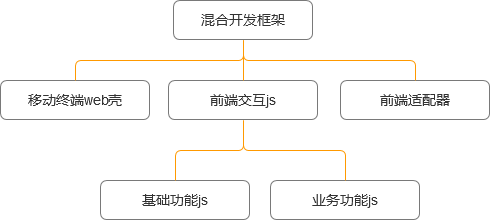
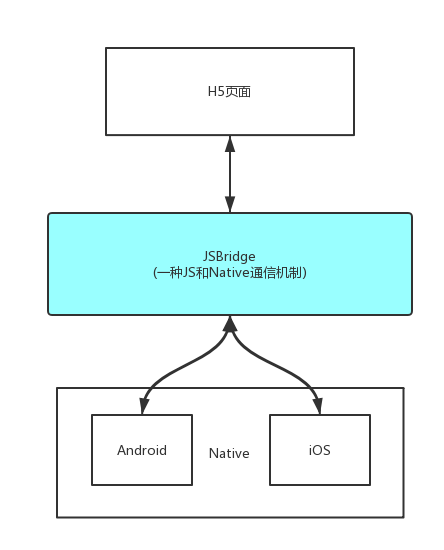

# Hybrid App的理解与思考

## Hybrid App是什么？

`Hybrid App`（混合模式移动应用）是指介于`Web App`、`Native App`这两者之间的`App`，通过不同的应用商店进行打包与分发，应用的特性更接近原生应用而且又区别与`Web`应用。在开发过程中同时使用了`Web`技术，所以开发成本大大降低，兼具“Native App良好用户交互体验的优势”和“Web App跨平台开发的优势”。

## 三大类App比较
### Web App
定义：将所有功能都放在`Web`上展现，运行基于本地浏览器。在此将给`Web`简单的套一层App外壳的应用也归入`Web App`。完全采用`HTML/CSS/JS`编写，专为触摸操作进行了优化。目前`iOS`已禁止简单的套壳App上架。
- 优点：开发速度快，跨平台，成本低，实时迭代无需用户更新。
- 缺点：网络速度要求高无法离线、服务器压力大，系统级别API调用难度大，用户体验差、用户留存度低。

### Native App
定义：是基于手机本地操作系统并使用原生语言编写的。因为位于平台层上方，向下访问和兼容的能力会比较好一些，可以支持在线或离线访问，消息推送或本地资源访问，摄像拨号功能的调取。但是由于设备碎片化，`App`的开发成本要高很多，维持多个版本的更新升级比较麻烦，用户的安装门槛也比较高。
- 优点：用户体验佳、交互风格与系统吻合，节省流量，可访问本地资源可离线，速度快，用户留存度高。
- 缺点：成本高，版本迭代慢，需要过审时间不定。

### Hybrid App
定义：介于`Web App`与`Native App`的一种折中方案，底层(框架)部分由`iOS/Android`开发人员处理，上层(内容展现)部分由`Web`前端人员处理，用户界面操作逻辑及部分静态资源驻留本地，使得`Web App`可以对操作迅速反应并在很大程度上实现离线访问。`Hybrid App`追求趋近于原生App的体验，但目前还较困难。
- 优点：跨平台，成本低，可访问设备的多种功能，可离线。
- 缺点：用户体验不如Native App，性能稍慢。

## Hybrid App适用场景
- 快速原型，验证产品功能。
- 对性能要求没有那么高的场景，比如内容类的应用，csdn的app，就是采用`hbuilder`混合方案实现的。
- ......

## 开始前的思考
### 为了HTML5而Hybrid App？
`Html5`只是技术实现手段而已，要根据公司的实际业务场景，以及人员配比综合考虑，不能因为某项开发模式或者技术比较火，就必须要在公司推行这种实现方案，我个人觉得为技术而技术是不可取的。
### 忽略关键因素
`Hybrid App`本质上还是基于PC的一种开发模式，开发者使用PC浏览器模拟App中的`WebView`进行调试。PC浏览器与手机`WebView`的区别是巨大的，包括能支配的CPU资源，最大占有的内存，运行的网络环境，`click`和`touch`事件的区别，浏览器对`CSS/JS`的解析和对事件处理，等等。

原生工程师考虑比较多的是内存的问题，这些在web开发时候是很少考虑的。另外，就是网络环境方面，虽然现在3g 4g覆盖率越来越高，但是移动终端的访问和pc还是有很大差距，wifi和蜂窝网络的切换，基站变化等诸多因素都会导致网络间歇性断开，web开发对于这种不稳定网络环境问题的处理上都有所欠缺。
### 交互体验一致性
`ios`和`android`的交互设计是两套规范，虽然有相似的地方，但是从操作习惯上，就已经决定了，我们想用一套交互设计，适配两个平台是很难的，包括包括视觉风格，界面切换，操作习惯等。

所以说`Hybrid App`方案是一把双刃剑，一方面它平衡了`Native App`和`Web`页面的优缺点，一定程度上解决了`Native App`开发过程中迭代慢，版本依赖，`Native`开发资源不足的问题，但另一个方面过度依赖`Hybrid`方案会造成Web前端开发成本快速上升，甚至造成App整体体验下降，甚至造成功能缺失。

总之“不要为了`Hybrid`而`Hybrid`“，根据实际场景，控制好方案中`Native`和`Web`的边界，是很重要的。

## 架构



## 核心原理



### 与Android通信
#### 拦截url schema
整个`Web`页面都是运行在`Java`提供的`Webview`实例当中。`Javascript`执行以下四种行为会被`Webview`监听到，箭头后面是对应触发的`Java`方法。

- window.alert => onJSAlert
- window.confirm => onJSConfirm
- window.prompt => onJsPrompt
- window.location => shouldOverrideUrlLoading

以上就是监听方式，最重要的就是通过`schema`方式，使用`shouldOverrideUrlLoading`方法对`url`协议进行解析。说到通信协议，我们首先想到的是`http`协议，没错，我们可以仿照`http`协议制定我们自己的协议。比如`http`协议是这样子的: `http://www.baidu.com?param `。而要实现`js`与`java`通信，我们就需要制定自己的协议比如: `bridge://toast?message` 其中`bridge`是`scheme`，代表我们自定义的协议，后面的`toast`,`message`就可以代表方法名和所需参数。

#### 注入 API
原生可以通过`WebView`提供的接口，向`JavaScript`的`Context（window）`中注入对象或者方法，让 `JavaScript`调用时，直接执行相应的`Native`代码逻辑，达到`JavaScript`调用`Native`的目的。
比如原生注入进来一个类名`JsBridge`，里面有个`openPicture`打开相册的方法，`js`就可以直接调用`window.JsBridge.openPicture()`。

### 与IOS通信
同理，与`ios`通信的方式是与上面`android`的使用方式是一样的。唯一的区别就是拦截`url schema`的底层机制不一样。

`android`是通过监听`shouldOverrideUrlLoading`方式。而`ios`没有现成的`API`拿来用，而是需要间接地通过一些方法来实现。`UIWebView`有个特性：在`UIWebView内发起的所有网络请求`，都可以通过`delegate`函数在`Native`层得到通知。因此，我们就可以在`UIWebView`内发起一个自定义的网络请求，格式和上面的`android`方式一致。

常见封装方法：
```js
function postWebviewData(fname, data) {
  const yourSchema = 'jsbridge'
  const base = `${yourSchema}://${fname}`

  let src
  if (typeof data === 'undefined') {
    src = base
  } else if (typeof data === 'string') {
    src = `${base}?${encodeURIComponent(data)}`
  } else {
    src = `${base}?${encodeURIComponent(JSON.stringify(data))}`
  }

  const wvIframe = document.createElement('iframe')
  wvIframe.style.display = 'none'
  waiframe.src = src
  document.body.appendChild(wvIframe)
  setTimeout(function() {
    document.body.removeChild(wvIframe)
  }, 0)
}
```

### 对比

拦截 url 的方式的优点：
- `JavaScript`端可以确定`JSBridge`的存在，直接调用即可。

拦截 url 的方式的缺陷：
- 长度可能会是隐患。
- 不要为了方便选择直接`locaiton.href`调用，最好统一通过`iframe.src`去调用。因为如果通过`location.href`连续调用`Native`，会丢失你之前的调用。
- 创建请求，需要一定的耗时，比注入`API`的方式调用同样的功能，耗时会较长。
- 如果桥的实现方式有更改，`JSBridge`需要兼容多版本的`Native Bridge`或者`Native Bridge`兼容多版本的`JSBridge`。

注入 API 的方式的优点：
- 桥的版本很容易与`Native`保持一致，`Native`端不用对不同版本的`JSBridge`进行兼容。

注入 API 的方式的缺陷：
- 注入时机不确定，需要实现注入失败后重试的机制，保证注入的成功率，同时`JavaScript`端在调用接口时，需要优先判断`JSBridge`是否已经注入成功。

## 总结

个人推荐使用注入 API 的方式。因为不管从易用性，维护性，合理性等方面考虑，它更胜一筹。
