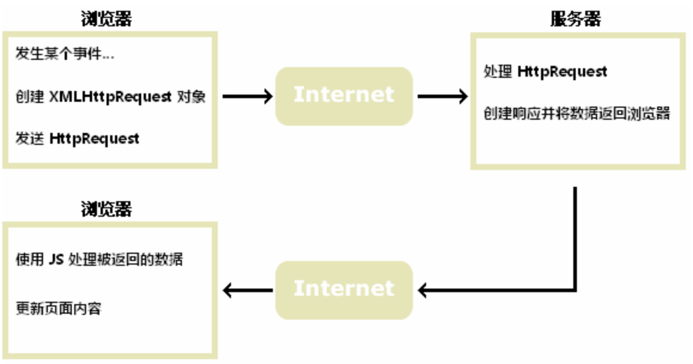

# Ajax工作原理

## Ajax是什么？

Ajax = 异步 JavaScript 和 XML。

通过在后台与服务器进行少量数据交换，`Ajax`可以使网页实现异步更新。这意味着可以在不重新加载整个网页的情况下，对网页的某部分进行更新。

`Ajax`是一种在无需重新加载整个网页的情况下，能够更新部分网页的技术。

传统的网页（不使用`Ajax`）如果需要更新内容，必需重载整个网页面。

## 工作原理



## 过程

`XMLHttpRequest`API 是`Ajax`的核心，用于在后台与服务器交换数据。这意味着可以在不重新加载整个网页的情况下，对网页的某部分进行更新。

### 创建 XMLHttpRequest 对象
```js
let xhr
if (window.XMLHttpRequest) {
  // IE7及以上
  xhr = new XMLHttpRequest()
} else {
  // IE5 和 IE6
  xhr = new ActiveXObject('Microsoft.XMLHTTP')
}
```

### 打开链接
```js
/*
 * @param {String} method 请求类型 'get', 'post'...
 * @param {String} url 请求服务器的链接
 * @param {Boolean} async 请求是否阻塞，同步false or 异步true
 */
xhr.open(method, url, async)
```

### 向服务器发送请求
```js
// get请求
xhr.send()

// post请求
// 添加请求头
xhr.setRequestHeader('Content-type', 'application/x-www-form-urlencoded')
xhr.send('fname=Zhou&lname=jingchao')
```

### 接收服务器响应
因为客户端不知道服务器何时会有响应，所以采取事件监听的方式去获取返回体
```js
xhr.onreadystatechange = function() {
  // xhr.readyState
  // 0: 请求未初始化
  // 1: 服务器连接已建立
  // 2: 请求已接收
  // 3: 请求处理中
  // 4: 请求已完成，且响应已就绪
  if (xhr.readyState === 4 && xhr.status >= 200 && xhr.status < 300 || xhr.status === 304) {
    return xhr.responseText // 获得字符串形式的响应数据
  }
}
```

## 最后

按这顺序整合起来，再通过一些中间件或者自己处理的方式去转换响应数据内容的格式即可。
