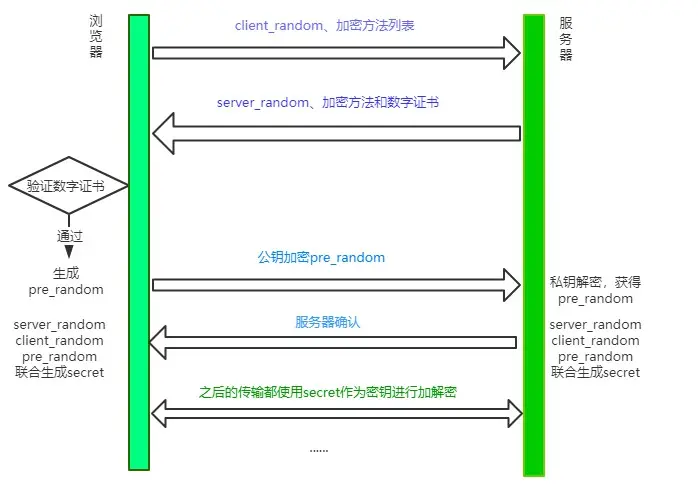

# http & http2 & https相关知识点

## http code码
100: 客户端继续请求

101: 服务端切换http协议，只能往更高级切换

200: 服务器处理成功并返回

201: 服务器处理并创建了一个新资源

202: `已接受，但未处理完成`

203: `非授权信息`，服务器从别的地方拷贝资源过来返回

204: `无内容，服务器成功处理，但未返回内容`

205: 重置内容

206: 只处理了部分请求

300：服务器存在的资源位置很多，返回一个比较有特性的
301: 永久重定向

302: 临时重定向

303: 类似于301

304: `请求的资源未修改，不返回任何资源`

305: `使用代理，请求的资源需要通过代理`

400: 客户端请求错误或者语法错误

401: 缺少认证

403: 服务器接受到请求，拒接处理

404: 访问的资源不存在

405: `客户端请求中的方法被禁止`

406: `服务器无法根据客户端请求的内容特性完成请求`

407: `请求需要代理认证授权`

408: `服务器等待客户端发送的请求时间过长，客户端超时`

409: `服务器处理请求时发生了冲突，服务器完成客户端的 PUT 请求时可能返回此代码`

410: `请求的资源已经不存在了，以前有现在被删了`

411: 服务器无法处理缺少content-length的请求信息

412: `客户端请求信息的先决条件错误`

413: `请求实体过大，服务器无法处理，因此拒绝请求，为防止客户端的连续请求，服务器可能会关闭连接。如果只是服务器暂时无法处理，则会包含一个Retry-After的响应信息`

414: `请求的URI过长（URI通常为网址），服务器无法处理`

415: `服务器无法处理请求附带的媒体格式`

416: `客户端请求的范围无效`

417: `服务器无法满足Expect的请求头信息`

500: 服务器处理请求错误

501: `服务器不支持请求的功能，无法完成请求`

502: 充当网关或者代理服务器，从远程服务器接收到了一个无效的响应

503: `由于超载或系统维护，服务器暂时无法处理客户端的请求。延时的长度可包含在服务器的Retry-After
头信息中`

504: 充当网关或者代理服务器，未及时从远程服务器获取到请求

505: `服务器不支持请求的HTTP协议的版本，无法完成处理`

## http缺陷
1. 队头阻塞：`chrome`浏览器机制同个域名最多开`6`个`TCP`链接，前面一旦阻塞后面就只能等待
2. 安全性：报文明文传输
3. 性能缺陷：无状态特性巨大的请求头开销
4. 不支持服务器推送

## http2优点

1. 链接复用：`SPDY`协议只建立一个`TCP`链接，这个链接承载了任意数量的双向通信数据流，每个数据流以消息的形式发送，每个消息以一个或多个帧组成，多个帧之间可以乱序发送，根据帧的首部标识又能重新组装起来。
2. 二进制传输：将请求和响应分割成更小的帧，并采用二进制编码
3. Header压缩：采用`HPACK`算法，可达`50-90%`的压缩率，变化的头部才会传，不变的就只传一次
4. 支持服务端推送`Server Push`

## https为什么让数据传输更安全
1. 对称加密：是最简单的方式，指的是`加密和解密用的是同样的密钥`。
2. 非对称加密：如果有 A、 B 两把密钥，如果用 A 加密过的数据包只能用 B 解密，反之，如果用 B 加密过的数据包只能用 A 解密。
3. 又添加了数字证书认证`CA(Certificate Authority)`的步骤。其目的就是让服务器证明自己的身份。

核心过程：

## charles中间人攻击

1. 截获客户端https请求，伪装成客户端向服务端发请求
2. 获取真实服务端响应，伪造服务端向客户端发消息

简单来说，就是`Charles`作为“中间人代理”，拿到了 `服务器证书公钥` 和 `HTTPS连接的对称密钥`，前提是`客户端选择信任并安装Charles的CA证书`，否则客户端就会“报警”并中止连接。这样看来，`HTTPS`还是很安全的。

关于 charles 的详细原理请参考此[链接](https://www.jianshu.com/p/f504848d62e0)
