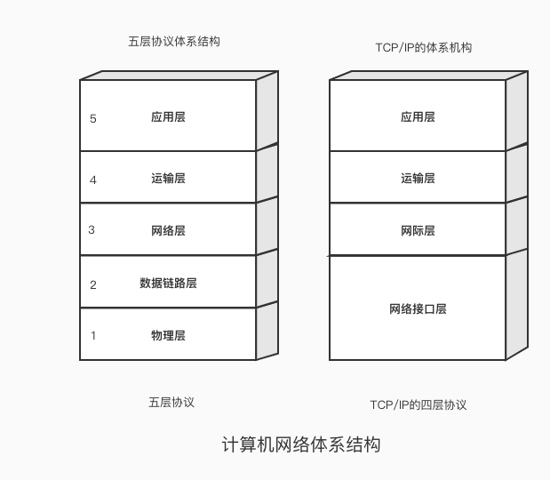
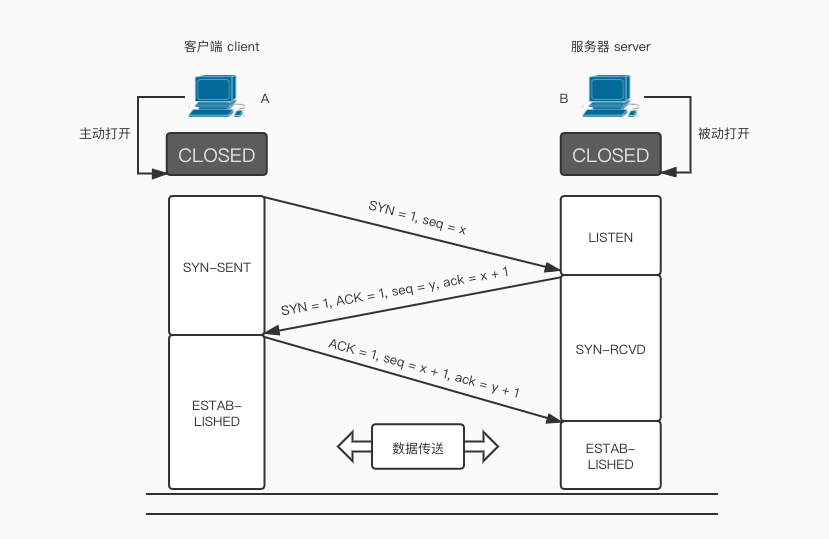

# 深入浅出TCP协议
## TCP/IP 协议是什么？
> TCP/IP（Transmission Control Protocol/Internet Protocol，传输控制协议/网际协议）是指能够在多个不同网络间实现信息传输的协议族。TCP/IP协议不仅仅指的是TCP和IP两个协议，而是指一个由FTP、SMTP、TCP、UDP、IP等协议构成的协议族等， 只是因为在TCP/IP协议中TCP协议和IP协议最具代表性，所以被称为TCP/IP协议。

## 计算机网络的体系结构

各层及其协议的集合，称为计算机网络的体系结构，体系结构是抽象的，但是他们的实现是具体的，是我们平常真正在运行的计算机硬件和软件。

## TCP协议的主要特点

1. 面向连接：在使用TCP之前，必须先建立TCP连接，传输完数据后，必须释放已建立的TCP连接。类似于“打电话”。
2. 在一个TCP连接中只能有两个端点，是点对点，一一对应的，所以像广播，多播这种是不能用于TCP的。
3. 提供可靠交付的服务：通过TCP连接传输的数据，无差错，不会丢失，不会重复并且按序到达。
4. 提供全双工通信：双向同时通信，即通信的双方可以同时发送和接收信息的信息交互方式。
5. 面向字节流：“流”（stream）指的就是流入到进程或从进程流出的字节序列。

## TCP的运输连接管理

### 三次握手
TCP的连接建立示意图：

这个过程就叫<b>三次握手</b>。

那么为什么是三次呢，而不是二次或者四次呢？在谢希仁著《计算机网络》第6版第五章225页中讲“三次握手”目的是：

> “为了防止已失效的连接请求报文段又突然传送到服务器，因为产生错误”

所谓的“已失效的连接请求报文段”是这样产生的。先考虑一种正常情况，A发出连接请求，但因连接请求报文丢失而未收到确认。于是A又重新传一次连接请求，后来收到了确认，建立了连接，传输完数据就释放了连接。A一共发送了两次连接请求报文段，其中一个丢失了，第二个到达了B。没有“已失效的连接请求报文段”。

现假定出一种异常情况，即A发出的第一个连接请求报文段并没有丢失，而是在某些网络节点被长时间滞留了，以致延误到连接释放以后的某个时间才到B。本来是一个早已失效的报文段。但B收到此失效报文段，被误认为是A又发出一次新的连接请求，于是就会又向A发出确认报文段，同意建立连接，假如没有第三次握手，那么只要B发出确认，连接就建立了。

实际上A并没有发出建立连接的请求，不会理采B，也不会给B发数据，但B却以为新的连接已建立，等待A传送数据。这么一来B的很多资源就被浪费了。

这些异常都是客观存在的，我们也可以换一个角度从<b>全双工通信</b>去理解这三次握手，A和B的握手实际上就是在通信，<b>发一次信息就是进行一次握手</b>。

1. 第一次握手：A给B打电话说，你可以听到我说话么？
2. 第二次握手：B收到了消息，对A说：我可以听到你说话，你能听到我说话么？
3. 第三次握手：A收到了B消息，然后说可以的，我要给你发消息了。

所以这里也能表明为什么是三次而不是两次。

1. Client ------SYN-----> Server
2. Client <-----ACK------ Server
3. Client <-----SYNC----- Server
4. Client ------ACK-----> Server

2和3步骤可以合并不用浪费资源，因此这里可以表明不是四次。

### 四次挥手
TCP的连接释放示意图：

MSL叫做最长报文段寿命（Maximum Segment Lifetime），为什么A在TIME—WAIT状态必须等待2MSL的时间呢？

1. 不等待的话，立马关闭，那最后A在给B发ACK报文段的时候，很有可能就会丢失，导致B无法正常关闭连接进入CLOSED状态。
2. 防止在三次握手中提到的“已失效的连接请求报文段”出现在此次连接中，A在发送完最后一个ACK报文段后，再经过时间等待计时器2MSL，就可以使此次连接持续的时间内产生的所有报文段都从网络中消失。保证下一个新连接中不会出现这样旧的连接请求报文段。

这个过程就叫<b>四次挥手</b>。

TCP的报文数据格式和其他一些特性机制，比如流量控制，拥塞控制，保活计时机制这里就不展开说明了，感兴趣的同学强烈建议读一下《计算机网络》教材，里面对原理以及算法都有说明。

TCP的报文数据格式这里就不展开了，感兴趣的同学强烈建议读一下《计算机网络》教材，里面对结构，原理以及算法都写得非常清楚。下面再稍微介绍一下它的一些特性。

### 如何控制滑动窗口

举个例子一开始，初始化窗口，双方各自200字节。
1. 发送端给接受端发了100字节，按道理接收端可用窗口减少100字节。
2. 100个到达了接收端，由于大量负载均衡处理不了，只处理了40字节，剩下60个被留在了缓存列表里。
3. 此时接收端处理能力不够了，你发送端给我少发点，所以接收端窗口缩小了具体点来说从200变为140，剩下60还在缓存队列里。
4. 因此接收端会在 ACK 的报文首部带上缩小后的滑动窗口 140 字节，发送端对应地调整发送窗口的大小为 140 个字节。对于发送端，已发送且确认的增加了40字节，同时发送窗口也缩小为140字节。

### 拥塞控制
流量控制发生在发送端跟接收端之间，并没有考虑到整个网络环境的影响，如果说当前网络特别差，特别容易丢包，那么发送端就应该注意一些了。而这，也正是拥塞控制需要处理的问题。

TCP每条链接维护两个核心状态：
1. 拥塞窗口
2. 慢启动阈值

#### 拥塞窗口
目前自己还能传输的数据量大小，接收窗口(rwnd)是接收端给的限制，拥塞窗口(cwnd)是发送端的限制，发送窗口大小 = min(rwnd, cwnd)，取两者的较小值。而拥塞控制，就是来控制cwnd的变化。

#### 慢启动
刚开始进入传输数据的时候，你是不知道现在的网路到底是稳定还是拥堵的，如果做的太激进，发包太急，那么疯狂丢包，造成雪崩式的网络灾难。
首先就是要采用一种保守的算法来慢慢地适应整个网路，这种算法叫慢启动
1. 首先，三次握手，双方宣告自己的接收窗口大小。
2. 双方初始化自己的拥塞窗口(cwnd)大小。
3. 在开始传输的一段时间，发送端每收到一个 ACK，拥塞窗口大小加 1，也就是说，每经过一个 RTT，cwnd 翻倍。如果说初始窗口为 10，那么第一轮 10 个报文传完且发送端收到 ACK 后，cwnd 变为 20，第二轮变为 40，第三轮变为 80，依次类推
难道就这么无止境地翻倍下去？当然不可能。它的阈值叫做慢启动阈值，当 cwnd 到达这个阈值之后，好比踩了下刹车，别涨了那么快了，老铁，先 hold 住！

#### 拥塞避免
原来每收到一个 ACK，cwnd 加1，现在到达阈值了，cwnd 只能加这么一点: 1 / cwnd。仔细算算，一轮 RTT 下来，收到 cwnd 个 ACK, 那最后拥塞窗口的大小 cwnd 总共才增加 1。

### 快速重传
在 TCP 传输的过程中，如果发生了丢包，即接收端发现数据段不是按序到达的时候，接收端的处理是重复发送之前的 ACK。
比如第 5 个包丢了，即使第 6、7 个包到达的接收端，接收端也一律返回第 4 个包的 ACK。当发送端收到 3 个重复的 ACK 时，意识到丢包了，于是马上进行重传，不用等到一个 RTO 的时间到了才重传。
这就是快速重传，它解决的是是否需要重传的问题。

#### 选择性重传
那你可能会问了，既然要重传，那么只重传第 5 个包还是第5、6、7 个包都重传呢？
当然第 6、7 个都已经到达了，TCP 的设计者也不傻，已经传过去干嘛还要传？干脆记录一下哪些包到了，哪些没到，针对性地重传。
在收到发送端的报文后，接收端回复一个 ACK 报文，那么在这个报文首部的可选项中，就可以加上 SACK 这个属性，通过left edge和right edge告知发送端已经收到了哪些区间的数据报。因此，即使第 5 个包丢包了，当收到第 6、7 个包之后，接收端依然会告诉发送端，这两个包到了。剩下第 5 个包没到，就重传这个包。这个过程也叫做选择性重传(SACK，Selective Acknowledgment)，它解决的是如何重传的问题。

### 快速恢复
当然，发送端收到三次重复 ACK 之后，发现丢包，觉得现在的网络已经有些拥塞了，自己会进入快速恢复阶段。
在这个阶段，发送端如下改变：
1. 拥塞阈值降低为 cwnd 的一半
2. cwnd 的大小变为拥塞阈值
3. cwnd 线性增加

## SYN攻击

什么是SYN攻击（SYN Flood）？

在三次握手过程中，服务器发送 SYN-ACK 之后，收到客户端的 ACK 之前的 TCP 连接称为半连接(half-open connect)。此时服务器处于 SYN_RCVD 状态。当收到 ACK 后，服务器才能转入 ESTABLISHED 状态.

SYN 攻击指的是，攻击客户端在短时间内伪造大量不存在的IP地址，向服务器不断地发送SYN包，服务器回复确认包，并等待客户的确认。由于源地址是不存在的，服务器需要不断的重发直至超时，这些伪造的SYN包将长时间占用未连接队列，正常的SYN请求被丢弃，导致目标系统运行缓慢，严重者会引起网络堵塞甚至系统瘫痪。

它是一种典型的 DoS/DDoS 攻击。

如何检测 SYN 攻击？

检测 SYN 攻击非常的方便，当你在服务器上看到大量的半连接状态时，特别是源IP地址是随机的，基本上可以断定这是一次SYN攻击。在 Linux/Unix 上可以使用系统自带的 netstats 命令来检测 SYN 攻击。

`netstat -nap | grep SYN_RECV`

如何防御 SYN 攻击？

SYN攻击不能完全被阻止，除非将TCP协议重新设计。我们所做的是尽可能的减轻SYN攻击的危害，常见的防御 SYN 攻击的方法有如下几种：

1. 缩短超时（SYN Timeout）时间或者增加最大半连接数：这种方法对于所有的连接一视同仁，而且由于SYN Flood造成的半开连接数量很大，正常连接请求也被淹没在其中。

2. Syn Cookie技术：使用特殊算法比如考虑到对方的IP、端口、己方IP、端口的固定信息，以及对方无法知道而己方比较固定的一些信息，进行加密生成seq，重新计算一遍看是否与对方回应报文中的（seq - 1）一致。

3. SYN Proxy防火墙：防火墙中都提供一种SYN代理的功能，其主要原理是对试图穿越的SYN请求进行验证后才放行。
