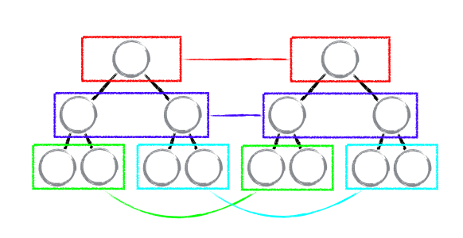
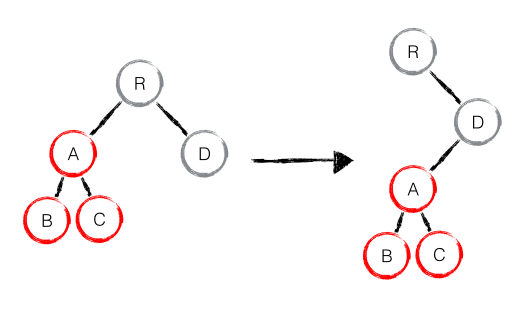
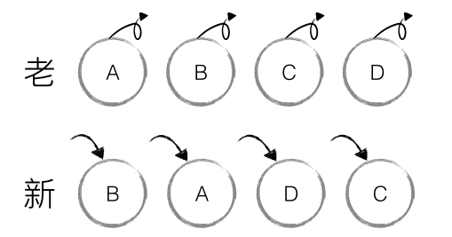
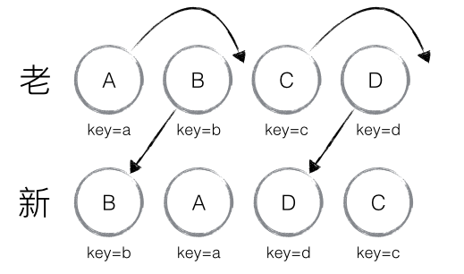

# React虚拟DOM和Diff算法
## 什么是虚拟DOM

你的组件dom结构是这样的：

```js
<ul id='list'>
  <li class='item'>1</li>
  <li class='item'>2</li>
  <li class='item'>3</li>
</ul>
```

当你打印这个react组件的时候，你会发现是这样的：

```js
{
  tagName: 'ul', // 节点标签名
  props: {       // DOM的属性，用一个对象存储键值对
    id: 'list'
  },
  children: [    // 该节点的子节点
    {tagName: 'li', props: {class: 'item'}, children: ['1']},
    {tagName: 'li', props: {class: 'item'}, children: ['2']},
    {tagName: 'li', props: {class: 'item'}, children: ['3']},
  ]
}
```

对你没有看错，虚拟DOM就是使用js对象来描述真实的DOM，它是一个树形结构。


## 为什么要使用虚拟DOM

众所周知，浏览器操作dom这个成本是很昂贵的，这里不展开，想钻研的自行搜索浏览器渲染机制原理。react频繁的setState更新组件，直接操作真实dom的话，就毫无性能可言，会非常卡顿。所以虚拟DOM只保留了真实DOM节点的一些基本属性，和节点之间的层次关系，它相当于建立在js和DOM之间的一层“缓存”。

## 什么是Diff算法

React需要同时维护两棵虚拟DOM树：一棵表示当前的DOM结构，另一棵在React状态变更将要重新渲染时生成。React通过比较这两棵树的差异，决定是否需要修改DOM结构，以及如何修改。这种算法称作Diff算法。

传统的Diff算法是一直都有的，但是它的时间复杂度为O(n^3)，意思是：在React中更新10个元素则需要进行1000次的比较，假如1000个，那就是10亿！

所以React内部通过一些精妙的手段，优化了此算法，将 O(n^3) 复杂度转换成 O(n) 复杂度：

1. 两个不同类型的元素会产生出不同的树
2. 对于同一层级的一组子节点，它们可以通过唯一 key 进行区分

### 特性

一、将新旧两颗虚拟DOM树。按照层级对应的关系，从头到尾的遍历一遍，就能找到那些元素是需要更新的。



像图上颜色标注的那样，进行同级节点比较，当发现节点不存在了，就删除该节点和此节点下的所有子节点。

举个例子🌰：



这会先创建A，后创建B和C，最后删除A。

二、同一层级中元素之间的对比
在类型相同的组件内，再继续对比组件内部的元素，查看内部元素是否相同，如果需要修改，找到需要修改的元素，进行针对性的修改。



如图所示，这块具体操作过程将会是：
B 不等于 A，则创建并插入 B，删除 A；以此类推，创建并插入 A、D、C，删除 B、C、D。

为了进一步优化上面这个算法，所以又产生了 key 属性



这时候就省去了B，D的对比和节点插删操作，只是将A，C进行了移动。

## 总结

保持完整的结构，有利于性能的提升。尽量使用相同类型组件，妥善利用key属性，不要瞎写key值