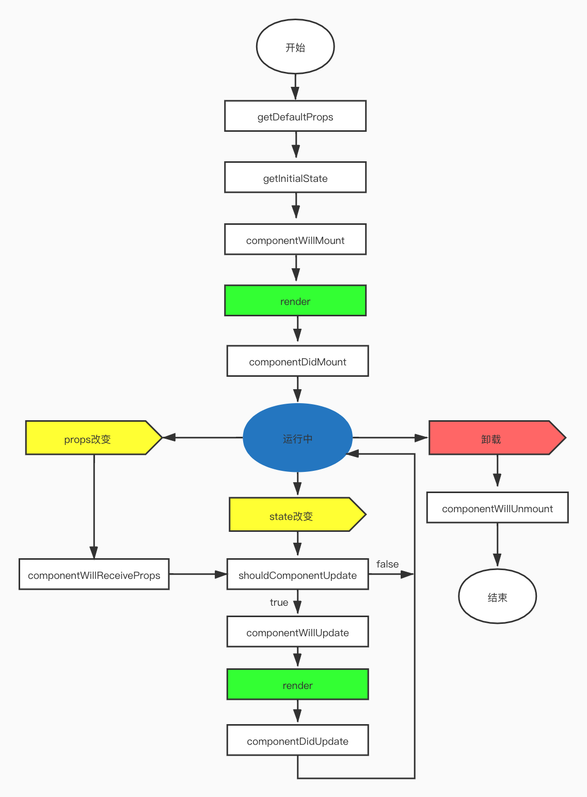
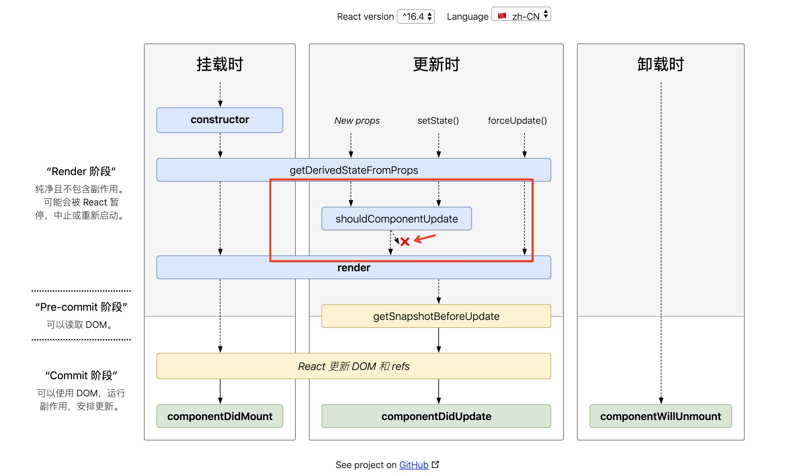

# React v16.4的生命周期理解

## 前言

好久没写`react`了，新的一些特性都没有用上，但是`demo`总不能拉下，还是要继续保持学习和理解的。

## 旧的生命周期理解



## 新的生命周期变动

1. 去掉了三个原有生命周期方法
- componentWillMount
- componentWillReceiveProps
- componentWillUpdate

2. 新增3个方法
- static getDerivedStateFromProps(nextProps, prevState)
- getSnapshotBeforeUpdate(prevProps, prevState)
- componentDidCatch(error, info)

3. 更改了一个方法
- componentDidUpdate(prevProps, prevState, snapshot)

官网说是为了实现将来新版本的异步渲染。

## 理解
### 为什么要下掉三个生命周期
#### componentWillMount

- 组件首次渲染，不管将异步请求放到哪里，它都是属于没有异步数据的状态。
-  React 并不能够保证在 componentWillMount 被调用后，同一组件的 componentWillUnmount 也一定会被调用。比如服务端渲染时，将事件订阅写进 componentWillMount 里， componentWillUnmount 是不会在服务端被调用的，会直接导致服务端的内存泄漏。

所以这个生命周期存在的意义不大，反而会有引起一些困扰。绝大部分逻辑都应该写进`componentDidMount`里。

#### componentWillReceiveProps

通过比较`props`和`state`的不同，来更新`state`，会破坏`state`的单一数据源性质，导致组件状态变得不可预测，并且也会增加组件的重绘次数。下面的`getDerivedStateFromProps`生命周期，就是来替代它的。

#### componentWillUpdate

- 以往在 componentWillUpdate 里，开发者根据 props 的变化来做一些回调。这会导致一次更新中回调被调用多次。
- 在组件更新前 componentWillUpdate 里读取 DOM 状态，并在 componentDidUpdate 里做相应的一些处理。但在 React 的异步渲染模式里，render 和 commit 阶段 DOM 状态可能会不同，因此他们的值是无法得到保障的，可能会出问题。

下面的`getSnapshotBeforeUpdate`生命周期，就是来改进它的。

### getDerivedStateFromProps

它需要返回一个对象来更新状态，不更新的话需要返回`null`。

```js
// 以前的使用方式
componentWillReceiveProps(nextProps) {
  if (nextProps.name !== this.state.name) {
    this.setState({
      name: nextProps.name 
    })
    // 一个 Promise 
    this.fetchUser(nextProps.name)
  }
}

// getDerivedStateFromProps
static getDerivedStateFromProps(nextProps, prevState) {
  if (nextProps.name !== prevState.name) {
    return {
      isChanged: true,
      name: nextProps.name
    }
  }
  return null
}

componentDidUpdate(prevProps, prevState) {
  if (this.state.isChanged) {
    this.fetchUser(this.state.name)    
  }
}
```
静态方法`getDerivedStateFromProps`禁止了组件去访问`this.props`，强制让开发者去比较`nextProps`与`prevState`中的值，以确保当用到`getDerivedStateFromProps`这个生命周期函数时，就是在根据当前的`props`来更新组件的`state`，而不是去做其他一些让组件自身状态变得更加不可预测的事情。简而言之就是：<b>通过框架级别的`API`约束，来帮助开发者写出更易维护的代码</b>。

### getSnapshotBeforeUpdate

`getSnapshotBeforeUpdate`会在最终的`render`之前被调用，它可以保证读取到的 DOM 元素状态是与`componentDidUpdate`中是一致的。我们应该在`getSnapshotBeforeUpdate`里返回你想用的值，然后传给`componentDidUpdate`再去更新状态，而不是在`getSnapshotBeforeUpdate`中直接更新组件状态。

官网demo：
```js
class ScrollingList extends React.Component {
  constructor(props) {
    super(props);
    this.listRef = React.createRef();
  }

  getSnapshotBeforeUpdate(prevProps, prevState) {
    // Are we adding new items to the list?
    // Capture the scroll position so we can adjust scroll later.
    if (prevProps.list.length < this.props.list.length) {
      const list = this.listRef.current;
      return list.scrollHeight - list.scrollTop;
    }
    return null;
  }

  componentDidUpdate(prevProps, prevState, snapshot) {
    // If we have a snapshot value, we've just added new items.
    // Adjust scroll so these new items don't push the old ones out of view.
    // (snapshot here is the value returned from getSnapshotBeforeUpdate)
    if (snapshot !== null) {
      const list = this.listRef.current;
      list.scrollTop = list.scrollHeight - snapshot;
    }
  }

  render() {
    return (
      <div ref={this.listRef}>{/* ...contents... */}</div>
    );
  }
}
```

在这dom挂载之前的虚拟dom构建阶段，判断变化了，再去实现更新。

### componentDidCatch

子组件发生错误后，将会调用此生命周期，抛出错误堆栈。

官网demo：
```js
class ErrorBoundary extends React.Component {
  constructor(props) {
    super(props);
    this.state = { hasError: false };
  }

  static getDerivedStateFromError(error) {
    // Update state so the next render will show the fallback UI.
    return { hasError: true };
  }

  componentDidCatch(error, info) {
    // Example "componentStack":
    //   in ComponentThatThrows (created by App)
    //   in ErrorBoundary (created by App)
    //   in div (created by App)
    //   in App
    logComponentStackToMyService(info.componentStack);
  }

  render() {
    if (this.state.hasError) {
      // You can render any custom fallback UI
      return <h1>Something went wrong.</h1>;
    }

    return this.props.children; 
  }
}
```

## 新的生命周期总结


