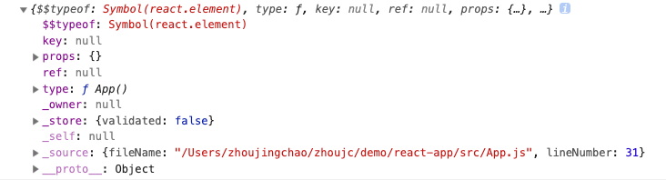
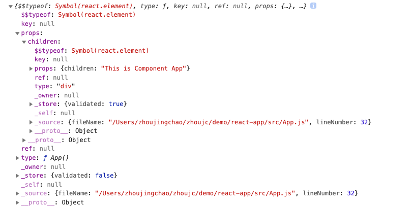
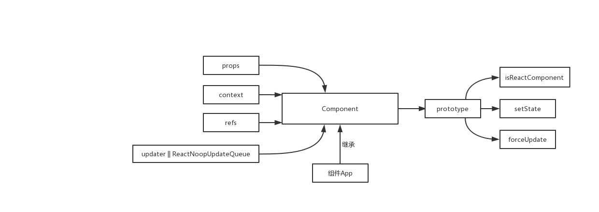
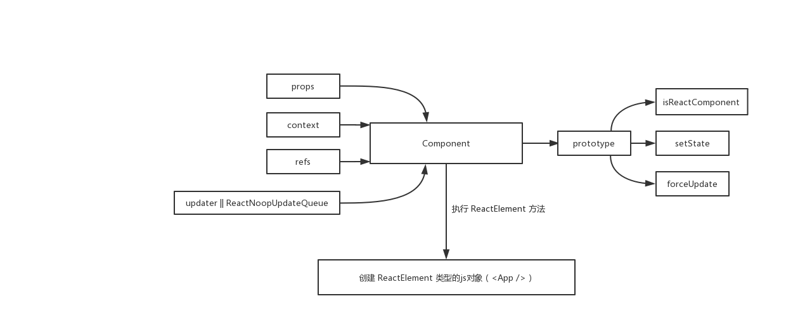
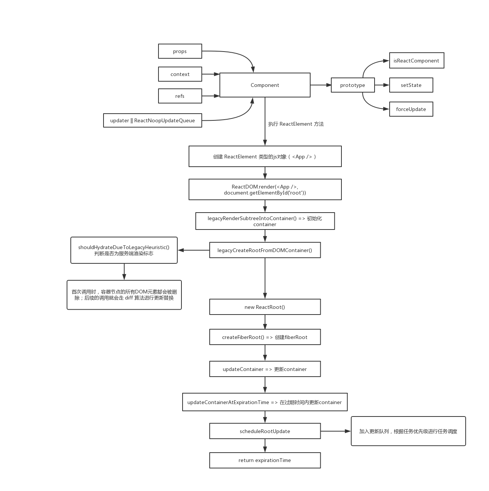

# React组件的初始化与挂载

React 是我的主要技术栈之一，难免想探索一下内部的一些机制实现，我会从组件的初始化与挂载、任务调度、组件类型和生命周期、事务、事件、hook等方向进行学习解析，也是第一次进行源码解析的写作，如有欠妥之处，欢迎朋友们不吝指正和讨论，共同学习进步。

下面，我们先来看看 React 组件的初始化。

## 组件是什么

首先编写一个最简单的组件。

```js
import React, { Component } from 'react';

class App extends Component {
  render() {
    return (
      <div>This is Component App</div>
    );
  }
}

console.log(<App />)

export default App;
```

这段代码我们实现了 `<App />` 组件，我们打印出来看看是个啥：



可以看出，`<App />` 其实是js对象不是真实的DOM，注意此时的 `props` 是空对象，接下来我们打印 `<App><div>This is Component App</div></App>`:



我们看到，`props` 发生了变化，由于 `<App />` 组件中嵌套了一个 `div`，`div` 中又嵌套了文字，所以在描述 `<App />` 对象的 `props` 中增加了 `children` 属性，其值为描述 `div` 的js对象。同理，如果我们进行多层的组件嵌套，其实就是在父对象的 `props` 中增加 `children` 字段及对应的描述值，也就是js对象的多层嵌套。

那么展现在我们眼前的html标签，实际上却是对象的React组件是如何实现的呢？

我们从代码的组件声明为源头进行探索，所以我们打开react内umd规范下的 `react.development.js`，看到如下代码：

```js
var React = {
  Children: {
    map: mapChildren,
    forEach: forEachChildren,
    count: countChildren,
    toArray: toArray,
    only: onlyChild
  },

  createRef: createRef,
  Component: Component,
  PureComponent: PureComponent,

  // ...

}
```

我们在 `import React, { Component } from 'react'` 时，引入的就是源码中提供的 `React` 对象。在 `extends Component` 时，继承了 `Component` 类。因为 `Component` 是 `React.Component` 的引用。也就是说 `Component === React.Component`，在实际项目中都可以写。

沿着 `Component` 线索我们继续在这个文件里搜寻一下它的踪迹：

```js
function Component(props, context, updater) {
  this.props = props;
  this.context = context;
  this.refs = emptyObject;
  this.updater = updater || ReactNoopUpdateQueue;
}
Component.prototype.isReactComponent = {};
Component.prototype.setState = function (partialState, callback) {
  // ...
};
Component.prototype.forceUpdate = function (callback) {
  // ...
};
```

上述代码大家再熟悉不过了。同时我们也发现 `setState` 是定义在原型上具有两个参数的方法，具体原理我们将在后续的篇章进行解析。

上述代码表明，我们在最开始声明的组件App，其实是继承 `Component`类，它的原型具有 `setState` 等方法。这样组件App已经有了最基本的雏形。



## 组件的初始化

声明App后，我们可以在其内部自定义方法，也可以使用生命周期的方法，这些和我们在写"类"的时候是完全一样的。唯一不同的是组件类必须拥有 `render` 方法输出类似 `<div>This is Component App</div>`的结构并挂载到真实DOM上，才能触发组件的生命周期并成为DOM树的一部分。首先我们观察ES6的"类"是如何初始化一个react组件的。

将最初的代码放入 [babel](https://babeljs.io/repl#?babili=false&browsers=&build=&builtIns=false&spec=false&loose=false&code_lz=JYWwDg9gTgLgBAJQKYEMDGMA0cDecDCE4EAdkifAL5wBmURcA5FKhowNwBQnSAHpLDgATJDRQBXADbw0klAGd5cAIJgwcPjHJClhYmQq5OcOCxIioACgCURkyZYxxUEnEvH7JgDxDgANwA-ABUAC2AlcIIiSAN4VTAvAHpfQI8Tay4TSk5soA&debug=false&forceAllTransforms=false&shippedProposals=false&circleciRepo=&evaluate=false&fileSize=false&timeTravel=false&sourceType=module&lineWrap=true&presets=es2015%2Creact%2Cstage-2&prettier=false&targets=&version=7.5.5&externalPlugins=) 中
```js
var App =
function (_Component) {
  _inherits(App, _Component);

  function App() {
    _classCallCheck(this, App);

    return _possibleConstructorReturn(this, _getPrototypeOf(App).apply(this, arguments));
  }

  _createClass(App, [{
    key: "render",
    value: function render() {
      return _react.default.createElement("div", null, "This is Component App");
    }
  }]);

  return App;
}(_react.Component);

exports.default = App;
```

其中 `_Component` 是对象 `Component`，`_inherit` 方法是 `extends` 关键字的函数实现，这些都是ES6相关内容，我们暂时不管。关键在于我们发现 `render` 方法实际上是调用了 `_react.default.createElement` 方法。然后我们继续在我们的源码文件中搜寻 `createElement`：

```js
function createElement(type, config, children) {
  var propName = void 0;

  var props = {};

  var key = null;
  var ref = null;
  var self = null;
  var source = null;

  // ...

  return ReactElement(type, key, ref, self, source, ReactCurrentOwner.current, props);
}
```

接着搜寻 `ReactElement`:

```js
var ReactElement = function (type, key, ref, self, source, owner, props) {
  var element = {
    $$typeof: REACT_ELEMENT_TYPE,

    type: type,
    key: key,
    ref: ref,
    props: props,

    _owner: owner
  };

  // ...

  return element;
};
```

看到这里我们发现，每一个组件对象都是通过 `ReactElement` 方法创建出来的对象。换句话说，`ReactElment` 是一种内部记录组件特征的对象。
在 `ReactElement` 中:

1. $$typeof: [使用符号标记每个ReactElement](https://github.com/facebook/react/pull/4832)
2. type: 用于判断如何创建节点
3. key: DOM结构标识，提升update性能
4. ref: 真实DOM的
5. props: 子结构相关信息(有则增加children字段/没有为空)和组件属性(如style等等)
6. _owner: _owner === ReactCurrentOwner.current, 值为创建当前组件的对象，默认值为null

总的来说，`ReactElement` 就是一个用来承载信息的容器，对于后期构建应用的树结构是非常重要的。



## 组件的挂载

我们知道可以通过 `ReactDOM.render(component, mountNode)`的形式对自定义组件/原生DOM/字符串进行挂载。

我们看下源码实现，找到react-dom内umd规范下的 `react-dom.development.js`，找到 `render` 方法看一下：

```js
render: function (element, container, callback) {
  // ...
  return legacyRenderSubtreeIntoContainer(null, element, container, false, callback);
}
```

```js
function legacyRenderSubtreeIntoContainer(parentComponent, children, container, forceHydrate, callback) {
  // ...
   var root = container._reactRootContainer;
  if (!root) {
    // Initial mount
    root = container._reactRootContainer = legacyCreateRootFromDOMContainer(container, forceHydrate);
    if (typeof callback === 'function') {
      var originalCallback = callback;
      callback = function () {
        var instance = getPublicRootInstance(root._internalRoot);
        originalCallback.call(instance);
      };
    }
    // Initial mount should not be batched.
    unbatchedUpdates(function () {
      if (parentComponent != null) {
        root.legacy_renderSubtreeIntoContainer(parentComponent, children, callback);
      } else {
        root.render(children, callback);
      }
    });
  } else {
    // ...
  }
  return getPublicRootInstance(root._internalRoot);
}
```

因为是首次渲染更新，所以 `root` 是 `null`，只需看 `!root` 的情况，它调用了 `legacyCreateRootFromDOMContainer`，我们接着往下看：

```js
function legacyCreateRootFromDOMContainer(container, forceHydrate) {
  var shouldHydrate = forceHydrate || shouldHydrateDueToLegacyHeuristic(container);
  // First clear any existing content.
  if (!shouldHydrate) {
    var warned = false;
    var rootSibling = void 0;
    while (rootSibling = container.lastChild) {
      {
        if (!warned && rootSibling.nodeType === ELEMENT_NODE && rootSibling.hasAttribute(ROOT_ATTRIBUTE_NAME)) {
          warned = true;
          warningWithoutStack$1(false, 'render(): Target node has markup rendered by React, but there ' + 'are unrelated nodes as well. This is most commonly caused by ' + 'white-space inserted around server-rendered markup.');
        }
      }
      container.removeChild(rootSibling);
    }
  }
  {
    if (shouldHydrate && !forceHydrate && !warnedAboutHydrateAPI) {
      warnedAboutHydrateAPI = true;
      lowPriorityWarning$1(false, 'render(): Calling ReactDOM.render() to hydrate server-rendered markup ' + 'will stop working in React v17. Replace the ReactDOM.render() call ' + 'with ReactDOM.hydrate() if you want React to attach to the server HTML.');
    }
  }
  // Legacy roots are not async by default.
  var isConcurrent = false;
  return new ReactRoot(container, isConcurrent, shouldHydrate);
}
```

此时 `forceHydrate` 是 `false`，所以看 `shouldHydrateDueToLegacyHeuristic(container)` 返回的是啥？

```js
// 判断是否为服务端渲染
function shouldHydrateDueToLegacyHeuristic(container) {
  //获取container的第一个节点（根节点），也就是 id='root' 的节点
  var rootElement = getReactRootElementInContainer(container);
  return !!(rootElement &&
  rootElement.nodeType === ELEMENT_NODE &&
  // 判断是否是服务端渲染
  rootElement.hasAttribute(ROOT_ATTRIBUTE_NAME));
}
```

```js
var ROOT_ATTRIBUTE_NAME = 'data-reactroot';
```

```js
function getReactRootElementInContainer(container) {
  if (!container) {
    return null;
  }

  if (container.nodeType === DOCUMENT_NODE) {
    return container.documentElement;
  } else {
    return container.firstChild;
  }
}
```

`container` 的首节点是没有 `data-reactroot` 属性的，所以会进行while循环，依次删除 `container` 的子节点，删除完毕后，`new` 一个 `ReactRoot` 的实例。所以说判断是否是服务端渲染的标志是：
在获取 `container` 中的第一个节点（或文档节点）后，看该节点是否有属性 `ROOT_ATTRIBUTE_NAME`。

接着 `ReactRoot` 的线索往下看，通过 `createContainer` 去创建 `FiberRoot`, 这个 `FiberRoot` 对象在后期调度更新的过程中非常非常重要。

```js
function ReactRoot(container, isConcurrent, hydrate) {
  var root = createContainer(container, isConcurrent, hydrate);
  this._internalRoot = root;
}
```

```js
function createContainer(containerInfo, isConcurrent, hydrate) {
  return createFiberRoot(containerInfo, isConcurrent, hydrate);
}
```

```js
ReactRoot.prototype.render = function (children, callback) {
  var root = this._internalRoot;
  var work = new ReactWork();
  callback = callback === undefined ? null : callback;
  {
    warnOnInvalidCallback(callback, 'render');
  }
  if (callback !== null) {
    work.then(callback);
  }
  updateContainer(children, root, null, work._onCommit);
  return work;
};
```

```js
function updateContainer(element, container, parentComponent, callback) {
  var current$$1 = container.current;
  // 返回的时间是以下这种数据类型
  // 是以V8引擎上最大31位整数1073741823为根据的
  // 可以追溯这个requestCurrentTime函数，就能看见源码注释了
  var currentTime = requestCurrentTime();
  // 计算过期时间，这是React优先级更新非常重要的点
  var expirationTime = computeExpirationForFiber(currentTime, current$$1);
  return updateContainerAtExpirationTime(element, container, parentComponent, expirationTime, callback);
}
```

我们发现调用了 `updateContainer` 方法后，内部开始计算时间 `requestCurrentTime()`, `computeExpirationForFiber()`暂且先不管具体细节。

```js
function updateContainerAtExpirationTime(element, container, parentComponent, expirationTime, callback) {
  var current$$1 = container.current;
  // ...
  return scheduleRootUpdate(current$$1, element, expirationTime, callback);
}
```

```js
function scheduleRootUpdate(current$$1, element, expirationTime, callback) {
  // ...

  // 创建更新的时间节点
  var update = createUpdate(expirationTime);

  // ...

  flushPassiveEffects();
  // 整个React应用中，会有多次更新，而这多次更新都在这个更新队列中
  enqueueUpdate(current$$1, update);
  // 进行任务调度，当React进行Update后，就要进行调度
  // 即根据任务的优先级去调度任务，先执行优先级高的任务，
  scheduleWork(current$$1, expirationTime);

  return expirationTime;
}
```

`enqueueUpdate()` 和 `scheduleWork()`，这个任务调度是最重要且最复杂的内容了，后续慢慢来解析。以上我们看见这个计划更新root的函数最终返回了一个 `expirationTime`, 就是说 `updateContainer()` 返回了 `expirationTime`。

到这先告一段落了，我们接着回到 `legacyRenderSubtreeIntoContainer` 函数往下看
最终返回了 `getPublicRootInstance`：

```js
function getPublicRootInstance(container) {
  var containerFiber = container.current;
  if (!containerFiber.child) {
    return null;
  }
  switch (containerFiber.child.tag) {
    case HostComponent:
      return getPublicInstance(containerFiber.child.stateNode);
    default:
      return containerFiber.child.stateNode;
  }
}
```

React初始化的时候，`container.current` 是没有子节点的，所以返回 null。

最后我们对之前的思维图再进行补充：



已经有点长了，暂时先解析到这里。组件是如何挂载到真正的DOM上以及它的任务调度又是如何，我在下一篇再来解析。

## 参考文章

> https://react.jokcy.me/