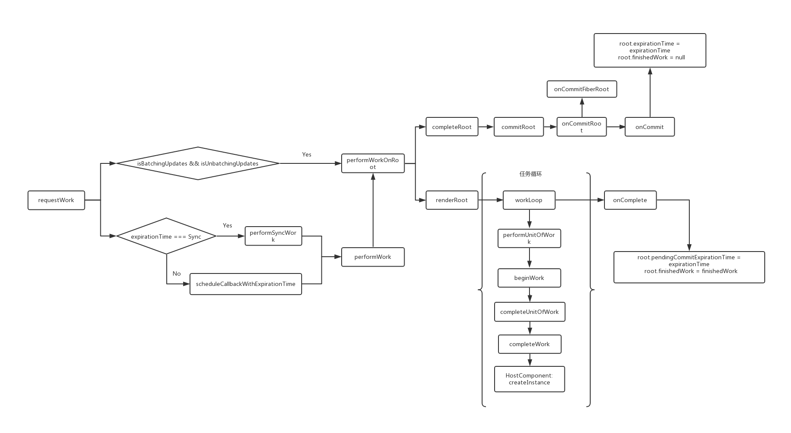

# React任务调度
上篇分析了组件的初始化，原本想把挂载方式也一块解析下，发现这挂载嵌在了任务调度的最后一个环节，而这任务调度实属复杂，本篇就浅析一下这个任务调度。

## Reconciler
在16+的React版本 [Fiber Reconciler（调和器）
](https://github.com/acdlite/react-fiber-architecture) 推出之前，React 用的是 [Stack Reconciler](https://reactjs.org/docs/implementation-notes.html)，它是自顶向下递归渲染及更新的，持续占用主线程并且是无法中断的，主线程上的布局、动画等周期性任务以及交互响应就无法立即得到处理，假如交互反馈延迟稍微大一丢丢，就会有明显的卡顿，这是影响体验的。

而 Fiber 就是为了解决上面的问题而诞生的，它把渲染或者更新过程拆分成一系列小任务，做完看是否有时间继续下一个任务，有的话继续，没有则自己挂起，主线程优先做更高优先级的任务，待到主线程不忙的时候再继续不太紧急的任务。这一切的实现是在代码层引入了新的数据结构对象 Fiber ，每一个组件实例都对应一个fiber实例，fiber实例负责管理组件实例的更新，渲染以及与其他fiber实例的联系。

初步了解 Fiber 的目的以后，我们回到上一章节的思维导图：


首先我们去看下 Fiber 的数据结构，从 `createFiberRoot()` 切入，我们发现最终调用 `new FiberNode()` 创建了一个作用于组件的 Fiber 对象

## FiberNode
```js
function FiberNode(tag, pendingProps, key, mode) {
  // 标记不同的组件类型
  this.tag = tag;

  // ReactElement 里面的 key
  this.key = key;

  // ReactElement.type，也就是我们调用`createElement`的第一个参数
  this.elementType = null;

  // fiber 对应的 function/class/module 类型组件名.
  this.type = null;

  // fiber 所在组件树的根组件 FiberRoot 对象
  this.stateNode = null;

  // 处理完当前 fiber 后返回的 fiber，
  // 返回当前 fiber 所在 fiber 树的父级 fiber 实例
  this.return = null;

  // fiber 树结构相关属性
  // 指向自己的第一个子节点
  this.child = null;
  // 指向自己的兄弟结构
  this.sibling = null;
  this.index = 0;

  // ref属性
  this.ref = null;

  // 当前处理过程中的组件 props 对象
  this.pendingProps = pendingProps;

  // 缓存上一次渲染完成之后的 props 对象
  this.memoizedProps = null;

  // 该组件状态更新及对应回调函数的存储队列
  this.updateQueue = null;

  // 上一次渲染的时候的state
  this.memoizedState = null;

  // 存放这个 fiber 依赖的 context
  this.contextDependencies = null;

  // 创建时候的标识，用来描述当前 fiber 和它子树的
  this.mode = mode;

  // Effects
  // 用来记录Side Effect
  this.effectTag = NoEffect;

  // 单链表用来快速查找下一个side effect
  this.nextEffect = null;

  // 子树中第一个side effect
  this.firstEffect = null;

  // 子树中最后一个side effect
  this.lastEffect = null;

  // 更新任务的最晚执行时间，注意不包括他的子树产生的任务
  this.expirationTime = NoWork;

  // 快速确定子树中是否有不在等待的变化
  this.childExpirationTime = NoWork;

  // fiber的版本池，记录fiber更新过程，便于在发生冲突需要回退时快速恢复
  this.alternate = null;

  // 调试相关，收集每个Fiber和子树渲染时间的
  if (enableProfilerTimer) {
    this.actualDuration = Number.NaN;
    this.actualStartTime = Number.NaN;
    this.selfBaseDuration = Number.NaN;
    this.treeBaseDuration = Number.NaN;

    this.actualDuration = 0;
    this.actualStartTime = -1;
    this.selfBaseDuration = 0;
    this.treeBaseDuration = 0;
  }

  {
    this._debugID = debugCounter++;
    this._debugSource = null;
    this._debugOwner = null;
    this._debugIsCurrentlyTiming = false;
    this._debugHookTypes = null;
    if (!hasBadMapPolyfill && typeof Object.preventExtensions === 'function') {
      Object.preventExtensions(this);
    }
  }
}
```

都说 Fiber 可以切分任务并设置不同优先级，它是如何做的又是怎样表现的？
从上面的数据结构是不是就可以看出来了？就是 `expirationTime` ，实现调度的方式正是<b>给每一个fiber实例设置到期执行时间，不同时间即代表不同优先级，到期时间越短，则代表优先级越高，需要尽早执行</b>。

## scheduleRootUpdate
下面我们接着看看任务调度那一块 `scheduleRootUpdate()`

```js
function scheduleRootUpdate(current$$1, element, expirationTime, callback) {
  // ...

  // 创建一个更新用的初始化对象
  var update = createUpdate(expirationTime);
  update.payload = { element: element };

  callback = callback === undefined ? null : callback;
  if (callback !== null) {
    // ...
    update.callback = callback;
  }

  // 根据回调来判断是关闭还是跟踪状态
  flushPassiveEffects();

  // 记录当前fiber的版本，加入更新队列
  enqueueUpdate(current$$1, update);
  scheduleWork(current$$1, expirationTime);

  return expirationTime;
}
```

## scheduleWork
`scheduleWork` 这一步非常重要，

```js
function scheduleWork(fiber, expirationTime) {
  // 找到当前 Fiber的 root
  var root = scheduleWorkToRoot(fiber, expirationTime);
  // ...

  // 如果不是工作状态，并且之前执行过任务，并且当前任务执行的时间比之前的执行的任务时间要大(就是优先级要低的意思)
  if (!isWorking && nextRenderExpirationTime !== NoWork && expirationTime > nextRenderExpirationTime) {
    // 中断任务
    interruptedBy = fiber;
    // 重置所有公共变量
    resetStack();
  }

  // 记录各项时间
  markPendingPriorityLevel(root, expirationTime);

  // 如果在渲染阶段，我们会在退出之前安排好更新，除非这是一个不同的根(应用程序有多个root)。
  if (!isWorking || isCommitting$1 || nextRoot !== root) {
    // 更新过期时间
    var rootExpirationTime = root.expirationTime;
    // 开始处理任务
    requestWork(root, rootExpirationTime);
  }

  // nestedUpdateCount初始值为0，在commit阶段会检查是否这是一个嵌套的更新，如果下一个根之前是一模一样的根，它就是一个嵌套更新，为了防止无限循环就会进行自增，一旦达到50次（NESTED_UPDATE_LIMIT）
  if (nestedUpdateCount > NESTED_UPDATE_LIMIT) {
    // 重置nestedUpdateCount变量，后续不更新
    nestedUpdateCount = 0;
    invariant(false, 'Maximum update depth exceeded. This can happen when a component repeatedly calls setState inside componentWillUpdate or componentDidUpdate. React limits the number of nested updates to prevent infinite loops.');
  }
}
```

## requestWork
现在看下任务处理

```js
function requestWork(root, expirationTime) {
  //  把 root 加入到调度队列，不会存在两个相同的 root 前后出现在队列中
  addRootToSchedule(root, expirationTime);
  if (isRendering) {
    return;
  }

  // 这里涉及到事件系统，后续再进行写作分析
  if (isBatchingUpdates) {
    if (isUnbatchingUpdates) {
      nextFlushedRoot = root;
      nextFlushedExpirationTime = Sync;
      performWorkOnRoot(root, Sync, false);
    }
    return;
  }

  // 根据 expirationTime 来执行同步还是异步任务，最终都会调用 performSyncWork
  if (expirationTime === Sync) {
    performSyncWork();
  } else {
    scheduleCallbackWithExpirationTime(root, expirationTime);
  }
}
```

仔细往里面看，会发现同步任务 `performSyncWork` 和异步任务`scheduleCallbackWithExpirationTime` 最终都会调用 `performSyncWork` 方法。

同步异步的处理都在 `performWorkOnRoot` 里进行，如果有上次遗留的任务，会直接调用`completeRoot` 进到提交阶段。如果没有就调 `renderRoot`开始渲染阶段。
异步任务主要是渲染的时候判断一下时间，如果没时间了，先把 `finishedWork` 赋给全局，下次循环处理。

## completeRoot
我们先沿着提交阶段的线索 `completeRoot` 往下看
```js
function completeRoot(root, finishedWork, expirationTime) {
  // 检查是否有一批这个过期时间相匹配。
  var firstBatch = root.firstBatch;
  if (firstBatch !== null && firstBatch._expirationTime >= expirationTime) {
    if (completedBatches === null) {
      completedBatches = [firstBatch];
    } else {
      completedBatches.push(firstBatch);
    }
    if (firstBatch._defer) {
      // 满足这个条件的这批根无法提交，直到收到新的更新
      root.finishedWork = finishedWork;
      root.expirationTime = NoWork;
      return;
    }
  }

  // 提交根.
  root.finishedWork = null;

  // 检查是否这是一个嵌套的更新(同步更新计划中提交阶段)
  if (root === lastCommittedRootDuringThisBatch) {
    // 如果下一根之前一样的根,这是一个嵌套的更新。为了防止无限循环,增加嵌套的更新计数。
    nestedUpdateCount++;
  } else {
    // 重置根开关
    lastCommittedRootDuringThisBatch = root;
    nestedUpdateCount = 0;
  }
  unstable_runWithPriority(unstable_ImmediatePriority, function () {
    commitRoot(root, finishedWork);
  });
}
```

最终会更新 `expirationTime` 值和重置 `finishedWork` 为 `null`。

而 `renderRoot` 则是开始渲染阶段了，里面有个 `workLoop` 循环机制不管是同步任务还是异步任务都要进行 `performUnitOfWork` 通过 `beginWork` 进行各项子节点的调和更新，直到完成工作进行 `createInstance`，创建 DOM 元素并添加至文档，最后通过 `onComplete` 更新 `root` 节点的 `pendingCommitExpirationTime` 为当前的过期时间 `expirationTime` 值和 `finishedWork` 的值。想要挖掘 `beginWork` 里的具体调和更新细节有兴趣的同学可以再钻研进去看看。

## createInstance
```js
function createInstance(type, props, rootContainerInstance, hostContext, internalInstanceHandle) {
  var parentNamespace = void 0;
  // ...

  // 真实创建dom
  var domElement = createElement(type, props, rootContainerInstance, parentNamespace);
  precacheFiberNode(internalInstanceHandle, domElement);
  updateFiberProps(domElement, props);
  return domElement;
}
```

`precacheFiberNode` 个人认为是新建了一个 `new FiberNode()` 的实例，而`updateFiberProps` 方法是将真实 dom 和 fiber，props关联在一起了，互相引用。

看到这里终于知道16+的 React 是在 createInstance 开始创建 dom 实例的，也就是之前所说的组件挂载就是在这里准备开始执行的。

## 总结



## 参考文章

> https://react.jokcy.me/
