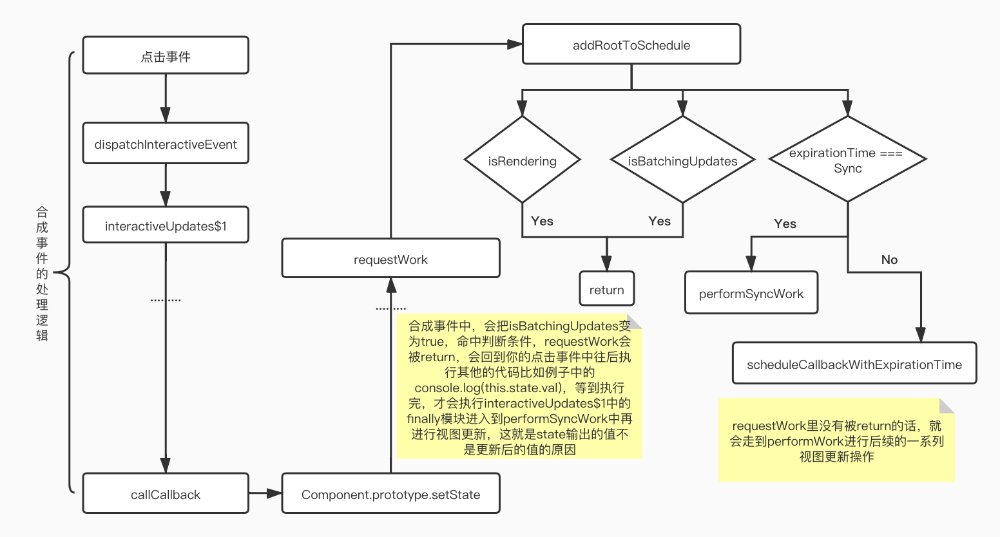

# 深入理解setState

## 前言
>面试官：“react中setState是同步的还是异步？”
>我：“异步的，setState不能立马拿到结果。”
>面试官：“那什么场景下是异步的，可不可能是同步，什么场景下又是同步的？”
>我：“......”

## 合成事件的setState

合成事件：react为了解决跨平台，兼容性问题，自己封装了一套事件机制，代理了原生的事件，像在jsx中常见的onClick、onChange等等都是合成事件。

```js
class App extends Component {
  state = { val: 0 }
  increment = () => {
    this.setState({ val: this.state.val + 1 })
    // 输出的是更新前的val --> 0
    console.log(this.state.val)
  }
  render() {
    return (
      <div onClick={this.increment}>
        {`Counter is: ${this.state.val}`}
      </div>
    )
  }
}
```

上图的操作，我们平常写react真的可以说是非常非常的频繁了，让我们来捋捋发生点击事件后react内部做了什么？你可以打断点 increment 看调用栈，也可以去看源码。我就不写的很具体了，可以粗略的概括如下：



```js
function interactiveUpdates$1(fn, a, b) {
  // If there are any pending interactive updates, synchronously flush them.
  // This needs to happen before we read any handlers, because the effect of
  // the previous event may influence which handlers are called during
  // this event.
  if (!isBatchingUpdates && !isRendering && lowestPriorityPendingInteractiveExpirationTime !== NoWork) {
    // Synchronously flush pending interactive updates.
    performWork(lowestPriorityPendingInteractiveExpirationTime, false);
    lowestPriorityPendingInteractiveExpirationTime = NoWork;
  }
  var previousIsBatchingUpdates = isBatchingUpdates;
  isBatchingUpdates = true;
  try {
    return scheduler.unstable_runWithPriority(scheduler.unstable_UserBlockingPriority, function () {
      return fn(a, b);
    });
  } finally {
    isBatchingUpdates = previousIsBatchingUpdates;
    if (!isBatchingUpdates && !isRendering) {
      performSyncWork();
    }
  }
}
```
performWork 后面做了啥想要进一步了解的同学，可以看一下之前的文章 [任务调度](https://zhoujingchao.github.io/2019/08/26/React%E6%BA%90%E7%A0%81%E8%A7%A3%E6%9E%90-%E4%BB%BB%E5%8A%A1%E8%B0%83%E5%BA%A6%EF%BC%88%E4%BA%8C%EF%BC%89/) 最后的总结图。

合成事件中，isRendering，isBatchingUpdates，isUnbatchingUpdates，三个值初始值是false
, false, true。interactiveUpdates$1 里将 isBatchingUpdates 置为true，导致后面的 requestWork 函数被直接 return，所以当你在 increment 中调用 setState 之后去console.log的时候，是属于 try 代码块中的执行，但是由于是合成事件，try 代码块执行完 state 并没有更新，所以你输入的结果是更新前的 state 值，这就导致了所谓的"异步"，但是当你的 try 代码块执行完的时候（也就是你的increment合成事件），这个时候会去执行 finally 里的代码，在 finally 中执行了 performSyncWork 方法，到这个时候才会去更新 state 并且渲染到UI上。

## 生命周期函数中的setState

```js
class App extends Component {
  state = { val: 0 }
  componentDidMount() {
    this.setState({ val: this.state.val + 1 })
    // 输出的还是更新前的值 --> 0
    console.log(this.state.val)
  }
  render() {
    return (
      <div>
        {`Counter is: ${this.state.val}`}
      </div>
    )
  }
}
```

它在 requestWork 中，isRendering 为true，就会被返回，所以后面会执行完 componentDidMount 函数，再去执行后面的更新逻辑，所以此生命周期里它的 state 值也是之前的值。

## 原生事件中的setState

```js
class App extends Component {
  state = { val: 0 }
  changeValue = () => {
    this.setState({ val: this.state.val + 1 })
    // 输出的是更新后的值 --> 1
    console.log(this.state.val)
  }
 componentDidMount() {
    document.body.addEventListener('click', this.changeValue, false)
 }
  render() {
    return (
      <div>
        {`Counter is: ${this.state.val}`}
      </div>
    )
  }
}
```

调用栈除了把合成事件的处理逻辑去掉，后面都是一样的，所以不会把 isBatchingUpdates 置为true，函数不会被 return，它会正常往下走去进行视图更新，所以它打印 state 的时候是更新过后的值。

## setTimeout中的setState

```js
class App extends Component {
  state = { val: 0 }
  componentDidMount() {
    setTimeout(() => {
      this.setState({ val: this.state.val + 1 })
      // 输出更新后的值 --> 1
      console.log(this.state.val)
    }, 0)
  }
  render() {
    return (
      <div>
        {`Counter is: ${this.state.val}`}
      </div>
    )
  }
}
```

在 setTimeout 中去 setState 并不算是一个单独的场景，你可以在原生事件中，合成事件中，钩子函数中等都可以 setTimeout，但是不管哪个场景下，它基于 [event loop](https://zhoujingchao.github.io/2018/06/28/JS%E6%89%A7%E8%A1%8C%E6%9C%BA%E5%88%B6%E8%AF%A6%E8%A7%A3/) 机制下都可以拿到最新的 state。

在 try 代码块中执行逻辑，遇到 setTimeout，把它丢进队列里，并没有去执行，而是先执行 finally 代码块，等 finally 执行完了，isBatchingUpdates 又变为了 false ，导致最后去执行队列里的 setState 时候， requestWork 走的是和原生事件一样的 expirationTime === Sync if分支，所以表现就会和原生事件一样，可以同步拿到最新的 state 值。

## setState中的批量更新

```js
class App extends Component {
  state = { val: 0 }
  batchUpdates = () => {
    this.setState({ val: this.state.val + 1 })
    this.setState({ val: this.state.val + 1 })
    this.setState({ val: this.state.val + 1 })
  }
  render() {
    return (
      <div onClick={this.batchUpdates}>
        {`Counter is ${this.state.val}`} // 1
      </div>
    )
  }
}
```

到目前为止，在最终的 performWork 中，相同的 key 会被覆盖，不同的 key 会被合并，是浅拷贝，最终只会对最后一次的 setState 进行更新。
但是在 React v17或更高版本的以后，会取消掉 unstable_batchedUpdates() 这个不稳定的API，让 React 中的所有 setState 按照顺序依次更新。

## 经典的例子🌰

```js
class App extends React.Component {
  state = { val: 0 }

  componentDidMount() {
    this.setState({ val: this.state.val + 1 })
    console.log(this.state.val)

    this.setState({ val: this.state.val + 1 })
    console.log(this.state.val)

    setTimeout(_ => {
      this.setState({ val: this.state.val + 1 })
      console.log(this.state.val);

      this.setState({ val: this.state.val + 1 })
      console.log(this.state.val)
    }, 0)
  }

  render() {
    return <div>{this.state.val}</div>
  }
}

```

综合上述特性分析，所以输出结果为0，0，2，3

## 总结

1. setState 只在合成事件和钩子函数中是“异步”的，在原生事件和 setTimeout 中都是同步的。

2. setState 的“异步”并不是内部异步代码实现的，其本身执行过程和代码是同步的，只是合成事件和钩子函数的调用顺序在更新之前，导致这两个场景下没法立马拿到更新后的值，形成了所谓的“异步”，但是我们还是可以通过 setState 的第二个参数，callback函数去拿到更新后的值的。

3. setTimeout 的批量更新优化机制是建立在“异步”（合成事件，钩子函数）之上的，在原生事件和 setTimeout 中不会批量更新。在“异步”中，如果是对同一个 key 值进行多次 setState，批量更新策略会对其进行覆盖，只对最后一次 setState 进行更新。如果同时 setState 多个不同的 key 值，会先进行合并操作，再在最后一个 setState 进行更新。

