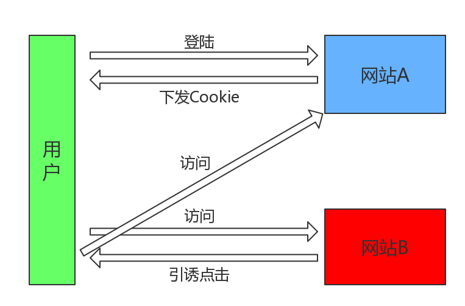

# 前端安全CSRF && XSS
## 前言

随着互联网的发达，各种WEB应用也变得越来越复杂，满足了用户的各种需求，但是随之而来的就是各种网络安全的问题。作为前端工程师的我们也逃不开这个问题。所以今天，就和大家一起聊一聊WEB前端的安全那些事儿。这里就不去说那些后端的攻击(SQL注入、DDOS攻击等)。

## 为什么要攻击？

其实真正为了玩的心态去进行黑网站的人，还是少数。多数攻击还是有利益的成分在里面的。开发者不可能确保自己的应用绝对无法被攻击，但是只要攻击我们的时候，骇客花费的成本远比他可以获取的利益大得多，骇客就不会去攻击。防范强如支付宝、QQ等产品，也都曾被报过漏洞，看来防御不是绝对的，我们只能想办法让我们的应用更加安全。

## 前端攻击形式以及如何防范

1. CSRF（Cross-site request forgery），通常称为跨站请求伪造
2. XSS（Cross-site scripting），通常称为跨域脚本攻击

### CSRF 攻击原理

如图所示，被攻击的前提就很明了了，**用户需要在A网站登录过，并且网站A存在接口漏洞**

### CSRF 防范

因此根据上述进行对症下药进行防范：

1. 利用Cookie的`SameSite`属性，在`Strict`模式下，`浏览器完全禁止第三方请求携带Cookie`。比如请求sanyuan.com网站只能在sanyuan.com域名当中请求才能携带 Cookie，在其他网站请求都不能。在`Lax`模式，就宽松一点了，但是只能在 `get` 方法提交表单况或者a 标签发送 get 请求的情况下可以携带 Cookie，其他情况均不能。 在None模式下，也就是默认模式，请求会自动携带上 Cookie。
2. 验证来源站点，`Referer`和`Origin`，Origin只包含域名信息，而Referer包含了具体的URL路径。可以伪造，安全性较差。
3. `CSRF Token`：浏览器向服务器发送请求时，服务器生成一个字符串，将其植入到返回的页面中。

注意⚠️：自 chrome80 版本开始
- 没有Samesite属性的cookie将视为SameSite=Lax
- Samesite=None的cookie必须设置为安全，意味着可以使用安全的上下文

### XSS 攻击原理

XSS 攻击是 Web 攻击中最常见的攻击方法之一，它是通过对网页注入可执行代码且成功地被浏览器执行，达到攻击的目的，形成了一次有效XSS攻击，一旦攻击成功，它可以获取用户的联系人列表，然后向联系人发送虚假诈骗信息，可以删除用户的日志等等，有时候还和其他攻击方式同时实施比如 SQL 注入攻击服务器和数据库、Click劫持、相对链接劫持等实施钓鱼，它带来的危害是巨大的，是web安全的头号大敌。

Web 应用程序的技术基础是由 HTTP 和 HTML 组成的。HTTP 协议是 HTML 的传输机制，可使用代码设计 Web 页面布局和生成页面。如果 Web 应用程序接受用户通过 HTTP 请求（如 GET 或 POST）提交的输入信息，然后使用输出 HTML 代码在某些地方显示这些信息，便可能存在 XSS 漏洞。

实施 XSS 攻击需要具备两个条件：

1. 需要向web页面注入恶意代码
2. 这些恶意代码能够被浏览器成功的执行

### XSS 攻击类型

1. 反射型攻击: 恶意代码并没有保存在目标网站，通过引诱用户点击一个链接到目标网站的恶意链接来实施攻击的。
2. 存储型攻击: 恶意代码被保存到目标网站的服务器中，这种攻击具有较强的稳定性和持久性，比较常见场景是在博客，论坛等社交网站上，但OA系统，和CRM系统上也能看到它身影，比如：某CRM系统的客户投诉功能上存在XSS存储型漏洞，骇客提交了恶意攻击代码，当系统管理员查看投诉信息时恶意代码执行，窃取了客户的资料，然而管理员毫不知情，这就是典型的XSS存储型攻击。
3. 文档型：作为中间人的角色，在数据传输过程劫持到网络数据包，然后修改里面的 html 文档！这样的劫持方式包括`WIFI路由器劫持`或者`本地恶意软件`。

通常都会去做这些事情：

- 窃取Cookie。
- 监听用户行为，比如输入账号密码后直接发送到黑客服务器。
- 修改 DOM 伪造登录表单。
- 在页面中生成浮窗广告。
- ...

了解了 XSS 的原理，接下去看看怎么防范吧。

### XSS 防范

1. 千万不要相信任何用户的输入！
2. 无论是在前端和服务端，都要对用户的输入进行转码或者过滤。过滤用户输入的，检查用户输入的内容中是否有非法内容。如<>、"、 '、%、;、()、&、+等。严格控制输出。
3. CSP，即浏览器中的`内容安全策略`，服务器决定浏览器加载哪些资源，比如`限制其他域下的资源加载`。`禁止向其它域提交数据`。`提供上报机制`，能帮助我们及时发现 XSS 攻击。
4. HttpOnly，防止js窃取cookie。
