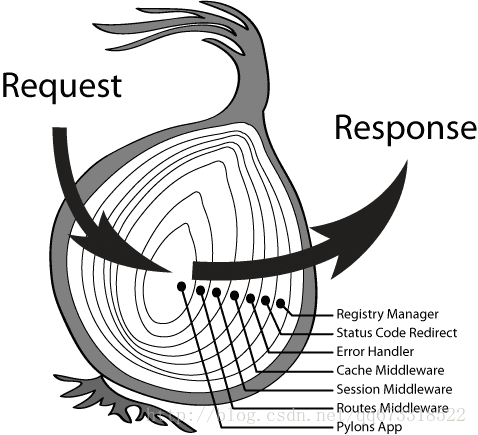
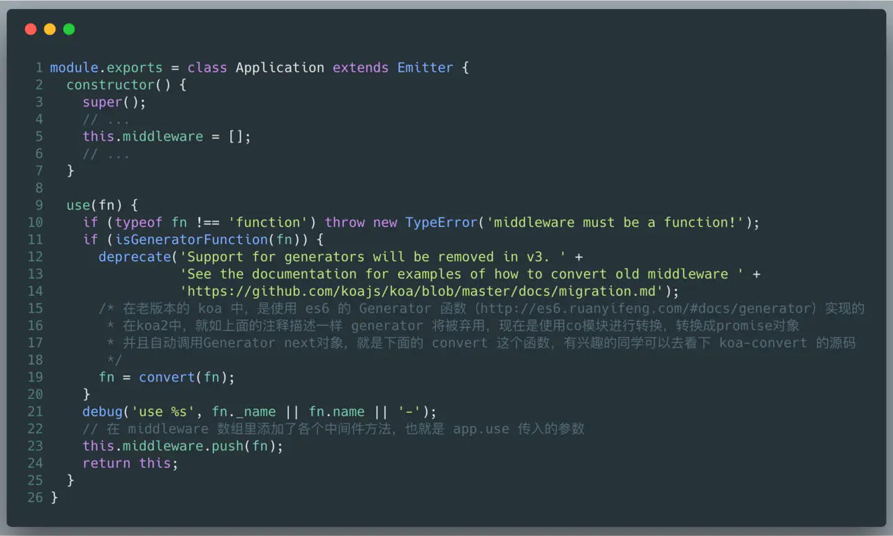
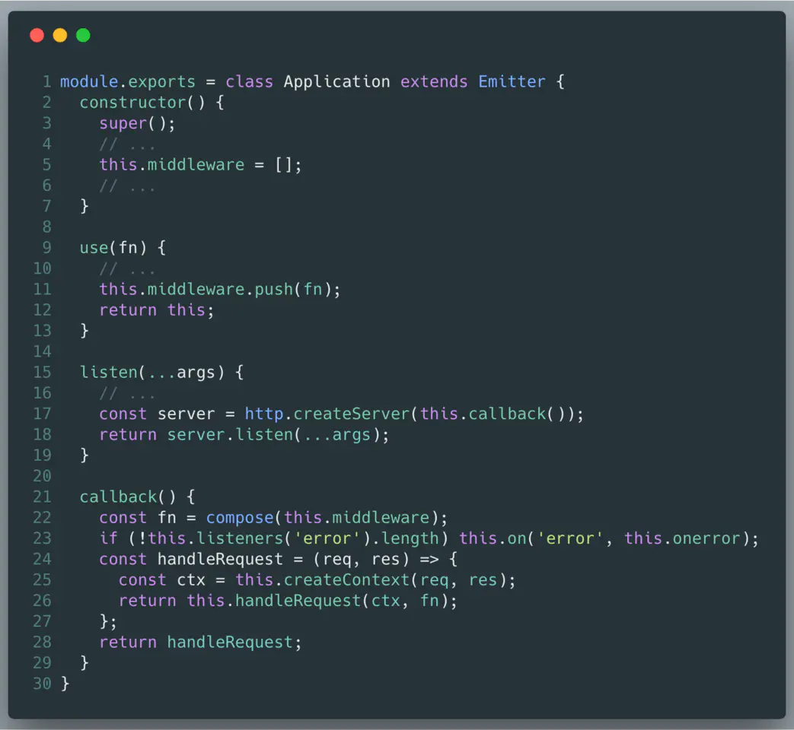
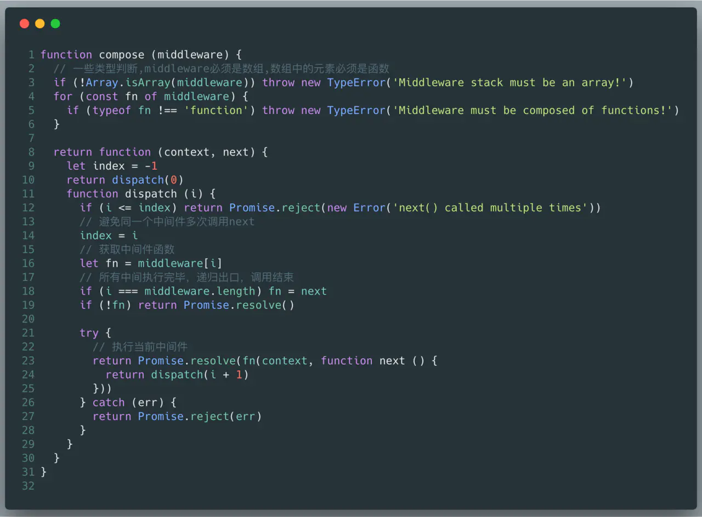

# koa洋葱模型分析
## 模型


```js
const Koa = require('koa')
const app = new Koa()

app.use(async(ctx, next) => {
  console.log('st1')
  await next()
  console.log('end1')
})

app.use(async(ctx, next) => {
  console.log('st2')
  await next()
  console.log('end2')
})

app.use(async(ctx, next) => {
  ctx.body = 'hello world'
  console.log('hello world')
  await next()
})

app.listen(8888)
```
```
st1
st2
hello world
end2
end1
```

## 原理浅析
我们翻进`koa`源码`application.js`瞅一瞅，对着上面用到的方法去找内容。

### app.use做了什么

过滤掉一些暂时用不到的代码



预先通过`use`方法，将请求可能会经过的中间件装在了一个数组里

### callback



通过 `compose()` 这个方法，就将我们传入的中间件数组关联起来了，最后 `callback()` 返回 `this.handleRequest()` 的执行结果，暂不管返回什么吧，先看看这个神奇的
`compose()` 方法做了什么使得文章最开始的例子可以那样执行

### compose



1. 首先会默认执行第一个中间件，返回`Promise`，被`Koa`监听，执行对应逻辑
2. 在执行第一个中间件的逻辑时，遇到`await next()`时，会继续执行`dispatch(i+1)`，也就是执行 `dispatch(1)`，会手动触发执行第二个中间件。这时候，第一个中间件`await next()`后面的代码就会被 `pending`，等待`await next()`返回`Promise`，才会继续执行第一个中间件`await next()`后面的代码。
3. 以此类推，如果有多个中间件的时候，会依照上面的逻辑不断执行，先执行第一个中间件，在`await next()` 出`pending`，继续执行第二个中间件，继续在`await next()`出`pending`，继续执行第三个中间，直到最后一个中间件执行完，然后返回`Promise`，然后倒数第二个中间件才执行后续的代码并返回`Promise`，然后是倒数第三个中间件，接着一直以这种方式执行直到第一个中间件执行完，并返回`Promise`，从而实现开头例子的执行顺序，就好比下面网上很火的一张洋葱图

## 总结

`koa`真香，这`compose()`函数真骚，所以说<b>评价一个好的程序员不是由代码量决定的</b>。
