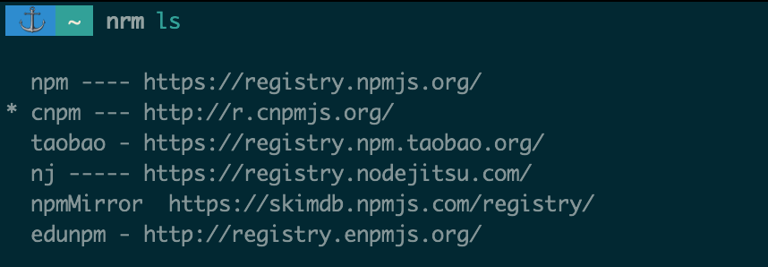

# puppeteer实战系列-介绍及安装

## 前言

[`Puppeteer`](https://github.com/GoogleChrome/puppeteer) 是一个`Node`库，它提供了一个高级`API`来控制`DevTools`协议上的`Chrome`或`Chromium`。`Puppeteer`默认运行无头，但可以配置为运行完整（非无头）`Chrome`或`Chromium`。

## 用处

可以在浏览器中手动执行的大多数事情都可以使用 `Puppeteer` 完成！以下是一些可以入门的示例：

1. 生成页面的屏幕截图和PDF
2. 爬取SPA应用，并生成预渲染内容（即 `SSR` 服务端渲染）
3. 自动化表单提交，UI测试，键盘输入等
4. 创建最新的自动化测试环境。使用最新的 `JavaScript` 和浏览器功能直接在最新版本的Chrome中运行测试
5. 捕获网站的时间线跟踪，以帮助诊断性能问题
6. 测试Chrome扩展程序

## 安装及部署
本地 MacOS ：
```
yarn add puppeteer
```
down不下来就试试换源，推荐 `nrm` 工具
```
yarn global add nrm
```

```
nrm use taobao
```

Centos 7 ：
需要安装以下依赖，确保任务可以正常执行，相关字体依赖是解决截图后中文乱码问题的。（[更多运行上的问题也可以查看此链接](https://github.com/GoogleChrome/puppeteer/blob/master/docs/troubleshooting.md)）
```
yum install pango.x86_64 libXcomposite.x86_64 libXcursor.x86_64 libXdamage.x86_64 libXext.x86_64 libXi.x86_64 libXtst.x86_64 cups-libs.x86_64 libXScrnSaver.x86_64 libXrandr.x86_64 GConf2.x86_64 alsa-lib.x86_64 atk.x86_64 gtk3.x86_64 ipa-gothic-fonts xorg-x11-fonts-100dpi xorg-x11-fonts-75dpi xorg-x11-utils xorg-x11-fonts-cyrillic xorg-x11-fonts-Type1 xorg-x11-fonts-misc
```
再设置
```js
const browser = await puppeteer.launch({
  args: [ '--no-sandbox', '--disable-setuid-sandbox' ]
})
```

Docker :

官方推荐使用
args参数：--disable-dev-shm-usage
默认情况下，Docker运行一个/dev/shm共享内存空间为64MB 的容器。这通常对Chrome来说太小，并且会导致Chrome在渲染大页面时崩溃。要修复，必须运行容器 docker run --shm-size=1gb 以增加/dev/shm的容量。从Chrome 65开始，使用--disable-dev-shm-usage标志启动浏览器即可，这将会写入共享内存文件/tmp而不是/dev/shm

注⚠️：
在某些情况下（例如在Docker中）很难正确终止Chrome。如果你遇到很多僵尸Chrome进程，那么 [dumb-init](https://github.com/Yelp/dumb-init) 值得一试。对于PID = 1的进程有特殊处理，

最后
如果还是down不下来puppeteer，那么请戳这里[下载Chromium](https://pkgs.org/download/chromium)，放入对应的环境或者项目里。
再设置 `.npmrc` 跳过下载 Chromium
```
puppeteer_skip_chromium_download = true
```
再启动浏览器
```js
const options = {
  headless: true,
  timeout: 0,
  args: [ '--no-sandbox', '--disable-setuid-sandbox' ],
  ignoreHTTPSErrors: true
};

const platform = os.platform().toLocaleLowerCase();

// 你所存放的路径
if (platform === 'linux') {
  options.executablePath = path.join(__dirname, '../../../chrome-linux/chrome');
}

const browser = await puppeteer.launch(options);
```

Have fun ！
