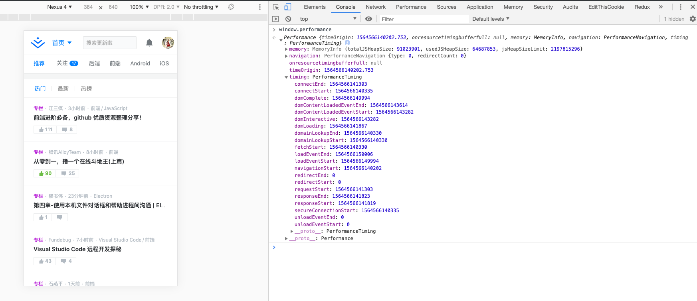
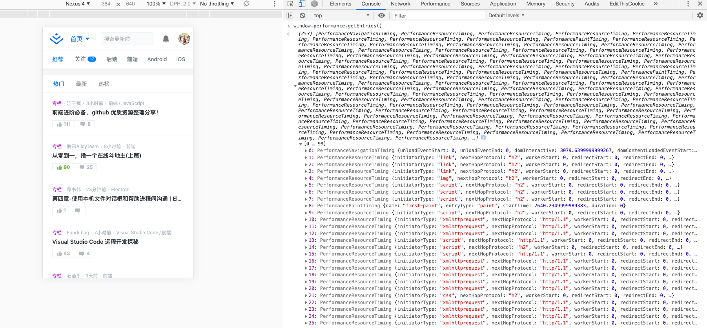

# puppeteer实战系列-网页性能分析

前两篇文章中，我们讲了安装和截图，这篇我们来讲讲页面性能分析的相关体系。

众所周知，页面性能优化要讲起来可谓是整大条链路上的事情，在这里我就不开展描述，后续我会出个全面的性能优化系列文章再进行讲解。回到我们的正题，我们是利用`puppeteer`对页面进行性能数据采集并分析，达到一个性能监控的效果。

这里我是用的 [Web performance](https://developer.mozilla.org/en-US/docs/Learn/Performance) 收集的，毕竟是原生对吧。 GoogleChrome 推的 [lighthouse](https://github.com/GoogleChrome/lighthouse) 也是个不错的工具，感兴趣的同学可自行研究 [传送门](https://github.com/GoogleChrome/lighthouse)

当然了，咱们要分析的页面在这里不是咱自家产的，假如是自家页面，那我们只需要将代码包装成sdk，用户访问的时候收集真实数据，再分析即可。所以这里主要是模拟分析第三方的页面。在讲具体操作前，我们先来认识一下 performance，看下图




相关时间点在`timing`里，加载的资源列表在`getEntries`里，我也是根据下面这张图来归结相关时间节点数据的，有不对的地方同学们帮忙指正下。


## 核心代码

```js
function performance() {
  const data = {
    cache: ['domainLookupStart', 'fetchStart'], // 读取缓存时间
    dns: ['domainLookupEnd', 'domainLookupStart'], // DNS 解析耗时
    tcp: ['connectEnd', 'connectStart'], // TCP 连接耗时
    req: ['responseStart', 'requestStart'], // 网络请求耗时
    res: ['responseEnd', 'responseStart'], // 数据传输耗时
    dom: ['domContentLoadedEventStart', 'domLoading'], // DOM 解析耗时
    readycb: ['domContentLoadedEventEnd', 'domContentLoadedEventStart'], // domContentLoaded回调函数耗时
    fasrt: ['domComplete', 'domContentLoadedEventEnd'], // 首屏异步资源加载耗时，即domContentLoaded和load之间加载的资源，一般为图片加载，JS异步加载的资源
    loadcb: ['loadEventEnd', 'loadEventStart'], // load回调函数耗时
    ready: ['domContentLoadedEventEnd', 'fetchStart'], // 	DOM Ready耗时，白屏时间
    load: ['loadEventEnd', 'fetchStart'] //	页面完全加载时间
  };
  const getData = {};
  const performance = window.performance || window.msPerformance || window.webkitPerformance;
  if (!performance || !performance.timing) {
    return null;
  }
  const timing = performance.timing;
  Object.keys(data).map(item => {
    const firstParams = timing[data[item][0]];
    const secondParams = timing[data[item][1]];
    const value = Math.round(firstParams - secondParams);
    value >= 0 && value < 36e5 && (getData[item] = value);
  });
  getData.resourceList = performance.getEntries();
  return getData;
}
```

所以当我们加载第三方页面的时候，我们插入此脚本，把数据捞出来，下面举个🌰

```js
const browser = await puppeteer.launch({
  headless: true,
  args: [ '--no-sandbox', '--disable-setuid-sandbox' ],
});
const page = await browser.newPage();
await page.goto('https://juejin.im', {
  waitUntil: [ 'load' ]
});
const monitorData = await page.evaluate(() => {
  // 这里就拿我们最常见也最关心的数据，更全的看上面核心代码图即可
  const data = {
    ready: [ 'domContentLoadedEventEnd', 'fetchStart' ], // DOM Ready耗时，白屏时间
    load: [ 'loadEventEnd', 'fetchStart' ] // 页面完全加载时间
  };
  const getData = {};
  const performance = window.performance || window.msPerformance || window.webkitPerformance;
  const timing = performance.timing;
  Object.keys(data).map(item => {
    const firstParams = timing[data[item][0]];
    const secondParams = timing[data[item][1]];
    const value = Math.round(firstParams - secondParams);
    value >= 0 && value < 36e5 && (getData[item] = value);
  });
  getData.resourceList = performance.getEntries();
  return Promise.resolve(getData);
});

console.log(monitorData);
```

拿到这些数据后，就可以开展各自的业务的场景了，比如后台系统上的展示监控，钉钉报警优化等等。
再复杂一点的场景可能需要模拟网络环境，我们需要再添加一些代码，如下：

```js
const NETWORK_PRESETS = {
  // 所有速度 / 8 是因为网络速度通常以比特/秒,而 DevTools 预计吞吐量在字节/秒! （1字节 = 8比特）
  GPRS: {
    offline: false, // 是否连接
    downloadThroughput: (50 * 1024) / 8, // 模拟下载速度
    uploadThroughput: (20 * 1024) / 8,  // 模拟上传速度 
    latency: 500 // 模拟延迟（毫秒）
  },
  Regular2G: {
    offline: false,
    downloadThroughput: (250 * 1024) / 8,
    uploadThroughput: (50 * 1024) / 8,
    latency: 300
  },
  Good2G: {
    offline: false,
    downloadThroughput: (450 * 1024) / 8,
    uploadThroughput: (150 * 1024) / 8,
    latency: 150
  },
  Regular3G: {
    offline: false,
    downloadThroughput: (750 * 1024) / 8,
    uploadThroughput: (250 * 1024) / 8,
    latency: 100
  },
  Good3G: {
    offline: false,
    downloadThroughput: (1.5 * 1024 * 1024) / 8,
    uploadThroughput: (750 * 1024) / 8,
    latency: 40
  },
  Regular4G: {
    offline: false,
    downloadThroughput: (4 * 1024 * 1024) / 8,
    uploadThroughput: (3 * 1024 * 1024) / 8,
    latency: 20
  },
  DSL: {
    offline: false,
    downloadThroughput: (2 * 1024 * 1024) / 8,
    uploadThroughput: (1 * 1024 * 1024) / 8,
    latency: 5
  },
  WiFi: {
    offline: false,
    downloadThroughput: (30 * 1024 * 1024) / 8,
    uploadThroughput: (15 * 1024 * 1024) / 8,
    latency: 2
  }
};

async function start(url, network) {
  const browser = await puppeteer.launch({
    headless: true,
    args: [ '--no-sandbox', '--disable-setuid-sandbox' ],
  });
  const page = await browser.newPage();
  await page.goto(url, { waitUntil: [ 'load' ]});

  // 添加网络环境
  if (network !== 'default') {
    // Connect to Chrome DevTools
    const client = await page.target().createCDPSession();
    // Set throttling property
    await client.send('Network.emulateNetworkConditions', NETWORK_PRESETS[network]);
  }

  const monitorData = await page.evaluate(() => {
    // ...同上
  });

  console.log(monitorData);
}
```

## 总结

`window.performance.getEntries()` 的方式拿到的资源，不是本域下面的话，一般是拿不到资源大小的，这个是由第三方cdn或者服务器所控制的。[lighthouse](https://github.com/GoogleChrome/lighthouse) 是拿得到的，所以根据各自场景，结合起来使用也是没问题的。另外 `puppeteer` 本身也提供一些页面数据在 `page.metrics()` 方法里，同学们可自行查看。
